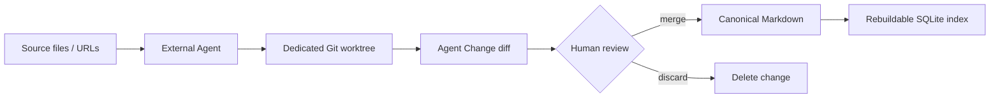
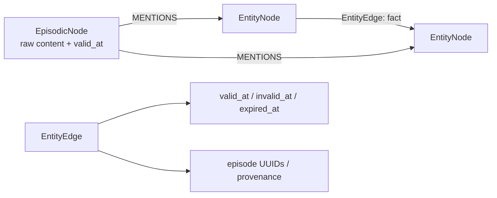
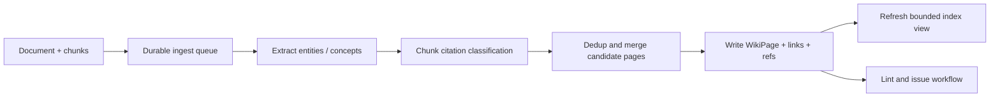
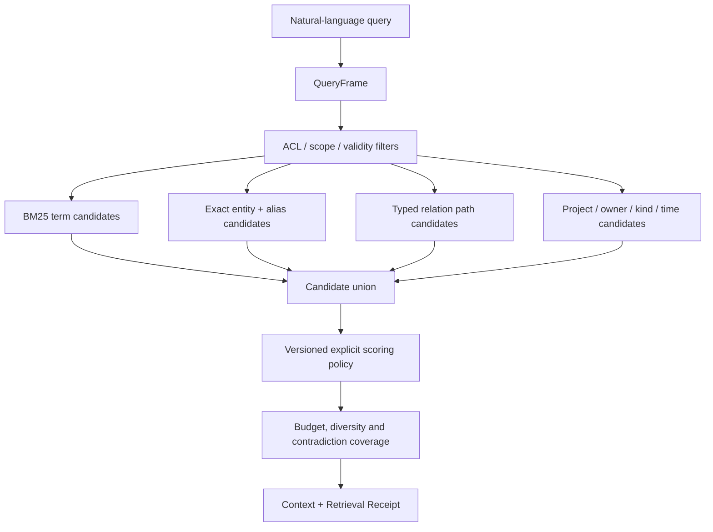
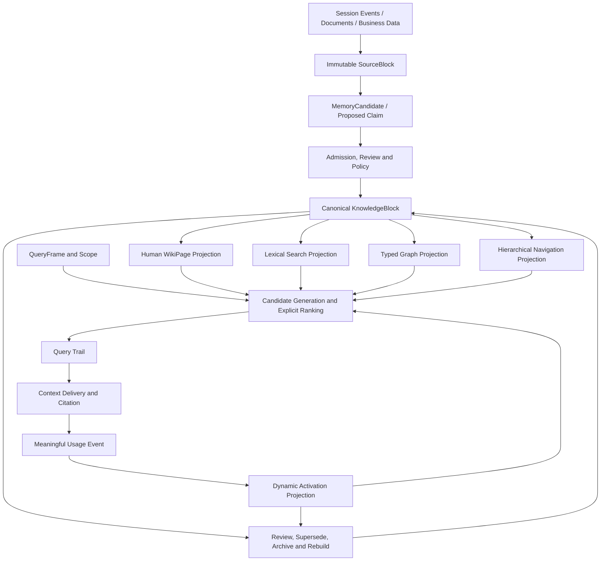

# CoWiki、OpenWiki、ClawMem、AgentMemory、Zep、Mem0、腾讯 WeKnora / LLM-Wiki / WikiKV、传统知识图谱、Palantir Ontology 与 Google Search 技术架构对比

- Status: research note
- Updated: 2026-07-16
- Scope: 团队协作型 LLM Wiki、Agent Memory、底层知识建模、召回与可解释性
- Code snapshots:
  - CoWiki `aae67833d934c0de177c6d5db36a1dd57514fece`
  - ClawMem `580f3cbb8ae6dff3e0f8faa7abba371efd928079` (`v0.24.0`)
  - Graphiti `5e2be0faf7038a5b40e700d757b2c337e96b3a05`
  - Mem0 `739534c0a3232e4b5ae6b4349ae4e50fc00df614` (OSS v3)
  - OpenWiki `d4e94ab513ab13908c6b61346b23dc17bbd59b1f` (`feat: OKF + telemetry`)
  - AgentMemory `93ae9bc04f3ab5042f982aaadf11f1e3f5137531` (`v0.9.27`)
  - WeKnora `79e8f3d894a8f993dad466779d98780e29c8debc` (`v0.6.3` README snapshot)

## 1. 结论摘要

七个开源/托管项目、腾讯的两项相关研究、传统知识图谱、Palantir Ontology 和 Google Search 解决的不是同一个问题。Google Search 不属于 memory store，因此只作为检索系统工程参照。

| 系统 | 核心问题 | 主要记忆对象 | 权威存储 | 默认召回方式 |
| --- | --- | --- | --- | --- |
| CoWiki | 团队认可什么知识 | Markdown concept / Wiki page | Git 中的 Markdown | SQLite FTS5、标题匹配、backlink |
| OpenWiki | 如何主动从工作来源维护 agent 可读 Wiki | 带 OKF frontmatter 的 Markdown page | 本地 `~/.openwiki/wiki` 或 repo `openwiki/` | Agent 读取文件、grep/glob；当前没有正式 ranking engine |
| ClawMem | 本地 Agent 现在应该想起什么 | 文档、观察、handoff、decision、relation | 本地 SQLite vault | BM25、vector、query expansion、reranker、生命周期加权 |
| AgentMemory | 如何跨 coding agent 自动捕获并复用工作过程 | RawObservation、CompressedObservation、Memory、Lesson、Graph node/edge | iii file-backed KV；BM25/vector index 可重建 | `memory_recall` 为 BM25；`memory_smart_search` 为 BM25 + vector + graph RRF |
| Zep / Graphiti | 关于用户或业务实体，什么事实在什么时间成立 | Episode、Entity、temporal Fact edge | Temporal context graph | BM25、vector、BFS、RRF / cross-encoder |
| Mem0 | 如何低成本地持续积累个性化事实 | 独立 memory text、metadata、entity links | Vector store，SQLite 保存历史 | vector 候选、BM25 加分、entity boost、可选 reranker；Platform 可选 access decay |
| WeKnora | 如何把企业文档做成 RAG、Agent 和可浏览 Wiki 产品 | Source document / chunk、WikiPage、WikiFolder、显式 page link | PostgreSQL Wiki 表 + 可替换 chunk/vector/keyword backend | Wiki regex search + read/follow；或 chunk vector + BM25 + RRF |
| LLM-Wiki | 如何把检索从一次 top-k lookup 变成 Agent 的结构化知识导航 | 有摘要、Key Facts、双向链接和 source refs 的 Wiki page | 文件式结构化 Wiki | `wiki_search`、`wiki_read`、沿 link 多步推理与 sufficiency check |
| WikiKV | 如何在大规模层级 Wiki 上低成本导航与演进 schema | path-addressed directory/file record | 分层 KV；生产实现描述为 Redis + TABLEKV | lexical path search + `GET` / `LS` + budgeted hierarchical `NAV` |
| 传统知识图谱 | 业务世界中有哪些实体、关系和约束 | RDF triple / property graph | Triple store 或 graph database | SPARQL、Cypher、规则推理、graph traversal |
| Palantir Ontology | 如何把企业数据、业务对象、权限和动作组成运行系统 | Object、Property、Link、Action、Interface、Object Set | Foundry Ontology / Object Storage | typed filter、search around、aggregation、function |

从 PAX 团队 LLM Wiki 的目标看：

1. **CoWiki 最值得学习的是知识发布和治理**：可移植格式、Git diff、人工审核、索引可重建。
2. **OpenWiki 最值得学习的是主动、source-specific 的摄取与 Markdown-first agent context**：先确定性拉取原始资料，再让 agent 综合进 Wiki。
3. **Zep / Graphiti 最值得学习的是时间与来源建模**：原始 Episode、事实边、有效期、失效但不抹除历史。
4. **ClawMem 最值得学习的是工作记忆生命周期**：自动捕获、去重、handoff、pin/snooze、过期和维护任务。
5. **AgentMemory 最值得学习的是跨 agent hook、观察压缩链路、可验证 derived citation，以及 BM25/vector/graph 三路工程**；但 raw observation 当前会被 compressed row 覆盖，对外结果也没有完整暴露三路选择依据。
6. **Mem0 最值得学习的是简单的 API 和 scoped memory**：按 user、agent、run 隔离，抽取结果短小，接入成本低。当前托管 Platform 还提供 opt-in Memory Decay，但 OSS v3 snapshot 没有同等的默认访问强化路径。
7. **WeKnora 最值得学习的是 Wiki 与原文 chunk 双表面路由、显式 Search -> Read -> Follow -> Source fallback、异步 ingest / DLQ、Wiki lint 和企业 RBAC**。它已经比普通 vector-first RAG 更接近可解释导航，但当前产品仍没有完整的候选排除与反事实 receipt。
8. **LLM-Wiki 最值得学习的是 retrieval-as-reasoning 和持久 Error Book；WikiKV 最值得学习的是 path-as-key、source hoisting、分层目录和预算化导航**。两篇论文与 WeKnora 开源代码有关联性，但不能写成同一个已经开源的实现。
9. **传统知识图谱最值得学习的是 typed schema、约束验证、精确 graph query 和规则推理**，但它不擅长直接承载大量自然语言内容。
10. **Palantir Ontology 最值得学习的是 nouns + verbs + security**：不仅描述对象和关系，还把可执行 Action、Function、权限和应用 API 纳入同一个语义层。
11. **所有项目的默认召回都不完整满足 PAX 的强可解释要求**。CoWiki 和 WeKnora Wiki regex route 当前较接近；LLM-Wiki 的工具轨迹也比 vector top-k 清楚，但 LLM 的页面选择和停止判断仍不可确定性重放。传统知识图谱与 Palantir 式 typed object query 在结构化查询上最可解释，但自然语言到结构化查询的转换仍需单独治理。
12. **Dynamic Activation 已经有人做，不应被当作单独壁垒**。ClawMem、AgentMemory 和 Mem0 Platform 都有访问强化；PAX 的差异应是只用 meaningful Usage Event 强化 activation，并与 confidence、freshness、approval 严格分离。
13. **完整 Query Trail 仍是明显空缺**。AgentMemory 有 execution trace，ClawMem 有 usage attribution，通用 observability 产品有 retriever span，Elasticsearch 有 score explain；但没有一个默认同时提供权限安全的候选决策 ledger、原快照重放和指定未召回对象的反事实解释。

PAX 不应把它们中的任何一个整体照搬。推荐组合为：

```text
OpenWiki-like proactive source ingestion
        |
        v
ClawMem / AgentMemory-like transient candidates
        |
        | deterministic admission / review / promotion
        v
CoWiki-like canonical knowledge
        |
        | Zep-like temporal facts and provenance
        v
Palantir-like typed objects, actions and security
        |
        v
Explainable retrieval planner
BM25 terms + entities + typed relations + policy + counterfactual trace
```

Google Web Search 不是另一种 memory store，但它提供了非常重要的系统工程参照：把内容发现、解析、canonicalization、索引、候选生成、排序、去重、snippet 和质量评测分成独立阶段。PAX 应借它的 pipeline 和 index 思维，不应复制其不透明的多信号 ranking。

## 2. 比较口径

本文把底层实现拆成六个问题：

1. **写入**：什么输入会被保存，LLM 在哪里参与。
2. **知识对象**：保存的是文档、事实、关系、摘要，还是运行时观察。
3. **权威性**：哪个存储是 source of truth，自动抽取结果是否直接成为事实。
4. **生命周期**：如何更新、失效、衰减、合并和删除。
5. **召回**：候选如何生成，如何排序，如何装配进上下文。
6. **可解释性**：能否说明为什么召回 A，以及为什么没有召回指定的 B。

这里还需要区分两种经常被混为一谈的“可解释”：

- **来源可解释**：返回的知识能追溯到哪条消息、文档或 Episode。
- **选择可解释**：能说明它为什么进入候选集、为何排名更高、另一个对象在哪一步被排除。

Zep / Graphiti 的来源可解释性较强，但其默认 hybrid search 并不具备完全的选择可解释性。Mem0 的 `explain` 能返回分项分数，但候选集由 vector search 先决定，也不能解释一个未进入 vector top-N 的对象。

### 2.1 零基础术语表

#### “召回”是什么意思

本文中的“召回”不是 LLM 在脑内想起一件事，而是：

> 用户提问后，系统从大量外部知识中找出一批可能有关的内容，交给 LLM 阅读。

它通常分成两步：

1. **候选召回**：先从十万或一百万条内容里快速找出几十条。
2. **排序与选择**：再决定哪些放进有限的 LLM context。

假设用户问：

```text
OAuth 登录为什么改成 PKCE？
```

下面所有术语都用这个问题解释。

#### `iii KV 中多类 memory object`

这句话专门描述 AgentMemory，可以拆成三部分理解：

- **iii**：AgentMemory 使用的运行时框架，负责调用 function、保存状态、发送事件和记录 trace。
- **KV**：Key-Value store，类似一个很大的字典。用 key 找 value，不必先理解复杂数据库表关系。
- **多类 memory object**：AgentMemory 不只保存一种“记忆”，而是保存 Session、Observation、Memory、Lesson、GraphNode、GraphEdge 等多种 JSON 对象。

可以把它想象成：

```text
key                                      value
mem:sessions/session-123                 {开始时间, project, agent, ...}
mem:observations/session-123/obs-9       {工具调用, 摘要, 文件, ...}
mem:memories/memory-7                    {"OAuth 改用 PKCE", 来源ID, 强度, ...}
mem:lessons/lesson-2                     {"不要再使用 implicit flow", ...}
mem:graph:nodes/oauth                    {type: "technology", ...}
mem:graph:edges/oauth-pkce               {from: "OAuth", to: "PKCE", relation: ...}
```

所以“权威存储是 iii KV 中多类 memory object”的白话意思是：

> AgentMemory 把不同种类的运行记录和派生记忆，以带地址的 JSON 对象保存在 iii 的状态库里；它没有一个单独、唯一的 WikiPage 或 KnowledgeBlock 代表全部知识。

`KV` 只是底层怎么存，不代表知识本身怎么组织得好，也不自动提供 SQL、全文检索或知识图谱能力。

#### `grep`

`grep` 是直接扫描文件并寻找文字或正则表达式：

```text
在所有 Markdown 中找包含 "PKCE" 的行
```

优点是简单、结果容易解释。缺点是大规模时反复扫描较慢，而且通常不会自动判断哪个结果最重要。

#### `FTS5`

FTS5 是 SQLite 自带的全文检索模块。它会提前建立“哪个词出现在哪些文档”的索引，所以不必在每次查询时扫描全部文件。

```text
PKCE -> page-17, page-42, page-108
OAuth -> page-3, page-17, page-42, ...
```

FTS5 是一个检索工具或引擎；BM25 是它可以使用的一种排序方法。两者不是同一层概念。

#### `BM25`

BM25 是经典的关键词相关性排序公式，不是数据库，也不是 AI 模型。它主要考虑：

- 查询词是否出现在文档中。
- 出现了多少次，但不会让重复一百次无限加分。
- 这个词是否稀有；`PKCE` 通常比“系统”更有区分度。
- 文档是否过长，避免长文仅凭包含词多就占便宜。

对白话查询“OAuth 登录为什么改成 PKCE”，BM25 可能让下面的页面得高分：

```text
《OAuth PKCE migration decision》
命中 OAuth、PKCE、migration，且 PKCE 是稀有词
```

BM25 的优点是快、成熟，且可以解释“命中了哪些词”。它不真正理解同义句，也不能仅凭关键词理解复杂关系。

#### `标题匹配`

标题匹配就是标题中出现查询词时额外加分：

```text
标题：《OAuth PKCE migration decision》
```

通常比正文里偶然出现一次 `PKCE` 更值得优先返回。

#### `backlink`

如果页面 A 链接到页面 B，那么 B 有一个来自 A 的 backlink，也就是“谁引用了我”。

```text
Authentication Architecture -> OAuth Migration Decision
```

查询 Authentication 时，可以沿 backlink 或普通链接找到 OAuth decision。它类似 Wiki 中显式可见的关系，但不一定具有正式的关系类型。

#### `vector`

Vector retrieval 会把查询和文档转换成一串数字，再按数学距离寻找“意思接近”的内容。

它可能在用户没写 `PKCE` 时，找到包含下面句子的文档：

```text
Public clients must use proof keys during authorization code exchange.
```

优点是能处理同义表达。缺点正是本文关心的可解释性问题：系统经常只能说“两串几百维数字距离较近”，很难给出可审计的业务理由。

#### `query expansion`

Query expansion 是先给查询补充同义词、缩写或相关词，再搜索：

```text
原查询：OAuth 登录为什么改成 PKCE
扩展后：OAuth, PKCE, Proof Key for Code Exchange,
         authorization code, implicit flow, public client
```

它可以提高召回率，但如果扩展词由 LLM 自由生成，就需要记录扩展结果，否则用户不知道系统实际搜索了什么。

#### `reranker`

Reranker 是“第二轮排序器”。第一轮先快速找出例如 50 条，reranker 再更仔细地阅读 query 和每个候选，把更相关的排到前面。

```text
BM25 快速找到 50 条
  -> reranker 重新阅读和排序
  -> 返回前 5 条
```

它可能是规则、cross-encoder 或 LLM。规则容易解释；神经模型或 LLM reranker 往往更难解释为什么交换了 A、B 的顺序。

#### `hybrid smart-search`

Hybrid 表示同时使用多条检索路径，再合并结果。例如 AgentMemory 的 smart-search 会综合：

```text
BM25 关键词结果
+ vector 语义结果
+ graph 关系结果
-> 融合排序
-> optional reranker
```

“smart”主要表示它比单一路径多做了融合，不意味着结果必然更正确或更可解释。

#### 如何读“默认检索”这一行

| 系统 | 原表写法 | 白话解释 |
| --- | --- | --- |
| OpenWiki | Agent grep / read Wiki | Agent 像人一样搜索文件、打开页面，再决定下一步读什么 |
| CoWiki | FTS5、标题、backlink | 用本地全文索引按关键词快速找，再利用标题和页面链接补充 |
| AgentMemory | BM25 recall；hybrid smart-search | 普通 recall 主要是关键词排序；smart-search 再加入语义 vector 和 graph 关系 |
| ClawMem | BM25、vector、expansion、reranker | 先做关键词与语义召回，可能扩展查询，最后用第二个模型重新排序 |

从 PAX 的可解释要求出发，第一版最容易理解和审计的组合是：

```text
BM25 关键词
+ 标题 / exact entity / alias
+ project、时间、类型、权限过滤
+ 显式 typed relation
-> 明确的分项加减分
```

Vector、LLM query expansion 和黑盒 reranker 可以以后离线实验，但不应成为第一版无法解释的核心路径。

## 3. CoWiki

### 3.1 产品定位

CoWiki 是 local-first、Git-based 的 Agent 协作 Wiki。它把一个普通目录作为 Space，让 Codex、Claude Code 或其他文件型 Agent 修改其中的 Markdown，再由人类查看 Git diff 并决定 merge 或 discard。

它的 memory 不是自动维护的隐藏状态，而是：

> 经过 Agent 编译、能够被人阅读、经过 diff 审核并保存在 Git 中的知识。

截至本次调研，CoWiki 是 macOS-first alpha。本地 Space 和人机 review 已实现，cloud publishing、团队权限、浏览器 review 和 remote MCP 仍属于下一阶段。

### 3.2 底层存储

```text
Space directory
├── index.md
├── architecture.md
├── projects/*.md
├── .cowiki/sources/*.md
└── .git/
```

- Markdown 和 Git 是唯一权威事实源。
- 页面遵循 Open Knowledge Format 0.1。
- 每个 concept 是一个 Markdown 文件。
- concept ID 是 bundle-relative path 去掉 `.md`。
- YAML frontmatter 只强制要求非空 `type`。
- 未识别的 type 和 frontmatter 字段会被保留。
- concept 关系使用普通 Markdown link。
- `.cowiki/sources/` 中的 source 也建模成 `type: Source` concept，只是在 CoWiki UI 中隐藏。

当前本地 SQLite 包含两个主要派生结构：

```text
indexed_pages(
  id, space_id, path, title, body, modified_ns
)

page_links(
  space_id, source_path, target
)
```

`indexed_pages_fts` 是 SQLite FTS5 虚表。触发器保持 FTS 与 `indexed_pages` 同步。索引可以完全从 Markdown 重新构建。

### 3.3 写入和审核链路



Agent change 的当前实现不是直接覆盖用户工作区：

- 创建 change-specific Git ref 和 worktree。
- Agent 在该 worktree 中写文件。
- merge 时对 base tree、当前 draft tree 和 Agent result tree 做 three-way merge。
- 冲突时保留专用 conflict ref。
- merge 或 discard 后清理 worktree。

这使 Agent 只有“提案权”，人类通过 diff 决定知识是否进入主工作区。

### 3.4 召回实现

当前桌面实现的检索是确定性的：

1. 遍历 Space 中 Markdown。
2. 根据文件修改时间增量刷新 SQLite。
3. 用 FTS5 查询 title 和 body。
4. title substring match 优先。
5. 其余结果按 SQLite `bm25()` 排序，最后用 path 稳定排序。
6. backlink 由 Markdown link 显式生成。

CoWiki 的 ADR 提到未来 PostgreSQL + pgvector 和 graph store，但这些是派生索引设计，不应被误认为当前本地产品已经使用。当前实现仍是 FTS5 和 backlink。

### 3.5 生命周期和一致性

- 版本历史由 Git commit 提供。
- 删除、回滚和 merge 都可以审计。
- 搜索、embedding 和未来 graph 都被定义为可重建派生层。
- reset 后的原则是移动 Git 状态，再标记索引过期并重建。
- 旧 ADR 曾提出 `main` 加 `user/{id}` 分支模型，但当前 README 已转向本地 Agent Change；企业设计不应直接假设 branch-per-user 已解决规模问题。

### 3.6 优点与限制

优点：

- 人类可读、可编辑、可迁移。
- Git diff 天然适合知识审核和回滚。
- 来源文件与知识页面可以共同保存。
- FTS 和显式 link 容易解释。
- 派生索引损坏不会破坏知识本体。

限制：

- page 粒度偏粗，不是稳定的 KnowledgeBlock 粒度。
- 当前没有自动的 contradiction、supersession 和 temporal validity 模型。
- 当前搜索对同义词和自然语言改写能力有限。
- Git 不适合大量高频并发小写入。
- cloud collaboration、细粒度 ACL 和企业级索引仍未完成。
- 如果为大量用户长期维护和索引独立分支，会出现存储、GC 和一致性压力。

## 4. ClawMem

### 4.1 产品定位

ClawMem 是单机、on-device 的 Agent memory runtime。它通过 Claude Code hooks、OpenClaw plugin、Hermes `MemoryProvider` 或 MCP，在每次 prompt 前自动召回，在 session 结束或 compaction 前后自动提取 decision、preference、problem、milestone 和 handoff。

它的核心目标不是形成团队认可的 Wiki，而是：

> 让一个或多个本地 Agent runtime 共享同一个工作记忆 vault，并尽量自动想起有用信息。

### 4.2 底层存储

默认 vault 是单个 SQLite 文件，使用 WAL、FTS5 和 `sqlite-vec`。当前版本也支持多个命名 vault，但每个 vault 仍是本地 SQLite。

核心 schema 包括：

```text
content(hash, doc, created_at)

documents(
  id, collection, path, title, hash,
  created_at, modified_at, active,
  domain, workstream, tags, content_type,
  review_by, confidence, access_count,
  quality_score, pinned, snoozed_until,
  last_accessed_at, archived_at,
  memory_type, normalized_hash,
  duplicate_count, last_seen_at,
  topic_key, revision_count, ...
)

documents_fts(filepath, title, body)
content_vectors(hash, seq, pos, model, embedded_at)
vectors_vec(hash_seq, embedding)

memory_relations(source_id, target_id, relation_type, weight, metadata)
memory_evolution(memory_id, triggered_by, version, previous_*, new_*, reasoning)

entity_nodes(entity_id, entity_type, name, canonical_id, vault, ...)
entity_mentions(entity_id, doc_id, mention_text)
entity_triples(
  subject_entity_id, predicate,
  object_entity_id, object_literal,
  valid_from, valid_to, confidence,
  source_doc_id, source_fact
)
```

正文采用 content-addressable storage。文件型文档通过 `collection + path` 保持身份；Hook 自动生成的 memory 直接写 SQLite，不要求对应真实 Markdown 文件。

### 4.3 写入链路

ClawMem 有两条写入路径：

```text
Markdown / project docs
  -> file indexer
  -> content + documents + FTS + vectors

Session transcript / hooks
  -> local observer model
  -> generated memory
  -> normalized hash dedup
  -> content + documents
  -> optional enrichment / relations / triples
```

自动 memory 的 `saveMemory` 流程是：

1. 对 semantic payload 归一化并计算 hash。
2. 在相同 collection、content type 和 30 分钟窗口内检查重复。
3. 重复时只增加 `duplicate_count` 和 `last_seen_at`。
4. 新内容写入 `content`，再写入 `documents`。
5. 如果 `collection + path` 冲突，则更新现有 document 并增加 `revision_count`。

ClawMem 还实现了 consolidation、contradiction guard、supersession、memory evolution 和 deductive observation。这些能力大量依赖本地 LLM、启发式阈值和后台 worker。

### 4.4 召回链路

完整 `query` pipeline 是：

```text
BM25 strong-signal probe
  -> optional LLM query expansion (lex / vec / HyDE)
  -> parallel BM25 and vector search
  -> weighted RRF
  -> intent-aware chunk selection
  -> cross-encoder reranking
  -> 0.9 reranker + 0.1 normalized RRF
  -> relevance / recency / confidence composite score
  -> quality, frequency, pin and co-activation adjustment
  -> MMR diversity
```

默认 query 权重为：

```text
0.70 * search relevance
+ 0.15 * recency
+ 0.15 * confidence
```

检测到 recency intent 时变成：

```text
0.10 * search relevance
+ 0.70 * recency
+ 0.20 * confidence
```

不同 content type 使用不同 half-life。例如 handoff 为 30 天，project 为 120 天；decision、preference、deductive 等被视为无限 half-life。访问次数会延长有效 half-life，pin、revision、duplicate 和 co-activation 也会改变最终排名。

### 4.5 可解释性评价

ClawMem 可以记录很多中间信号，但默认决策仍不是强可解释的：

- BM25 命中可以解释。
- relation 和 triple path 可以解释。
- recency、content type、pin、revision 等加权可以解释。
- vector similarity 不能提供业务理由。
- HyDE 和 LLM expansion 会改变候选生成，用户难以预测。
- cross-encoder 给出相关性分数，但通常不能给出稳定、可验证的判定规则。
- co-activation 可能形成反馈循环：曾经一起被召回，会导致以后更容易一起被召回。
- access frequency 表示“经常出现”，不表示“事实更可靠”。

因此 ClawMem 的 lifecycle 元数据值得借鉴，但不能原样作为团队知识的 truth 或权威排名依据。

### 4.6 规模与协作边界

- SQLite WAL 适合本地多进程，不是企业分布式知识底座。
- named vault 提供本地隔离，不等于 tenant / project / document ACL。
- 自动 Hook 适合个人 Agent，不提供 CoWiki 式的 publication review。
- 本地 embedding、reranker、observer 和 maintenance worker 带来明显运维复杂度。
- 大量启发式权重需要持续评测，否则容易产生难以定位的排序漂移。

## 5. Zep 与 Graphiti

### 5.1 必须区分 Zep 和 Graphiti

- **Graphiti** 是开源 temporal context graph engine。
- **Zep** 是基于 context graph 的托管产品，增加 user、thread、context assembly、governance、cache、API 和企业运维能力。

Zep 的托管服务没有完整开源。因此本文对底层图构建的描述来自 Graphiti 当前源码；Zep 专有的跨 scope rerank、Context Lake、缓存和 production tuning 只能依据公开文档描述，不能声称已经从源码验证。

### 5.2 知识模型

Graphiti 的核心模型是：



主要对象：

```text
EpisodicNode:
  uuid, name, group_id, source,
  source_description, raw content,
  created_at, valid_at,
  entity_edges, episode_metadata

EntityNode:
  uuid, name, labels,
  name_embedding, summary, attributes

EntityEdge:
  source_node_uuid, target_node_uuid,
  name, fact, fact_embedding,
  episodes,
  valid_at, invalid_at, expired_at,
  reference_time, attributes
```

Episode 是原始输入和 provenance 根。Entity 是被解析、去重后的实体。Fact 是 Entity 到 Entity 的 edge，并带有时间有效区间。旧事实在被新信息推翻时可以 invalidated，而不是直接从历史中消失。

Graphiti 还支持：

- 自定义 Pydantic entity / edge types。
- learned ontology 和 prescribed ontology。
- Community、Saga 和 Episode 顺序关系。
- `group_id` 图分区。
- Neo4j、FalkorDB、Amazon Neptune 等后端。

### 5.3 写入链路

`add_episode` 的当前源码流程为：

```text
raw message / text / JSON episode
  -> retrieve previous episodes as context
  -> LLM extract nodes
  -> resolve and deduplicate nodes
  -> LLM extract edges and temporal fields
  -> resolve edges
  -> invalidate contradicted / superseded edges
  -> extract node attributes and summaries
  -> save episode, mention edges, entities and facts
  -> optionally update communities
```

Graphiti 依赖 LLM structured output 完成 entity、edge、attribute、date 和 dedup 判断，并为 Entity name 和 Fact 生成 embedding。一次 Episode ingest 可能触发多次 LLM 和 embedding 调用，适合放在后台队列顺序处理。

这个模型的最大价值是把三件事分开：

1. Episode 保存“原文发生了什么”。
2. Entity / Fact 保存“系统推导出了什么”。
3. temporal fields 保存“这个事实什么时候成立”。

但自动抽取的 Fact 会直接进入 graph，并没有 CoWiki 式的人类 publication gate。

### 5.4 召回链路

Graphiti 默认 `search()` 对 EntityEdge 执行：

```text
BM25 fact search
+ cosine similarity over fact embeddings
-> RRF
```

高级 `search_()` 可以分别检索 edges、nodes、episodes 和 communities。可配置方法包括：

- BM25 full-text search
- cosine similarity
- BFS graph traversal
- RRF
- MMR
- node distance
- episode mention count
- LLM / BGE cross-encoder

开源实现会为各方法各取约 `2 * limit` 个候选，再按配置 rerank。Graphiti 的 `SearchResults` 返回对象列表和 reranker score，但默认不返回每个结果在每条召回支路中的完整解释。

Zep 托管产品在此基础上提供两级接口：

- `graph.search`：直接控制 scope、query、reranker、limit 等。
- `thread.get_user_context`：使用 thread 最近两条消息自动搜索整个 User Graph，组装 Context Block。

公开文档显示，Zep Context Block 可以包含 user summary、facts、entities 和 episodes。User summary 总是出现；其他内容由 search 决定。`scope="auto"` 会跨 edges、nodes、episodes、observations 和 thread summaries rerank，并在 character budget 内打包。

这里的 **Context Block 是一次召回后生成的 prompt string，不是 canonical knowledge block**。Zep 中更接近知识原子的对象是 temporal Fact edge；Context Block 只是 user summary、facts、entities 和 episodes 的运行时投影，下一次查询可能得到完全不同的组合。

### 5.5 可解释性评价

Zep / Graphiti 的优势：

- Fact 能追溯到 Episode。
- 图路径、中心节点距离和 BFS hop 可以解释。
- `valid_at`、`invalid_at` 可以解释当前事实和历史事实的区别。
- BM25 和 episode mention count 可以解释。
- 自定义 ontology 可以把关系限制为业务可理解类型。

不足：

- 默认 hybrid search 仍包含 embedding cosine similarity。
- RRF 只能解释“来自哪些有序列表”，不能解释 vector 列表本身为何这样排序。
- MMR 依赖向量相似度判断冗余。
- cross-encoder 是另一个黑盒相关性模型。
- Zep `scope="auto"` 的跨 scope rerank 和 packing 是托管内部逻辑，外部无法完整重放。
- provenance 解决“这条事实来自哪里”，不自动解决“为什么没有召回指定事实”。

因此 Zep 的 temporal graph 可以作为 PAX 知识建模参考，但默认召回管线不应直接采用。

### 5.6 企业能力与边界

Zep 在四个 memory / Wiki 项目中最接近 production context infrastructure，公开能力包括独立 user graph、standalone graph、thread 管理、删除 user 时清理关联数据、托管低延迟 Context Block 和企业部署选项。

对团队 Wiki 仍有几个结构性差异：

- User Graph 默认围绕个人跨 thread 记忆，不是团队共同编辑的知识出版物。
- standalone graph 可以共享，但编辑、审批和 Wiki 页面体验需要上层产品实现。
- Graphiti 的 `group_id` 是图分区，不是完整的企业 ACL 继承模型。
- 自动抽取和 dedup 的成本、误差和可观测性在大规模 ingest 时必须单独治理。

## 6. Mem0

### 6.1 产品定位

Mem0 是面向个性化 Agent 的 memory API。调用者按 `user_id`、`agent_id` 或 `run_id` 写入和搜索 memory，Mem0 负责从对话中提取短事实并保存。

需要特别注意版本变化：当前 OSS v3 已将自动抽取改为 **ADD-only**。旧版的 LLM `ADD / UPDATE / DELETE / NONE` 记忆管理器仍能在历史 prompt 和旧文档中看到，但不是当前 v3 自动写入主路径。显式 `update()` / `delete()` API 仍然存在。

当前 ADD-only extraction prompt 要求模型为新 memory 返回可选的 `linked_memory_ids`，但 `_add_to_vector_store` 的持久化主路径只读取 `text` 和 `attributed_to`，没有把模型返回的 memory-to-memory links 写入 memory payload 或 history。当前实际落库的同名字段位于 entity collection，语义是“这个 entity 连接到哪些 memory”。因此不能把 prompt 中声明的 memory linking 当成已完成的持久化关系模型。

旧版 OSS graph memory 也已从 v3 主配置中移除，替换为内置 entity linking。仓库中仍存在旧示例和 CLI 文案，阅读时必须以 v3 `MemoryConfig` 和 `Memory` 当前实现为准。

### 6.2 底层存储

`Memory` 初始化三个可插拔核心组件：

```text
Embedder
VectorStore
LLM
```

并使用本地 SQLite `history.db` 保存 memory 变更历史和最近消息。默认 memory 主对象保存在 vector store：

```text
vector id: memory UUID
vector: embedding(memory text)
payload:
  data
  hash
  user_id / agent_id / run_id
  actor_id / role / attributed_to
  created_at / updated_at / expiration_date
  text_lemmatized
  arbitrary metadata
```

当前 v3 还在同一个 vector store provider 中创建单独的 entity collection：

```text
entity vector id
entity text embedding
payload:
  data
  entity_type
  linked_memory_ids[]
  user_id / agent_id / run_id
```

Entity identity 优先使用归一化文本 exact match；找不到时再用 vector similarity `>= 0.95` 做 semantic dedup。

### 6.3 写入链路

`add(messages, infer=True)` 当前主路径为：

```text
messages
  -> load last 10 session messages
  -> vector search top 10 existing memories
  -> map existing UUID to short integer IDs
  -> one LLM call with ADD-only extraction prompt
  -> batch embed extracted memory texts
  -> exact content hash dedup
  -> batch insert vectors and payloads
  -> append SQLite history records
  -> extract entities
  -> batch embed and link entities to memory IDs
```

几个关键实现细节：

- `infer=False` 时，每条非 system message 被原样保存为 memory。
- `infer=True` 时，LLM 看到最近消息和 vector 搜出的已有 memory。
- 抽取结果是否遗漏，受第一阶段 vector retrieval 影响。
- 去重主要是抽取文本的 MD5 exact hash，不是团队知识级的事实一致性判断。
- 主 memory 和 entity 都是 embedding-first 的 vector store records。

### 6.4 召回链路

当前 OSS search 的实际实现为：

```text
query
  -> lemmatize for BM25
  -> extract query entities
  -> embed query
  -> vector search, over-fetch max(top_k * 4, 60)
  -> optional vector-store keyword search
  -> normalize BM25 scores
  -> vector search entity collection and compute boosts
  -> score only candidates from the semantic result set
  -> optional configured reranker
```

基础融合公式为：

```text
raw = semantic_score + normalized_bm25_score + entity_boost
final = raw / active_signal_max
```

其中 entity boost 最高权重为 `0.5`。一个很重要的实现事实是：

> `candidates` 只从 `semantic_results` 构建。BM25-only 命中的 memory 不能独立进入候选集。

另外，semantic score 先通过 threshold gate，之后才叠加 BM25 和 entity boost。因此 Mem0 当前不是“BM25 与 vector 对等召回后融合”，而是“vector 先决定候选，BM25 和 entity 再加分”。

`explain=True` 会返回：

```text
semantic_score
bm25_score
entity_boost
raw_score
max_possible_score
final_score
threshold
```

这比只返回一个最终分数更好，但仍然不能解释 semantic score 的业务含义，也不能解释一个没有进入 vector top-N 的指定 memory。

### 6.5 生命周期与协作边界

- memory 可以显式 update、delete 和查看 history。
- ADD-only 自动抽取减少了错误覆盖旧记忆的风险，也会让 memory 数量持续增长。
- expiration date 当前 OSS 可用于隐藏过期 memory。
- 当前 Mem0 Platform 提供 project-level、默认关闭的 `decay` 开关。它在 v3 search 时把每条 memory 最近 20 次 returned-access history 转换为 `0.3x` 到 `1.5x` multiplier，扩大候选池后重排，并为每条最终返回的 memory 异步记录一次 reinforcement。该能力不改变存储内容，也不是本文 OSS snapshot 的默认实现。
- 这种实现证明主流 memory 产品已经采用访问强化，但“返回即使用”会产生 position / exposure feedback loop：曾经排得高的 memory 更容易再次返回并继续强化。PAX 不应把 surfaced 或 returned 自动计为 meaningful use。
- user、agent、run filter 是 scope，不是完整的团队角色、继承 ACL 或文档级访问控制。
- memory 是独立短文本，没有 CoWiki 的 Wiki page、review diff 和 publication state。
- entity linking 提升实体相关召回，但不等于支持 typed relation path 的知识图谱。

## 7. OpenWiki

### 7.1 产品定位

OpenWiki 最早是代码仓库文档生成器，2026 年 7 月扩展为两种 Brain：

- **Code Brain**：读取代码、Git 历史和已有文档，在仓库 `openwiki/` 下生成并维护工程 Wiki。
- **Personal Brain**：从 Gmail、Notion、Git repo、X、Hacker News、Web Search 等来源主动摄取信息，维护 `~/.openwiki/wiki/`。

官方所说的“proactive memory”重点不是新的记忆数据库，而是：

> 用户先声明要关心什么，系统随后按计划从被授权的数据源主动找信息，再让 agent 把它们综合进一个本地 Wiki。

这与 query-time RAG 不同，也与 Mem0 监听对话抽取偏好不同。OpenWiki 把大量重复的来源探索提前到后台任务中，产物是后续 agent 可直接阅读的高密度 Markdown。

### 7.2 底层架构和存储

当前实现基于 TypeScript、LangChain Deep Agents 和本地文件系统：

```text
onboarding config
  ~/.openwiki/onboarding.json

credentials
  ~/.openwiki/.env

connector raw evidence
  ~/.openwiki/connectors/<connector>/raw/*

canonical personal wiki
  ~/.openwiki/wiki/*.md

code wiki
  <repo>/openwiki/*.md

chat checkpoint only
  ~/.openwiki/openwiki.sqlite
```

这里的 SQLite 由 LangGraph `SqliteSaver` 使用，保存交互式 chat thread 的 checkpoint；它不是 Wiki 的内容库，也不是全文或向量索引。`init` 和 `update` 使用内存 checkpointer，最终知识仍然是 Markdown 文件。

Agent 使用 `LocalShellBackend` / `CompositeBackend` 读写受限目录。非 chat 模式通过 docs-only backend 限制写入范围，并在完成后确定性重建每个目录的 `index.md`。Code Brain 还能维护 `AGENTS.md` / `CLAUDE.md` 中带 marker 的 OpenWiki 引用，并可通过 GitHub Actions 提交文档 PR。

### 7.3 OKF 知识建模

当前快照刚加入所谓 OKF 建模。它不是 RDF，也不是独立 graph database，而是：

```text
Markdown document = concept node
Markdown link     = directed relationship edge
surrounding prose = relationship meaning
```

普通页面使用 YAML frontmatter：

```yaml
---
type: Architecture overview
title: Runtime architecture
description: How the runtime ingests sources and updates the wiki.
resource: src/agent/index.ts
tags: [architecture, ingestion]
---
```

支持字段只有：

```text
type
title
description
resource
tags
```

这形成的是文档级概念图，不是 claim 级知识图谱：

- 页面没有稳定、独立于路径的 concept ID。
- 链接类型没有结构化 predicate 字段，关系语义依赖链接周围的自然语言。
- 没有 SourceBlock -> Claim 的机器可查询 provenance edge。
- 没有 assertion、validity interval、approval state 或 policy version。
- 一个页面内的多个事实无法分别 supersede、授权和召回。

还有一个源码层面的不一致：system prompt 说 `title`、`description` 和 `tags` 也必填，但 `validateOkfFrontmatter()` 实际只强制 `type`；`index.md` 生成器本身也不写 `tags`。因此不能把当前 OKF frontmatter 当成严格 schema contract。

### 7.4 摄取和写入链路

OpenWiki 把 connector 分成两类：

1. **确定性 pull**：例如 Gmail、X、Hacker News、Web Search、Slack、Git manifest。connector 先通过受控 API 写原始 JSON。
2. **Agentic discovery**：例如当前 Notion MCP。agent 只能调用发现到的 read-only MCP tool，并把结果当作不可信证据。

每个 source instance 独立运行：

```text
scheduled source job
  -> fetch last 24h source data
  -> persist raw files and manifest
  -> run one source-specific Deep Agent update
  -> read current wiki + this source's evidence
  -> summarize / merge / deduplicate
  -> write canonical pages
  -> validate frontmatter
  -> deterministically rebuild index.md
  -> write .last-update.json only if content changed
```

Personal Brain 的 prompt 要求把信息路由到 `themes.md`、`commitments.md`、`personal-logistics.md`、`open-questions.md`、`quickstart.md` 和 `sources/<connector>.md`，并使用 `confirmed`、`source-backed`、`watchlist`、`saved-context` 等标签。它还要求 stable topic key、跨来源去重和弱证据不进入 quickstart。

这些规则很适合作为产品原型，但目前大部分是 prompt-level policy。模型怎样从原始条目得出某个主题、怎样把两条材料合并、为什么提升为 `confirmed`，没有被记录成结构化 decision record。

### 7.5 召回实现

OpenWiki 的当前 chat 路径是 wiki-first agentic retrieval：

```text
user question
  -> agent 先读 ~/.openwiki/wiki
  -> 用 index / glob / grep / read_file 定位页面
  -> Wiki 缺失、过期、矛盾或用户要求证据时才看 raw connector data
```

2026-07-10 的官方文章明确说，当前 Brain 是文件系统 Wiki，full-text search、MCP、semantic search 和 agentic search 仍在探索。当前源码虽然已经加入 OKF frontmatter 和确定性目录索引，但仍没有统一的检索器、候选集、排名公式或 retrieval trace。

因此 OpenWiki 不是“没有向量，所以天然可解释”：

- `grep` 命中本身可以解释。
- 哪些文件被 agent 搜索、读了多少、何时停止，仍由 LLM tool-use 决定。
- 一个未返回页面可能是没有词项命中，也可能是 agent 没有继续搜索。
- 最终答案通常无法给出完整候选集和逐阶段淘汰原因。

### 7.6 对团队 Wiki 的价值和边界

OpenWiki 对 PAX 最有价值的是三件事：

1. **主动摄取**：用户无需每次提醒 agent 去查邮件、Notion 或代码变更。
2. **原始来源与综合 Wiki 分层**：credentialed fetch 在 connector 中发生，LLM 读取本地 evidence 后再综合。
3. **Markdown-first 可移植性**：知识对人和 agent 都可读，Code Brain 可借 Git PR 审核。

但它还不是大企业共享 Wiki 的底座：

- Personal Brain 是单机、单用户目录，没有 tenant、group、document inheritance ACL。
- 本地定时任务和逐 source agent synthesis 难以直接扩展到数百万文档。
- Personal Brain 的自动写入没有 Code Brain PR 那样的默认 publication gate。
- 原始 JSON 到页面内 claim 的 lineage 没有结构化保存。
- source 删除、权限收回、retention policy 和 right-to-forget 如何传播到综合 Wiki 尚不明确。
- 页面级 OKF 粒度太粗，无法满足 claim 级反事实召回解释。

所以 OpenWiki 更适合做 PAX 的 **proactive ingestion / synthesis worker 和可读 projection**，不适合直接成为 canonical KnowledgeBlock store 或最终 retrieval authority。

## 8. AgentMemory

### 8.1 产品定位

AgentMemory 面向 coding agent 的持续工作记忆。它通过 Claude Code、Codex、OpenCode 等运行时的 hooks 自动捕获 prompt、tool call、tool output、错误和 session lifecycle，并通过 MCP / REST 给多个 agent 共享。

它比 ClawMem 更强调三件事：

- hook-first 的零手工捕获；
- 从 raw observation 到压缩记忆、lesson、graph 的多层 consolidation；
- 一个独立的 iii-engine server、实时 viewer 和较大的 MCP tool surface。

它不是团队 Wiki publication system。默认内容是 agent 工作轨迹和从轨迹派生的记忆，不是经过 owner 审核的团队事实。

### 8.2 知识对象模型

核心链路至少包含四种不同对象：

```text
RawObservation（当前是摄取过程中的临时表示）
  hookType, toolName, toolInput, toolOutput, raw, sessionId

CompressedObservation
  type, title, facts[], narrative, concepts[], files[],
  importance, confidence, source session

Memory
  type, title, content, concepts[], files[], sessionIds[],
  strength, version, supersedes[], sourceObservationIds[], TTL

GraphNode / GraphEdge
  typed entity, typed relation, weight,
  sourceObservationIds[], temporal and context fields
```

此外还有 SessionSummary、SemanticMemory、ProceduralMemory、Lesson、Crystal、Insight、Action、Routine、Slot、Facet 等对象。这让 lifecycle 和 agent orchestration 很丰富，也意味着“哪个对象是 canonical knowledge”并不唯一。

`Memory` 最接近 PAX KnowledgeBlock，但仍有明显差距：

- 类型只限 `pattern/preference/architecture/bug/workflow/fact`。
- `sourceObservationIds` 能追溯来源，但没有逐 claim evidence span。
- `strength`、`confidence`、`importance` 分散在不同对象上，语义容易混淆。
- project、agent 和 team scope 不是一个统一 authorization model。
- 自动生成内容没有 review / accepted / rejected publication state。

### 8.3 权威存储和索引

AgentMemory 使用 iii-engine 的三个原语：function、state 和 stream。默认 `iii-config.yaml` 的 state adapter 是 file-backed KV：

```text
iii KV scopes
  mem:sessions
  mem:obs:<sessionId>
  mem:memories
  mem:graph:nodes
  mem:graph:edges
  mem:lessons
  mem:team:<teamId>:shared
  ...

disk
  ./data/state_store.db
```

BM25 和 dense vector 是进程内索引，并通过 snapshot persistence 保存和在启动时重建。默认不是 PostgreSQL、Qdrant 或 Neo4j。图节点和边也保存在 KV scope 中；当前 graph retrieval 的若干路径仍会 `kv.list` 全部 node / edge，再在内存中过滤和遍历。

源码已经为 75K+ node 图增加 name/edge/degree 定向索引和 top-degree snapshot，说明作者正处理大 payload 和 engine timeout；但 hybrid graph retrieval 本身仍存在全图枚举路径。因此当前架构适合本地或中等规模 agent memory，不应直接视为企业知识库的分布式检索层。

### 8.4 捕获、压缩和 consolidation

默认观察写入链路为：

```text
PostToolUse / other hook
  -> privacy filter and SHA-256 dedup
  -> write RawObservation at mem:obs:<sessionId>/<obsId>
  -> synthetic compression by default
     or LLM compression when auto-compress enabled
  -> overwrite the same key with CompressedObservation
  -> BM25 index
  -> optional vector embedding/index
```

一个容易被 README 流程图掩盖的实现事实是：从 v0.8.8 起，每条 observation 的 LLM compression 是 opt-in。默认会构造 `confidence: 0.3` 的 synthetic observation；只有启用 auto-compress 才让 LLM 生成 `facts/narrative/concepts/files/importance`，其 confidence 来自压缩输出质量评分，不是事实真实性概率。

另一个更重要的事实是：raw 和 compressed 没有使用两个持久化 scope。`observe.ts` 先以 `obsId` 写入 `RawObservation`，随后 synthetic 或 LLM compression 又以同一个 `obsId` 写入 `KV.observations(sessionId)`，覆盖原记录。raw event 会发到 stream 供实时 viewer 消费，但当前 canonical KV / export / verify 链路保留的是 compressed observation。因此不能把 `sourceObservationIds` 理解为指向不可变原始 tool event 的 evidence ID。

Session 结束后可生成 summary，并在配置 LLM 时运行 consolidation、lesson、semantic/procedural memory 和可选 graph extraction。显式 `memory_save` 写入 `Memory` 时，会用文本 Jaccard `> 0.7` 查找近似现有 memory 并建立 supersession；这是一种轻量 dedup heuristic，不是 claim-level contradiction resolution。

### 8.5 两条不同的召回链路

AgentMemory 对外至少有两条容易混淆的检索路径。

`memory_recall` 实际调用 `mem::search`：

```text
query
  -> in-memory BM25 index
  -> optional project/cwd/agent post-filter
  -> load observation or memory
  -> compact / narrative / full formatting
  -> token budget
```

`memory_smart_search` 才调用 `HybridSearch`：

```text
query
  -> BM25 top 2K
  -> optional dense vector top 2K
  -> query entity extraction
  -> graph entity match + weighted traversal
  -> optional graph expansion from top vector chunks
  -> weighted RRF, k=60
  -> max 3 results per session diversification
  -> optional reranker
  -> compact result
```

默认权重为 BM25 `0.4`、vector `0.6`、graph `0.3`，不可用的 channel 会被置零后重新归一化。内部 `HybridSearchResult` 保留：

```text
bm25Score
vectorScore
graphScore
combinedScore
graphContext
```

但是 `mem::smart-search` 对外 compact 结果只返回 `score: combinedScore`，丢弃了三路 raw score、rank、有效权重和 graph path context。默认 agent 很难回答某条结果究竟是词项命中、vector 命中还是图扩展进入的。

当前快照还有一个三路召回的实现边界：`GraphRetrievalResult` 返回的 `sessionId` 是空字符串；如果一个 observation 只由 graph channel 发现，后续 `enrichResults()` 会按空 session scope 取 observation，通常无法加载它。若同一 observation 已由 BM25/vector 找到，graph score 可以合并进现有候选。也就是说，当前 graph 更可靠地充当 **已有候选的 boost / expansion signal**，不能无条件当作独立、完整的第三路召回。

另一个企业边界是过滤顺序：agent scope 在检索后 over-fetch 再过滤；当前 smart-search 的 `project` 只传给 lesson recall，没有用于 hybrid observation results 的 project filter。这意味着 scope 和 ranking 没有统一进入一个可审计 query plan。

### 8.6 来源验证不等于召回解释

AgentMemory 的 `memory_verify(id)` 是这批 memory 项目里很值得学习的能力。对于 `Memory`，它沿 `sourceObservationIds` 返回 compressed observation、session、timestamp、confidence 和 project；对于 observation，它返回所属 session。Graph node / edge 也保存 `sourceObservationIds`，graph path 可以带 edge reasoning 和时间。

这使它能回答：

> “这条 memory 是从哪些压缩 observation 派生的？”

但还不能完整回答：

> “为什么本次 query 召回 A，没有召回 B？”

缺口包括：

- compact API 不返回各 channel 的 candidate rank 和 contribution。
- citation 默认止于可变换的 compressed observation，而不是不可变 raw event / evidence span。
- vector cosine 仍是核心 channel，不能给出人类可读的匹配证据。
- graph query 的实体抽取和 substring match 没有统一 trace。
- optional reranker 可以再次改变顺序，却不返回理由。
- session diversification 会淘汰同 session 的结果，但没有暴露 exclusion event。
- 没有针对指定未召回对象的 counterfactual replay API。

所以 AgentMemory 的 **derived-record lineage 有用，但 raw-evidence provenance 和 selection explainability 都仍然不足**。

### 8.7 生命周期、协作和规模边界

AgentMemory 提供 decay、access reinforcement、TTL、auto-forget、supersession、contradiction relation、audit、Git snapshot、governance delete 和 viewer。团队能力包括 `TEAM_ID/USER_ID` 的 shared feed，以及 `AGENT_ID` 的 shared / isolated 模式。

这些能力适合 agent coordination 原型，但不等于大公司知识治理：

- team shared item 是按 `teamId` 划分的 KV scope，成员由已分享记录推导，没有独立 group directory 或 RBAC policy engine。
- `visibility` 虽有 shared/private 类型，当前 `team-share` 写入固定为 `shared`，feed 只按该值过滤。
- server secret 和环境变量 scope 不是文档、对象、属性和 relation 级 ACL。
- 自动捕获 tool output 会带来敏感数据、数据驻留和 source permission 传播问题。
- 默认 file-backed KV、in-memory index 和部分全量枚举不适合直接承载超大企业 corpus。
- access count 和 decay 可帮助管理注意力，但不能被解释为事实可信度。
- README 中的 R@5 等结果来自该项目自己的 benchmark harness；它们值得复现，但不能直接外推到 PAX 的企业 corpus、ACL filtering、中文检索和反事实解释质量。

对 PAX 来说，AgentMemory 更适合作为 **个人/agent 工作轨迹层和 MemoryCandidate 来源**。可借它的 hook adapters、raw/compressed 分层、citation verify、index rebuild、viewer 和 eval harness；不应让其自动 consolidation 直接成为共享团队知识。

### 8.8 OpenWiki、CoWiki、AgentMemory、ClawMem 的直接区别

| 维度 | OpenWiki | CoWiki | AgentMemory | ClawMem |
| --- | --- | --- | --- | --- |
| 主要输入 | 外部 connector、repo、定时 source job | 人或 agent 提交的 Wiki change | coding-agent hooks 和显式 memory API | transcript、hook、文件、显式 capture |
| Canonical store | 本地生成 Markdown | Git-reviewed Markdown | iii KV 中多类 memory object | SQLite vault |
| 主要粒度 | 页面 / 主题 | concept / page | observation、memory、lesson、graph edge | document、memory、observation、relation |
| 默认审核 | Personal 无；Code 可走 PR | Git diff / review 是核心 | 无 publication gate | 无 publication gate |
| 默认检索 | Agent grep / read Wiki | FTS5、标题、backlink | BM25 recall；hybrid smart-search | BM25、vector、expansion、reranker |
| 来源链 | raw 文件存在，claim lineage 弱 | source concept + Git history | `sourceObservationIds` + verify，但默认止于覆盖 raw 后的 compressed observation | source doc / hook metadata |
| 最强项 | 主动跨来源综合 | 团队知识发布和治理 | 跨 agent 自动捕获、验证、工具生态 | 本地工作记忆 lifecycle |
| 对 PAX 的角色 | ingestion / readable Wiki projection | canonical publication model | MemoryCandidate / agent trace layer | transient working-memory model |

最重要的组合不是在四者中选一个，而是保持权威边界：

```text
OpenWiki-style connectors       AgentMemory / ClawMem-style hooks
          |                                  |
          +--------> MemoryCandidate <-------+
                           |
                    deterministic admission
                           |
                    CoWiki-style review
                           |
                  approved KnowledgeBlock
```

## 9. 腾讯 WeKnora、LLM-Wiki 与 WikiKV

### 9.1 三者必须分开

用户给出的三个腾讯来源属于同一方向，但不是一个可以直接画等号的代码库：

| 名称 | 性质 | 主要解决的问题 | 本文证据边界 |
| --- | --- | --- | --- |
| WeKnora | 腾讯开源产品 | 文档摄取、RAG、Agent、Wiki、图谱、团队权限和部署 | 以 GitHub 当前 commit 的 Go / SQL / prompt 源码为准 |
| LLM-Wiki | 微信团队研究论文 | 把文档编译成可由 Agent 搜索、阅读和沿链接推理的 Wiki | 以论文算法和实验为准 |
| WikiKV | 微信团队研究论文与生产系统描述 | 为层级 Wiki 提供 path-indexed KV、schema evolution 和低延迟导航 | 以论文描述为准；TABLEKV 生产代码未在 WeKnora repo 中开源 |

WeKnora 的源码中没有发现 `WikiKV`、`Intent-Anchored Schema Induction`、`DIMENSIONMERGE` 或五层 `Index -> Dimension -> Entity -> Digest -> Document` 模型。它的 Wiki 当前使用 PostgreSQL `wiki_pages` / `wiki_folders` 和 regex search。因此正确表述是：

> WeKnora、LLM-Wiki、WikiKV 可以共同说明腾讯在“RAG + Agent-native Wiki”方向的产品和研究路线，但不能把论文能力自动归给 WeKnora，也不能把 WeKnora 的 4 万文档 ingest 优化当成 WikiKV 的生产部署证据。

### 9.2 WeKnora 的底层对象和存储

WeKnora 同时保留三种不同的知识表面：

```text
Raw document
  -> Knowledge record
  -> Chunk records
  -> keyword / vector index

Raw document + chunks
  -> LLM extraction and synthesis
  -> WikiPage + WikiFolder + explicit links

Optional extraction
  -> graph nodes / graph relations
```

知识库的 `indexing_strategy` 可以分别开启 `vector`、`keyword`、`wiki` 和 `graph`。因此 Wiki 不是对原 RAG index 的改名，而是和 chunk index、graph projection 并存的独立检索表面。

`wiki_pages` 的核心字段是：

```text
WikiPage(
  id, tenant_id, knowledge_base_id,
  slug, title, page_type, status,
  content, summary,
  folder_id, parent_slug, category_path, wiki_path, depth, sort_order,
  source_refs, chunk_refs,
  in_links, out_links, aliases,
  page_metadata, version,
  created_at, updated_at, deleted_at
)
```

其中：

- `slug` 在知识库内唯一，是 Agent 和链接使用的稳定地址。
- `content` 是生成的 Markdown；`summary` 用于搜索结果和邻接页提示。
- `source_refs` 指向源 Knowledge；`chunk_refs` 保存 chunk citation pass 找到的更细证据。
- `in_links` / `out_links` 是从 `[[slug|display]]` 解析出的显式关系。
- `wiki_folders` 是独立 adjacency-list 目录树，页面用 `folder_id` 归档，并冗余 materialized path 以便列表和排序。
- `page_type` 至少区分 index、summary、entity、concept 等页面；它仍是 page-level taxonomy，不是 claim-level ontology。

辅助表也很重要：

- `wiki_page_issues` 保存 issue type、描述、suspected source IDs 和处理状态。
- `wiki_log_entries` 以 append-only 单行事件替代不断重写一个超大 log 页面。
- `task_pending_ops` 是 durable pending queue，支持 dedup key、claim timestamp 和 `FOR UPDATE SKIP LOCKED` 式并发领取。
- `task_dead_letters` 保存超过重试次数的任务和原 payload，便于人工重放与 postmortem。

权威边界仍需谨慎：原始文档和 chunk 是事实证据，WikiPage 是 LLM 综合的派生页面。WeKnora 的产品可以让 WikiPage 直接被 Agent 使用和编辑，但其 schema 没有把“页面中的每个 claim”建模成独立、经审核的权威对象。

### 9.3 WeKnora 的 Wiki 写入和维护

Wiki ingest 大致是：



实现上有几个值得学习的细节：

1. 标题用 `pg_trgm` 预筛相似页面，降低重复实体页概率。
2. citation pass 把 LLM 返回的 chunk alias 校验成真实 chunk ID，再写入 `chunk_refs`；未知 alias 会被拒绝并记录日志。
3. 删除源文档时会根据 `source_refs` 找受影响页面：单一来源的 stale page 可以删除，多来源页面需要清除已删除来源贡献。
4. index page 不再包含整个超大目录正文。Agent 读取 index 时，服务动态装配 bounded top-K overview，避免把多 MB 目录塞进上下文。
5. lint 使用 cursor 每批 200 页流式检查，避免一次加载全 Wiki。检查项包括 orphan page、broken link、stale source ref、missing cross-reference、empty content 和 duplicate slug。
6. fixer workflow 先读 issue 和当前页；涉及事实冲突时必须读取 raw source，再执行 replace、rewrite、rename、split 或 delete，最后更新 issue 状态。

这里和 LLM-Wiki 的 Error Book 思路相似，但当前 WeKnora 实现是结构化 issue table + linter/fixer 工具，并不等于论文中的 `error_book.yaml` constraint learning loop。

### 9.4 WeKnora 的两条召回链路

**Wiki 链路**不是 dense vector search。数据库用 PostgreSQL case-insensitive POSIX regex `~*` 同时匹配四个字段，并使用显式 CASE 排序：

```text
title hit   -> match_rank 4
slug hit    -> match_rank 3
summary hit -> match_rank 2
content hit -> match_rank 1
tie         -> updated_at DESC
```

单次最多返回 50 页。`wiki_search` 输出 KB ID、slug、title、page type、aliases、summary 和匹配正文 snippet。随后 Agent：

1. 先以 1-3 个 regex 查询搜索 Wiki。
2. 读取前 1-2 个 page 的完整 Markdown。
3. 如果信息不完整，再沿 `links_to` / `linked_from` 扩展一跳。
4. 对精确引文、数字、代码和可核验名称，转到 chunk surface；搜索命中后还必须读取完整 chunk，不能只依据 snippet 作答。
5. Wiki 和 raw chunk 冲突时以 raw chunk 为准，并为 WikiPage 创建 issue。

**传统 RAG 链路**仍然存在：vector 和 keyword 分别生成 chunk 候选；两路都存在时用 weighted Reciprocal Rank Fusion：

```text
rrf(chunk) = vector_weight / (k + vector_rank)
           + keyword_weight / (k + keyword_rank)
```

它支持 pgvector、Elasticsearch、OpenSearch、Milvus、Weaviate、Qdrant、Doris 和 Tencent VectorDB 等后端，也支持可选 reranker。这个 chunk 链路仍包含用户明确不希望作为主要解释的 dense-vector 候选；WeKnora 的价值在于提供了可以优先走的 Wiki lexical/navigation surface，而不是消除了 vector RAG。

### 9.5 WeKnora 的召回可解释性

WeKnora Wiki route 已经能给出很多人类可读证据：

- 查询 regex 是什么。
- 命中了 title、slug、summary 还是 content；服务内部 rank 规则是固定的。
- 命中的原文 snippet 是什么。
- Agent 实际读取了哪些 page。
- 从哪条显式 in-link / out-link 走到了下一页。
- WikiPage 指向哪些 source document 和 chunk。
- 何时因为精确事实要求回退到 raw chunk。

如果把这些内部事件完整保存，它可以生成类似：

```text
召回 entity/oauth：
  query = "oauth|pkce"
  title 命中，field rank = 4
  来源于 KB security-handbook
  读取后沿 [[desktop-login]] 扩展 1 hop
  数字结论由 chunk c_172 验证
```

但当前代码还没有形成 PAX 所要求的完整 Retrieval Receipt：

- `match_rank` 用于 SQL 排序，但 tool result 没有明确返回“命中字段 = title、rank = 4”。
- Agent 生成 regex、选前 1-2 页、决定是否继续沿链接和何时停止，仍由 LLM prompt 控制。
- 搜索只返回 top-N，没有保存 N 之外候选、硬过滤统计和 cutoff reason。
- server-side source/tag scope 会过滤页面，但 `filteredCount` 当前不向模型或用户展示。
- 没有针对指定页面 B 的 counterfactual replay，无法直接回答 B 是未命中、被 ACL 过滤、低于 limit，还是被 Agent 忽略。
- chunk hybrid route 的 vector 候选仍然无法用人类可读语义解释。

所以 WeKnora 的评价是：**来源和导航路径中上，Wiki lexical ranking 可解释性较强，但选择与未召回反事实尚未产品化**。

### 9.6 WeKnora 的企业规模与协作能力

当前源码已针对大 Wiki 做了实际工程处理：

- README 声明 Wiki ingest 已优化到 4 万文档知识库；源码注释和迁移也明确以 `4w-document-scale` 为目标。
- durable queue、dead-letter、dedup key、并发 claim 和 stale-claim recovery 处理批量摄取。
- source-ref GIN、title trigram、Wiki full-text 和目录索引减少全表操作。
- append-only operation log 避免旧实现反复重写多 MB log page 的 O(n^2) write amplification。
- index overview、lint 和 page list 都改成 bounded / cursor-based 路径。
- Workspace RBAC 有 Owner、Admin、Contributor、Viewer 四级角色、per-KB creator ownership、共享空间和 audit log。
- 检索 API 先经过 tenant / KB read guard；Agent 内部还可按 source IDs 或 tags 对 WikiPage 做 server-enforced scope filtering。
- Langfuse 可记录 ReAct、tool call、token 和异步流水线 trace，适合运维，但 trace 还不等于稳定的用户级召回解释。

边界也要写清楚：4 万文档是项目声明和针对性源码优化，不是公开的标准化规模 benchmark；Wiki 元数据主库仍以 PostgreSQL schema 为核心；页面正文和 JSON link arrays 在更大规模下仍需要 partition、冷热分层和索引治理；RBAC 主要是 workspace / KB / owner 级，不等于每个 KnowledgeBlock 的细粒度 ACL。

### 9.7 LLM-Wiki：Retrieval as Reasoning

论文《Retrieval as Reasoning: Self-Evolving Agent-Native Retrieval via LLM-Wiki》把文档离线编译成结构化、互相链接的 Wiki：

```text
index.md
directory/_index.md
page.md
  frontmatter: type, aliases, tags, timestamps
  summary
  Key Facts
  Related Pages: bidirectional wikilinks
  Related Sources
source digests / archives
```

在线阶段只暴露两类核心工具：

- `wiki_search(query)`：优先 page name、alias、tag、description，再搜索正文。
- `wiki_read(paths)`：批量读取目录或页面，Agent 可继续沿链接探索。

它不是一次 `query -> top-k chunks`，而是一个有预算的推理过程：直接定位、bridge 页面、多步探索、search-first 或 browse-first；每次 read 后检查 evidence 是否充分，达到答案充分、工具预算耗尽或连续空搜索阈值时停止。论文实现最多 15 次 tool call、连续 3 次空搜索停止，并最终选最多 5 页进入答案上下文。

它最特别的部分是持久 **Error Book**：

```text
Discover
  -> Attribute failure
  -> Constrain future compilation
  -> Inject constraint into prompt
  -> Verify and close
```

确定性 validator 检查 dangling link、页面不完整、引用格式、index 不一致等；LLM validator 检查 unsupported fact 和跨页矛盾。确定性问题可批量 auto-fix，复杂问题进入 LLM fix loop。增量文档不是全量重建 Wiki，而是先选择可能受影响的现有页面，再修改、校验和更新索引。

实验使用 HotpotQA、MuSiQue、2WikiMultiHopQA 各前 500 个问题，并把这些问题自带 context paragraph 的并集作为 corpus；不是开放 Web Wikipedia。所有方法使用相同 GLM-5.1，embedding baseline 使用 Qwen3-Embedding-8B。LLM-Wiki 在三组 F1 上为 0.839、0.739、0.911，并在 AuthTrace 多文档场景表现较强；但它拥有更大的 query-time tool budget，因此结果是端到端系统比较，不是严格等预算的 retriever comparison。单文档细粒度问题上，编译页面可能遗漏细节，HippoRAG2 反而高 2.3 个点。

论文也明确承认：每个 passage 的 page selection 与 compilation 有显著成本；达到数万页后目录会变得笨重，page selection 退化；Web-scale 和频繁变化场景需要 hierarchical index、sharding、stale-fact handling 和全局目录维护。

对 PAX 的评价：工具轨迹、显式页面和链接比 vector top-k 更容易解释，但页面选择、充分性判断和停止仍是 LLM 决策；Error Book 约束是自然语言，不是 versioned executable retrieval policy；页面内 Key Fact 也没有稳定 claim ID。因此它仍不能单独回答“为何 A 入选而 B 未入选”。

### 9.8 WikiKV：Path-indexed Wiki Storage

《WikiKV: Schema-Evolving Path-Indexed Storage for Hierarchical Knowledge Navigation》可以理解为 LLM-Wiki 方向的数据库工程化：

```text
Index -> Dimension -> Entity -> Digest -> Document
```

每个节点有：

```text
node = (human-readable path, content, metadata)
```

逻辑 path 同时是知识地址和 storage key；物理层可对 path 做 hash，解决定长和非 ASCII key。目录 record 显式保存 `sub_dirs[]` 与 `files[]`，因此 `LS(path)` 可以通过一次 point GET 获得；file record 保存 version、confidence、source URI、last_verified 和 access_count。源材料被提升到共享 `/sources/digests/...` 与 `/sources/articles/...`，Entity 页面通过链接引用，避免为每个实体复制原文。

schema 不是预先固定，也不是每次全文聚类：

1. IASI 先用一次 LLM 从少量高信息样本生成 corpus positioning descriptor：`focus`、`audience`、`ingestion-bias`。
2. 再生成初始 Dimension scaffold。
3. 运行中根据 co-access mutual information 执行 `DIMENSIONMERGE`，并通过 Architect-Critic-Arbiter 执行 `PAGESPLIT`。
4. Error Book 持久记录失败和结构演进约束。

在线 `NAV(q, budget)` 是 anytime navigation：预算小时可以停在 Dimension / Entity / Digest 摘要，预算足够才下钻原文。search-accelerated route 使用 path namespace 的 lexical keyword / prefix search 直接找候选路径，再执行 `GET` / `LS`；论文明确把 dense vector 放在可选 leaf-content 层，而不是 hierarchy routing 的必要条件。

一致性采用 parent-after-child：先 PUT child，再 UPDATE parent 公告 child。这样 reader 不会看到“父目录声称 child 存在但 child 尚未写入”的状态；代价是 parent update 失败会产生暂时不可达 orphan。其并发假设是每个 subtree 单一 offline writer、online reader 无锁读取，并用 monotonic version / CAS 控制记录更新；这不是多 writer snapshot isolation。

论文描述生产系统使用 Redis 热缓存和 TABLEKV 持久层，后者基于 LSM 与 PaxosStore；按 author 串行、跨 author 并行。论文称已经用于微信公众号 AI Assistant，生产量级为数百万 pages、数千万 KV pairs、数百 author accounts，但因商业敏感没有给绝对流量和完整硬件配置。1000 条在线 query 报告平均 2.2 次 Wiki tool call、Wiki tool 平均 0.432 秒 / P99 0.966 秒、first token 平均 6.856 秒、人工评分 2.86/3。存储 backend 对比实验的 medium 设置仅约 2000 KV pairs 且是本地 memory-resident 环境，不能拿来直接证明任意企业知识库规模。

对 PAX 最有价值的是：

- human-readable path 可成为一等候选路径证据。
- `LS` / `GET` / lexical route 可以生成确定性 navigation receipt。
- source hoisting 避免证据复制和删除传播困难。
- budgeted NAV 可以解释“为何只读到摘要而未下钻原文”。
- parent-after-child、version/CAS 和 partitioned writer 是大规模 materialized Wiki projection 的实用技巧。

但 co-access 只能表示用户如何共同浏览内容，不表示两个业务概念在 ontology 上相同。PAX 不应让 `DIMENSIONMERGE` 因访问共现自动合并 canonical concept；它最多提出 taxonomy change proposal，必须经过 schema owner 或 deterministic constraint 审核。

### 9.9 腾讯路线给 PAX 的组合结论

三者组合起来最值得借鉴的是：

```text
WeKnora
  product shell: connectors + RAG + Agent + Wiki + RBAC + ops

LLM-Wiki
  retrieval behavior: Search -> Read -> Follow -> Sufficiency -> Source

WikiKV
  storage/navigation: Path -> LS/GET -> hierarchical budget -> versioned KV
```

PAX 应再增加它们缺失的两层：

```text
claim-level KnowledgeBlock + deterministic admission
per-query Retrieval Receipt + counterfactual replay
```

一个可执行的改造方向是：WikiKV path 或 WeKnora slug 只负责定位 WikiPage；页面内部每个 Decision、Constraint、Procedure 和 Fact 都有稳定 Block ID；`wiki_search` 返回 field match、term span、ACL/scope result 和 cutoff；Agent 每次 read/follow 记成显式 event；最终用 versioned rule 对 Block 排名。这样才能从“Agent 的浏览过程可看见”升级到“召回决定可解释、可重放、可比较”。

## 10. 传统知识图谱

### 10.1 定义和产品定位

传统知识图谱不是 Agent memory 产品，而是一种结构化知识表示与查询范式。它通常从业务本体、主数据和 ETL 开始，目标是：

> 用稳定 ID、明确类型、受约束的关系和可执行查询，表达业务世界中有哪些对象以及它们如何关联。

常见实现分为两类：

- **RDF graph**：事实是 `subject-predicate-object` triple，使用 IRI 标识实体和关系，通常用 SPARQL 查询。
- **Property graph**：node 和 edge 都可以携带 properties，通常用 Cypher、Gremlin 或厂商查询语言。

二者都比“文档加 embedding”更结构化，但 RDF 标准更强调跨系统语义、ontology 和推理；property graph 更强调工程上的遍历、路径和图算法。

### 10.2 底层数据模型

RDF 的基本对象是 triple：

```text
subject                 predicate            object
pax:AuthService         pax:dependsOn        pax:OAuthProvider
pax:AuthService         pax:ownedBy          team:Identity
pax:Decision42          pax:supersedes       pax:Decision17
```

RDF Dataset 还可以用 named graph 表达上下文或来源：

```text
graph/source/meeting-123:
  pax:Decision42 pax:decidedBy team:Platform
  pax:Decision42 pax:validFrom "2026-07-01"
```

传统 enterprise knowledge graph 往往区分：

```text
TBox / Ontology
  class, property, domain, range, cardinality, subclass, constraints

ABox / Instance Data
  concrete entities and facts
```

OWL / RDFS 可以根据 ontology 推出隐含事实；SHACL 可以在写入前验证类型、必填关系、数量、datatype 和其他约束。例如“每个 published Decision 必须至少有一个 source”和“`ownedBy` 的 object 必须是 Team”。

Property graph 则更接近：

```text
Node(id, labels, properties)
Edge(id, source_id, target_id, type, properties)
```

时间、来源和审核状态不是传统 graph 自动提供的语义，必须显式建模为 edge properties、statement node、named graph 或额外 provenance records。

### 10.3 底层存储与查询

典型 RDF triple store 会把 IRI 和 literal dictionary-encode 成内部整数，再维护多组 permutation index：

```text
SPO  subject -> predicate -> object
SOP  subject -> object -> predicate
PSO  predicate -> subject -> object
POS  predicate -> object -> subject
OSP  object -> subject -> predicate
OPS  object -> predicate -> subject
```

SPARQL Basic Graph Pattern 被编译成多个 triple pattern 的 join。查询规划器根据 predicate selectivity、bound variables 和统计信息选择 index 与 join order。

```sparql
SELECT ?decision ?source
WHERE {
  ?decision a pax:Decision ;
            pax:affects pax:AuthService ;
            pax:source ?source ;
            pax:status pax:Published .
}
```

这条查询的解释天然清楚：结果必须同时满足四个 graph patterns。一个对象未返回，也可以逐项检查哪个 pattern 不成立。

Property graph 通常为 node label、property 和 edge adjacency 建索引，再通过邻接表做路径扩展：

```cypher
MATCH (d:Decision)-[:AFFECTS]->(s:Service {id: 'auth-service'})
WHERE d.status = 'published'
RETURN d
```

查询可以说明起点、edge type、hop、filter 和路径，因此比 vector similarity 更适合作为 PAX 的可解释 relation channel。

### 10.4 写入和治理链路

传统知识图谱通常不是从所有聊天自动生长，而是：

```text
business systems / documents
  -> mapping and entity resolution
  -> ontology / shape validation
  -> curator or data-owner approval
  -> triple / node / edge upsert
  -> optional materialized inference
```

最难的部分不是 graph database，而是：

- stable entity ID 和跨系统 identity resolution。
- ontology owner 与 schema evolution。
- 相同 predicate 在不同团队中的语义一致性。
- provenance、validity 和 deletion propagation。
- inferred fact 的 derivation proof。
- 开放世界假设下，“图中没有”通常不等于“事实为假”。

### 10.5 与 Zep / Graphiti 的区别

| 维度 | 传统知识图谱 | Zep / Graphiti |
| --- | --- | --- |
| 建图方式 | ontology、ETL、人工治理优先 | LLM 从 Episode 增量抽取优先 |
| 主要输入 | 结构化业务数据、主数据 | 对话、文本、JSON、事件流 |
| 时间 | 通常需要自行扩展 | Fact edge 一等建模 validity |
| Provenance | named graph、reification 或扩展表 | Fact 直接关联 Episode |
| Schema | prescribed ontology 为主 | prescribed + learned ontology |
| 冲突 | 规则、数据治理或人工处理 | 新 Episode 可使旧 edge invalidated |
| 查询 | SPARQL / Cypher，结构化且可重放 | natural-language hybrid search 为主 |
| 可解释性 | graph query 和 rule path 强 | provenance 强，默认 ranking 部分黑盒 |

Zep 可以看成“面向动态 Agent context 的自动 temporal KG”，但它牺牲了一部分传统 KG 的严格 schema 和写入治理，换取了对非结构化事件流的快速吸收。

### 10.6 对 PAX 的价值与限制

传统知识图谱对 PAX 很有帮助，尤其适合：

- entity identity、alias 和 type hierarchy。
- owner、dependency、supersedes、implements、affects 等 typed relations。
- ACL inheritance 和 organizational scope。
- current / historical fact 的精确查询。
- deterministic multi-hop retrieval。
- constraint validation 和 contradiction detection。
- 对“为什么 A、为什么不是 B”生成 path-level explanation。

但它不应该成为唯一知识存储：

- 大量设计背景、讨论和 procedure 很难自然压成 triples。
- ontology 设计和 entity resolution 成本高。
- 自动把自然语言全部转成图会产生错误关系和治理负担。
- graph traversal 只会找到已经结构化的关系，无法替代全文检索。
- Wiki 的叙事、diff 和人类协作体验仍然需要文档层。

推荐把 traditional KG 作为从 reviewed KnowledgeBlock 构建的可重建 projection，而不是让图数据库拥有事实权威：

```text
SourceBlock
  -> reviewed KnowledgeBlock
  -> WikiPage projection
  -> typed Graph projection
  -> lexical Search projection
```

## 11. Palantir Ontology

### 11.1 它不是普通知识图谱

Palantir Foundry Ontology 被定义为组织的 operational layer。它位于 datasets、streams、models 和其他数字资产之上，把它们映射为现实世界对象，同时把业务动作、函数和动态安全策略放入同一层。

传统 KG 通常强调：

```text
nouns + facts + relations + reasoning
```

Palantir Ontology 强调：

```text
nouns + relations + verbs + logic + security + applications
```

这也是 Palantir 经常用“组织的 digital twin”描述 Ontology 的原因。它不仅回答“Order 和 Factory 有什么关系”，还定义“谁可以查看这个 Order”“谁可以修改状态”“修改时执行哪些规则”“如何通知或写回外部系统”。

### 11.2 核心对象模型

官方 Ontology resource 包括：

```text
Object Type
  业务对象 schema，例如 Project、Decision、Service、Incident

Property
  primary key、status、owner、validity、description 等字段

Link Type
  object 之间的 1:1、1:N、N:M 关系

Action Type
  带参数、validation、rule 和 side effect 的受控修改入口

Interface
  多种 Object Type 共享的抽象 shape 和 capabilities

Shared Property / Object Type Group
  跨类型复用字段与组织 ontology resources
```

Object Type 是 schema，Object 是带 primary key 和 property values 的实例。Interface 类似编程语言接口，本身不能实例化，但可以要求实现类型提供特定 properties、links 和 actions。

对于 PAX，可以映射为：

```text
Object Types:
  Project, Task, Thread, Agent, Member,
  SourceBlock, KnowledgeBlock, WikiPage,
  Decision, Service, Artifact, Incident

Link Types:
  BELONGS_TO, OWNED_BY, SUPPORTED_BY,
  SUPERSEDES, AFFECTS, DEPENDS_ON,
  PRODUCED_BY, PUBLISHED_IN

Interfaces:
  Ownable, Reviewable, Publishable,
  Temporal, EvidenceBacked
```

### 11.3 底层实现

Palantir 公开的 Ontology backend 是 microservice architecture，不是把所有能力塞进一个 graph database：

```text
Ontology Metadata Service (OMS)
  object/link/action/interface metadata

Object databases / Object Storage
  indexed object instances and edits

Object Set Service (OSS)
  search, filter, aggregation, object loading

Object Data Funnel
  datasource indexing and write orchestration

Actions
  controlled object/link edits and side effects

Functions on Objects
  typed business logic over objects and object sets
```

Object Storage V2 将 indexing 和 querying 等职责解耦，以便不同子系统水平扩展。数据可以通过 batch datasource、streaming datasource 或 low-latency direct datasource 进入 Ontology；Funnel 负责组织增量 indexing 和写入。

这和 PAX 的企业场景很接近：

```text
Source systems / Session Lake / connectors
  -> ingestion and normalization
  -> canonical records
  -> typed object index
  -> query service
  -> controlled actions
```

### 11.4 Object Set 是重要抽象

Palantir 不只查询单个 object，还把查询结果表示为 Object Set。Object Set 可以继续：

- filter。
- order。
- aggregate。
- 沿 link type 做 Search Around。
- 保存并在数据更新后重新求值。
- 批量执行 Action。

PAX 可以借这个思路定义 KnowledgeSet：

```text
Published decisions
  WHERE project = pax-cloud
  AND affects = authentication
  AND valid_at = now
```

KnowledgeSet 应保存 query definition，而不是保存一次查询得到的静态 ID 列表。它可以成为 Wiki dynamic section、Agent context policy 或 review queue 的基础。

### 11.5 Action Type 是 Palantir 最值得学习的部分

传统 KG 更擅长 read/query；Palantir 把 write 也建模成 ontology capability。Action Type 使用 typed parameters 和 rules 创建、修改、删除 object 或 link，也可以触发 notification、webhook 和外部 build。

PAX 不应该让 Agent 直接任意 UPDATE KnowledgeBlock。应定义受控 actions：

```text
ProposeKnowledge
ApproveKnowledge
RejectKnowledge
PublishKnowledge
SupersedeDecision
RetractKnowledge
AssignOwner
ResolveContradiction
ChangeVisibility
PromoteTeamNote
```

每个 Action 应包含：

```yaml
action_type:
parameters:
submission_criteria:
required_permissions:
preconditions:
rules:
object_edits:
side_effects:
audit_record:
```

这使 Agent 获得的是 capability，而不是数据库写权限。例如 Agent 可以调用 `ProposeKnowledge`，但没有 `PublishKnowledge` 权限。

### 11.6 权限模型

Palantir 区分 ontology resource 权限与 object data 权限：

- Object Type、Link Type、Action Type 等 schema resources 受 project / role 管理。
- Object instance 可以受 row-level policy 控制。
- Property 可以受 column-level policy 控制。
- 组合后可以实现 cell-level security。
- markings、organization 和 classification checks 可以继续叠加。
- 对象也可以继承 backing datasource 的权限。

官方 UI 还提供 permissions explainability，展示查看 object type、instances 或执行 action 所需的权限。

这对 PAX 的启示是，ACL 不能只做 `tenant_id` filter。至少需要：

```text
schema permission
  谁能看到或修改 KnowledgeBlock type / Action type

instance permission
  谁能看到某个 Project 或 KnowledgeBlock

property permission
  谁能看到 source content、PII、security notes

action permission
  谁能 publish、retract、change ACL、run sensitive function
```

Retrieval Receipt 也必须记录每个候选在哪个 permission policy 上通过或失败，但不能向无权限用户泄露对象存在性或敏感字段。

### 11.7 SDK 和 Agent interface

Palantir OSDK 根据获准访问的 ontology subset 生成 typed code bindings。应用通过这些 bindings 查询 objects、links、actions 和 functions，而不是拼接任意数据库语句。

PAX 可以为 Agent 生成 project-scoped tools：

```text
searchKnowledge(query_frame)
getKnowledgeBlock(id)
traceRecall(query_id, block_id)
proposeKnowledge(candidate)
approveKnowledge(id, revision)
supersedeKnowledge(old_id, proposal)
listAffectedProjects(block_id)
```

Tool schema 应从 Ontology / Action definitions 生成，并同时编码权限和 precondition。这样 Agent context 中出现的是业务 capability，而不是底层 storage API。

### 11.8 可解释性评价

Palantir 式 Ontology 在以下方面很强：

- Object Set filter 可以列出具体 property conditions。
- Search Around 可以给出 link type 和 traversal path。
- Action 可以说明 parameters、criteria、rules 和 object edits。
- Permission check 可以说明需要哪些 policy，前提是不会泄密。
- Object 与 datasource、schema 和 application 之间的 lineage 可以治理。

它仍然不自动解决：

- 自然语言 query 为什么被解析成某个 Object Set。
- keyword search 内部如何排序。
- LLM / AIP 为什么选择某个 Object 或 Action。
- 大段 Wiki narrative 如何召回。
- 某个未进入候选集的 KnowledgeBlock 为什么缺席。

因此 PAX 仍需自己的 QueryFrame、Retrieval Receipt 和 counterfactual trace。

### 11.9 与传统 KG、CoWiki 和 PAX 的关系

| 维度 | 传统知识图谱 | Palantir Ontology | PAX 应采用的方向 |
| --- | --- | --- | --- |
| 核心抽象 | Triple / node / edge | Object / link / action / function | KnowledgeBlock / relation / action / receipt |
| 写入 | ETL、SPARQL update、curation | Controlled Action + Funnel | Candidate + admission + typed Action |
| 权限 | 产品相关，RDF 标准不规定 | Object / property / action security | Schema / instance / property / action ACL |
| 运行逻辑 | Rule / reasoner | Function、Action、side effect | Deterministic policy + audited function |
| 人类知识页面 | 弱 | 应用层提供 | WikiPage 是一等 projection |
| 开放性 | RDF/W3C 较强 | Foundry proprietary platform | Portable canonical model + replaceable indexes |

PAX 最应该借 Palantir 的不是 UI 或具体产品，而是这个判断：

> 企业知识只有在绑定对象、关系、权限和动作之后，才会从“可搜索内容”变成“可运营的组织系统”。

但 PAX 需要保留 CoWiki 式 portable source of truth，避免把所有 canonical knowledge 和 workflow 锁进某个专有 ontology runtime。

## 12. Google 搜索引擎对 PAX 的启示

### 12.1 哪些部分真的有帮助

Google 公开的 Search pipeline 可以概括为：

```text
crawl
  -> render and parse
  -> index and canonicalize
  -> retrieve matching pages
  -> rank and deduplicate
  -> render result with title / snippet / features
```

它与 PAX 的对应关系是：

| Google Search | PAX LLM Wiki |
| --- | --- |
| Crawl | connector / Session Lake / document ingestion |
| Render and parse | format normalization / SourceBlock extraction |
| Canonical URL | canonical KnowledgeBlock / supersedes chain |
| Inverted index | BM25 fielded index |
| Web page | WikiPage 和 KnowledgeBlock |
| Link graph | citation、dependency、ownership、supersession graph |
| Query understanding | inspectable QueryFrame |
| Ranking | versioned explicit retrieval policy |
| Snippet | evidence-bearing recall explanation |
| Search quality evaluation | judged enterprise query sets and regression gates |

### 12.2 倒排索引比 vector 更值得作为核心

Web search 能在巨大语料上工作的基础仍包括 inverted index。它把 term 映射到 document postings，并保存 field、term frequency、position 等信息：

```text
"oauth" ->
  KB-142: title position 2, body positions 18/73
  KB-091: body position 44
```

这对 PAX 有三个直接价值：

1. candidate generation 可以扩展到非常大的知识库。
2. 每次匹配可以解释到具体 term、field 和 position。
3. phrase、proximity、title boost 和 rare-term contribution 都可以重放。

因此企业规模下，OpenSearch / Elasticsearch 一类 inverted-index engine 比“全库 vector top-K”更适合作为核心召回底座。Vector 可以不使用。

### 12.3 Canonicalization 对知识库尤其重要

Google 在 indexing 阶段识别 duplicate pages，并选择 canonical page，把重复版本的信号汇聚到代表对象。

PAX 应使用更严格、可审核的 canonicalization：

```text
same_as          两个 Block 表达同一知识
supersedes       新 Block 替代旧版本
derived_from     新 Block 从旧知识或 Source 推导
variant_of       不同团队或环境下的变体
canonical_id     当前代表对象
```

与 Google 不同，PAX 不能只把 canonical 选择当算法 hint。它应成为有来源、有批准者、有 revision 的显式知识关系。

### 12.4 “Things, not strings”可以借，但要受控

Google Knowledge Graph 的核心思想是把 query 中的字符串解析成真实 entity，从而区分同名对象并利用 entity relationships。

PAX 可以采用：

- canonical entity ID。
- reviewed aliases。
- type 和 namespace。
- project-local entity 与 company-global entity 的映射。
- query 中 entity mention 的可见解析结果。

例如用户输入“Pax auth”，系统应该展示：

```yaml
mentions:
  - text: Pax
    resolved_entity: product:pax
    reason: exact reviewed alias
  - text: auth
    resolved_entity: service:authentication
    reason: project-local alias in pax-cloud
```

Entity resolver 可以提出候选，但歧义较高时必须保留多个解释或要求 scope，而不是静默选择 embedding 最近的实体。

### 12.5 Link authority 有用，但不能等同于真相

早期 Google / PageRank 的重要思想是利用 hyperlink structure 判断 authority，而不是只看页面自身词频。

PAX 可以构建受约束的 authority signals：

- 被 published decision 引用。
- 被 authoritative source 支持。
- owner 明确且仍在任。
- 被当前 runbook 或 policy 引用。
- 是其他 active KnowledgeBlock 的 canonical source。

但以下信号不能提升事实可信度：

- 被 Agent 召回次数多。
- 被点击次数多。
- 被同一错误内容重复引用。
- 内容来自高职级作者但没有证据。

Popularity、authority、epistemic confidence 必须是三个不同字段。Link graph 可以贡献 authority，但不能绕过 source evidence 和 approval state。

### 12.6 Passage ranking 证明 Block 粒度是必要的

Google 的公开 ranking guide 描述了 passage-level system，即识别页面中的某个 section 是否特别相关。对 PAX 的启示不是采用 Google 的 AI passage ranker，而是：

> 不能只给 WikiPage 建一个检索 ID；页面内部的 KnowledgeBlock 必须有稳定 ID、独立字段和独立 provenance。

WikiPage 可以很长，但召回应命中具体 Decision、Constraint 或 Procedure block，并把 page path 作为展示上下文。

### 12.7 Snippet 本身就是 explanation UI

搜索结果如果只显示标题和总分，用户无法判断是否可信。PAX 的 recall result 应类似 search snippet，但信息更强：

```text
[KB-142] Use OAuth PKCE for desktop login

Matched:
  exact entity OAuth
  relation authentication USES OAuth
  terms "PKCE" in decision statement

Authority:
  published architecture decision
  supported by ADR-27 and security review SEC-19

Validity:
  current since 2026-06-14
```

Snippet 不是 LLM 随机总结，而应由命中字段、原文 span、graph path 和 metadata 模板生成。

### 12.8 搜索质量评测比单一 benchmark 更重要

Google 公开说明其 Search 改动会经过广泛测试和 quality raters。PAX 也需要 judged query set，但评测目标应拆开：

- eligibility correctness：权限、scope、validity 是否正确。
- candidate recall：正确 Block 是否进入显式候选渠道。
- ranking quality：正确 Block 是否排在前面。
- explanation fidelity：理由是否与实际执行路径一致。
- counterfactual correctness：指定未召回 Block 的失败阶段是否准确。
- stability：同 policy 和 index snapshot 是否可重放。
- provenance correctness：source 是否真实支持 statement。

每次修改 alias、ontology、BM25 权重或 policy，都应跑固定 query set 和 pairwise `A vs B` cases。

### 12.9 哪些 Google 做法不应该照搬

Google Search 的最终 ranking 并不满足 PAX 的解释要求。公开资料明确提到 automated ranking systems、hundreds of factors、neural matching 和 passage AI，但不会提供某次查询完整、可重放的 per-result decision trace。

PAX 不应该复制：

- 数百个相互作用但无法对用户说明的 ranking signals。
- neural matching 作为不可替代的 candidate channel。
- 根据隐式行为历史进行不可见 personalization。
- 黑盒 passage ranker 或 cross-encoder。
- 只展示最终 relevance score，不展示过滤和候选路径。
- 像开放 Web 一样把“算法选择 canonical”凌驾于知识 owner 的审核。

### 12.10 推荐组合

Google Search、传统知识图谱和 CoWiki 分别解决三个不同问题：

```text
Google-like search engine
  解决大规模发现、倒排索引、多阶段检索和评测

Traditional KG
  解决 entity、typed relation、constraints 和 exact path query

CoWiki-like governance
  解决 source、review、version、publication 和人类协作
```

PAX 的差异化能力应位于三者交叉点：

```text
large-scale lexical retrieval
+ governed knowledge graph
+ human-reviewable wiki
+ per-query Retrieval Receipt
```

## 13. 底层实现总表

| 维度 | CoWiki | OpenWiki | ClawMem | AgentMemory | Zep / Graphiti | Mem0 OSS v3 | 传统知识图谱 | Palantir Ontology |
| --- | --- | --- | --- | --- | --- | --- | --- | --- |
| Canonical data | Git Markdown | 本地 Markdown | SQLite content/documents | iii file-backed KV | Temporal graph + Episodes | Vector records | RDF dataset 或 property graph | Ontology metadata + Object Storage / backing data |
| Raw source preserved | Source concept | connector raw JSON / repo source | 文件或 transcript-derived doc | 先写 RawObservation，随后同 key 被 compressed row 覆盖；live stream 另发事件 | Episode | 默认只保留抽取 memory；最近消息另存 SQLite | 通常在外部 source system；需额外 provenance 建模 | Foundry datasets、streams、models 和外部 systems |
| Knowledge unit | Page/concept | OKF-frontmatter page/concept | Document/memory/observation | CompressedObservation、Memory、Lesson、Graph edge | Entity node + Fact edge | Memory text | Triple、quad、node、typed edge | Object、Link、Action、Interface |
| Human review | Git diff | Code Brain 可走 PR；Personal Brain 默认自动写 | 无默认 publication gate | 无默认 publication gate | 无默认 publication gate | 无 | 常通过 ETL、data owner、curator 治理 | Action、application workflow 和 project governance |
| Entity model | Markdown links / future graph | Markdown page + type/tag/resource | Entity table + mentions + triples | typed GraphNode；Memory concepts 另存字符串 | First-class typed Entity | Entity vector collection | Stable IRI / node ID + ontology class | Object Type + primary-keyed Object |
| Relation model | Markdown links | Markdown link，关系含义在 prose | memory_relations + SPO triples | MemoryRelation + typed GraphEdge | Temporal fact edge | entity-to-memory IDs；extraction prompt 的 memory links 当前未持久化 | Predicate / typed edge | Typed Link，支持常见 cardinality |
| Time model | Git history / timestamp field | source timestamp、page text、Git history | recency、half-life、valid_from/to | timestamp、TTL、decay、temporal graph edge | valid_at、invalid_at、expired_at | timestamps、expiration date | 不固有，需 temporal ontology 或 edge properties | 通过 properties、streams 和 source history 建模，不是默认 temporal Fact |
| Contradiction | 人工 review | prompt-driven merge / confidence label | heuristics + consolidation guard | supersession、relation、consolidation heuristic | edge invalidation | 当前 ADD-only，不自动覆盖 | SHACL、OWL consistency、业务规则或人工治理 | Index restriction、Action criteria、Function 和业务 workflow |
| Lexical index | SQLite FTS5 | 当前主要靠 agent grep/glob；无统一 index | SQLite FTS5 / BM25 | in-memory BM25，可持久化重建 | Graph full-text / BM25 | 依 vector store 能力提供 BM25 | 通常是附加 full-text index，不是 graph 核心 | Object database 的 searchable properties |
| Dense vector | 当前本地无 | 当前 Wiki retrieval 无 | 是 | 可选，smart-search 核心 channel | 是 | 是，候选生成核心 | 传统实现无，现代产品可能附加 | 可在 transform / function 中附加，不是 Ontology 核心抽象 |
| Graph traversal | backlink only | Agent 沿 Markdown links；无正式 query engine | 多图 / triples | entity match + weighted Dijkstra；部分路径全图枚举 | BFS / node distance | 无 typed path traversal | SPARQL property path / Cypher traversal | Link Search Around / Object Set traversal |
| Reranker | 无 | Agent 自行选择文件 | cross-encoder | optional reranker；smart-search 先 RRF | RRF / MMR / cross-encoder | 可选 provider reranker | 通常无，按 query semantics 返回 | Object query 以 filter / link / aggregation 为主；搜索排序实现专有 |
| Source trace | Git/source files | raw source files存在；claim lineage 未结构化 | source doc / hook metadata | `sourceObservationIds` + `memory_verify`，默认追到 compressed observation | Episode provenance | metadata/history，较弱 | named graph / statement node / reification，需显式设计 | Datasource、OMS、Funnel 和 application lineage |
| Collaboration | 本地 review，cloud planned | Personal 本地；Code 可 Git PR | 本地共享 vault | team KV scope、agent shared/isolated | 托管 graph/user/thread | scoped API | data governance 强，Wiki 协作体验弱 | Project、Ontology Manager、Actions、applications |
| Primary scale unit | Space / Git repo | 本地 Brain / Git repo / source instance | SQLite vault | iii server / project / agent / team scope | User or standalone graph | user/agent/run collection filters | Dataset、named graph、tenant 或 graph partition | Ontology、Object Type、Object Set、OSv2 partition |

腾讯三层因为产品、算法和存储职责不同，单独列出：

| 维度 | WeKnora 开源产品 | LLM-Wiki 论文 | WikiKV 论文 / 生产描述 |
| --- | --- | --- | --- |
| Canonical / primary data | 原始 Knowledge + chunk；WikiPage 是持久派生表面 | source archive + compiled Wiki | source records + path-addressed tree records |
| Knowledge unit | WikiPage、chunk、可选 graph node/edge | structured linked Wiki page | directory/file KV record；不是 claim 原子 |
| Hierarchy | WikiFolder adjacency tree + materialized path | global / directory index + linked pages | 固定最大五层的 schema-evolving tree |
| Lexical route | PostgreSQL regex；title > slug > summary > content | `wiki_search` over name/alias/tag/description/content | path keyword/prefix search + `GET` / `LS` |
| Dense vector | chunk RAG 支持；Wiki search 不依赖 | baseline / compiler 可用，在线 Wiki tools 不以 vector top-k 为核心 | hierarchy route 不依赖；leaf search 可选 |
| Navigation | Agent search、read、follow page links、source fallback | Agent 多步 search/read + sufficiency check | budgeted coarse-to-fine `NAV` |
| Source trace | page-level `source_refs` + `chunk_refs` | Related Sources，可追到 source paragraph | file metadata source URI + shared `/sources` |
| Quality loop | deterministic lint + issue table + Agent fixer | deterministic / LLM validators + Error Book | Error Book + schema evolution operators |
| Collaboration / security | Workspace RBAC、KB ownership、sharing、audit | 不属于论文重点 | author partition；不是细粒度 enterprise ACL 模型 |
| Scale evidence | README / 源码针对 4 万文档 ingest 优化 | 论文承认数万页后需分层与 sharding | 论文称生产数百万 pages / 数千万 KV；公开 backend microbenchmark 更小 |

### 13.1 各种体系所谓的“知识 Block”并不相同

| 系统 | 最接近 Block 的对象 | 是否是权威知识原子 | 主要问题 |
| --- | --- | --- | --- |
| CoWiki | 一个 Markdown concept/page | 是，Git 中的文件就是 canonical content | 粒度通常太大，页面内事实没有稳定 ID |
| OpenWiki | 一个带 OKF frontmatter 的 Markdown page | 是生成 Wiki 的 canonical page，但不是经审核的 claim | 文档即节点、链接即边；来源和关系都没有 claim-level 结构 |
| ClawMem | `documents` row 指向一段 content | 是该本地 vault 的运行时 memory，但不是团队认可事实 | lifecycle 丰富，publication 和 ACL 弱 |
| AgentMemory | `Memory` 或 `CompressedObservation` | 是运行时 memory record，不是团队批准知识 | 对象种类多、canonical 边界不唯一；有 source IDs 但无 publication state |
| Zep / Graphiti | EntityEdge Fact | 是 graph 中的派生事实，Episode 才是原始证据 | 自动抽取直接入图，审核边界不足 |
| Zep Context Block | 一次检索拼出的 prompt string | 否 | 是 projection，不应被持久化为知识本体 |
| Mem0 | vector store 中的一条 memory text | 是个人化 memory item | 结构过轻，事实、证据和关系没有一等建模 |
| WeKnora | `WikiPage` 或 raw `Chunk` | Chunk 更接近证据；WikiPage 是持久派生知识 | page 内 claim 没有稳定 ID，page 与 chunk 两种粒度并存 |
| LLM-Wiki | Wiki page 中的一条 Key Fact | 否，仍是编译页面中的 bullet | 有 source ref，但 Key Fact 不是独立 versioned / reviewed record |
| WikiKV | path-addressed file record | 否，它首先是存储和导航对象 | path / file 粒度仍偏大；`confidence` 不能代替 claim 证据和审核 |
| 传统知识图谱 | Triple / typed edge | 通常是 graph 中的 canonical assertion | 叙事能力弱；来源、时间和审核不是默认字段 |
| Palantir Ontology | Primary-keyed Object 或 Link | 是 operational object state；schema 由 Ontology resource 定义 | 适合运行状态和动作，不等于 evidence-backed narrative knowledge |

对 PAX 来说，KnowledgeBlock 应选择 Zep Fact 的稳定粒度、CoWiki 的审核和版本、ClawMem 的 lifecycle metadata，但不能等同于 WikiPage 或一次 Context Block。

## 14. 可解释召回对比

### 14.1 评价标准

PAX 的要求不是“能显示一个 score”，而是对任意一次召回回答：

1. 查询被解析成了什么。
2. 哪些 hard filters 生效。
3. 一个知识对象通过哪条显式路径进入候选集。
4. 每个排名 feature 贡献了多少。
5. 为什么 A 排在 B 前面。
6. 为什么指定的 B 没有返回。
7. 当时使用的是哪个 policy version。
8. 能否重放同一个决定。

### 14.2 各种体系表现

| 系统 | 来源可解释 | 候选生成可解释 | 排序可解释 | 未召回反事实 | 结论 |
| --- | --- | --- | --- | --- | --- |
| CoWiki | 强 | 较强 | 较强 | 当前未提供产品化 trace，但可实现 | 最接近要求 |
| OpenWiki | 中；raw source 可回看，但 claim lineage 未结构化 | 弱到中；grep 可解释，agent 搜索策略不可重放 | 无正式 ranking；LLM 决定读哪些页面 | 无 | 文件可读不等于召回可解释 |
| ClawMem | 中 | 弱到中 | 部分分项可见，但有多个黑盒模型 | 无完整支持 | lifecycle 可借鉴，ranking 不可照搬 |
| AgentMemory | 中；`memory_verify` 可回溯 compressed observation/session，但 raw row 已被覆盖 | 中；BM25/graph 部分可解释，vector 不可解释 | 内部有三路分数，compact API 只给 combined score；reranker 可黑盒改序 | 无 | derived citation 值得借，raw provenance 与 selection trace 不足 |
| Zep / Graphiti | 强 | 中，BM25/BFS 可解释，vector 不可解释 | RRF 部分可解释，MMR/cross-encoder 不透明 | 无完整支持 | graph provenance 强，selection explanation 不足 |
| Mem0 | 中 | 弱，vector 先圈候选 | `explain` 有分项，但 semantic 核心不透明 | 无 | 不满足强可解释要求 |
| WeKnora Wiki route | 中上；page 有 source/chunk refs | 较强；regex、字段、snippet、link 可读 | SQL 规则固定，但结果未暴露 match field；Agent 选择页仍不可重放 | 无产品化支持 | 很适合做 PAX lexical/navigation channel 的起点 |
| LLM-Wiki | 强于普通 RAG；page/source 可回看 | 中上；工具轨迹和 link path 可见 | 弱到中；LLM 决定搜索、阅读和停止 | 无 | retrieval-as-reasoning 可借，但不是确定性 explanation |
| WikiKV | 中上；path 和 source URI 可读 | 强；path search、`LS`、`GET`、NAV level 可记录 | hierarchy route 较强；schema evolution 和 Agent 选择仍有 LLM / behavior signal | 未提供 | 最适合作为大规模 Wiki projection / navigation 层 |
| 传统知识图谱 | 取决于 provenance 建模 | 结构化 query 下强 | graph pattern / rule path 强 | 可以逐 pattern 或 constraint 检查 | 最适合 relation channel，不适合单独处理自然语言检索 |
| Palantir Ontology | datasource lineage 较强 | property / link filter 下强 | Object Set query 强；keyword relevance 内部不完全公开 | policy 可以测试，search miss 仍需额外 trace | 最适合 operational object/action layer，不替代可解释检索器 |

### 14.3 为什么 `score_details` 仍然不够

下面这种输出不是充分解释：

```json
{
  "semantic_score": 0.81,
  "bm25_score": 0.20,
  "final_score": 0.67
}
```

它没有回答：

- 0.81 对应哪些人类可读证据。
- 为什么另一个对象只有 0.62。
- 未进入 vector top-60 的对象是否有精确实体或关系命中。
- embedding model 更换后结果为何变化。

同样，Graphiti 的 provenance 只能证明“事实 F 来自 Episode E”，不能证明“F 为什么比另一个事实更适合这次查询”。

## 15. 对 PAX 的具体启示

### 15.1 应该采用的部分

来自 CoWiki：

- 可移植、人类可读的 canonical representation。
- Agent change proposal 和 human review。
- canonical data 与 derived index 分离。
- source、知识和版本历史共同保留。
- 索引可删除、可验证、可重建。

来自 OpenWiki：

- 主动、按 source instance 隔离的后台摄取，而不是等用户显式说“记住”。
- credentialed deterministic fetch 与 LLM synthesis 分离。
- raw evidence、source evidence page、cross-source canonical page 三层组织。
- prompt-level source policy：不同来源使用不同的提取、提升和去噪规则。
- Markdown 概念节点、语义链接和确定性目录 index 作为低门槛可读 projection。
- Code Brain 通过 GitHub PR 交付变更，Personal Brain 则提醒我们必须另加审核边界。

来自 ClawMem：

- transient memory 与 durable memory 使用不同 lifecycle。
- normalized hash、dedup window、revision 和 supersession 元数据。
- handoff、decision、problem、preference 等 typed memory。
- pin、snooze、archive 等显式用户控制。
- retrieval 和 lifecycle 的离线评测意识。

来自 AgentMemory：

- 跨多个 agent runtime 的 hook adapter 和统一 MCP / REST memory service。
- RawObservation 与 CompressedObservation 的概念分层；当前同 key 覆盖也反向证明 PAX 必须把 immutable SourceEvent 单独保存。
- `sourceObservationIds` 和 `memory_verify` 式 citation chain，但要把链尾从 compressed observation 延伸到 raw evidence span。
- BM25、vector、graph channel 在内部保留独立结果，再通过 RRF 合并。
- index 可重建、删除时同步清理 BM25/vector、viewer 和诊断工具。
- retrieval benchmark、follow-up query diagnostic 和规模故障修复所体现的 eval / observability 意识。

来自 Zep / Graphiti：

- Source Episode 与 derived Fact 分离。
- Fact 使用 `valid_from` / `valid_to`，旧事实失效而不是丢失。
- 每个 Fact 保留完整 provenance。
- typed entity、typed relation 和自定义 ontology。
- graph 是派生知识结构，原始证据始终可回看。

来自 Mem0：

- 简单的 `add/search/get/update/delete` 接口。
- 明确的 user、agent、run scope。
- ADD-only candidate 可以减少自动覆盖已知事实。
- 批量 extraction、embedding 和持久化的工程优化思路。

来自 WeKnora：

- Wiki 与 raw chunk 是两个明确的检索表面：概念导航走 Wiki，可核验事实回到 chunk。
- `Search -> Read -> Follow -> Source fallback` 作为标准 Agent tool protocol。
- Wiki regex route 的 field priority、匹配 snippet、slug 和显式链接适合作为可解释候选通道。
- `source_refs` 与更细的 `chunk_refs` 同时保留；未知 chunk alias 在写入前校验。
- durable ingest queue、dedup claim、dead-letter、append-only log 和 bounded index / cursor lint。
- issue table、deterministic linter 和 source-grounded fixer 分离。
- workspace RBAC、per-KB ownership、共享空间和审计日志作为企业产品外壳。

来自 LLM-Wiki：

- retrieval-as-reasoning：检索过程由多步 search、read、link traversal 和 sufficiency check 组成。
- directory index、page summary、Key Facts、related pages 和 related sources 的可读编排。
- compiler 与 online retrieval 分离，增量更新只选择受影响页面。
- Error Book 将已发现的失败转成后续编译约束，但 PAX 应将关键约束升级为 versioned executable validator。

来自 WikiKV：

- human-readable path 同时作为逻辑地址、candidate evidence 和可 hash 的 storage key。
- `LS` / `GET` 一次 point lookup、source hoisting、parent-after-child 和 version/CAS。
- budgeted coarse-to-fine NAV；解释最终停在 Dimension、Digest 还是原文。
- lexical path routing 作为 hierarchy navigation 主通道，dense vector 仅可选用于 leaf exploration。
- schema evolution 只应生成 taxonomy proposal；不能因 co-access 自动改变 canonical ontology。

来自传统知识图谱：

- stable entity ID、typed predicate 和 ontology namespace。
- SPARQL / Cypher 式的显式 graph pattern 与 path explanation。
- SHACL 式 admission validation 和可读 validation result。
- asserted fact 与 inferred fact 分离，并为 inference 保留 derivation。
- graph projection 可重建，不能脱离 SourceBlock 和 KnowledgeBlock 自成事实源。

来自 Palantir Ontology：

- 把 Object、Link、Action、Function 和 Security 放进同一 operational semantic layer。
- Object Set 作为可组合、可保存、可重新求值的查询定义。
- 所有写入通过 typed Action、criteria 和 rules，而不是任意数据库 mutation。
- schema、instance、property 和 action 四层权限。
- 从 Ontology subset 生成 scoped SDK / Agent tools。
- indexing 与 querying 解耦，通过 batch、stream 和 direct write 支持不同延迟需求。

来自 Google Search：

- ingestion、canonicalization、index、retrieval、ranking、render 分层。
- 大规模 fielded inverted index 和 term-position evidence。
- canonical object、dedup 和 signal consolidation。
- entity-aware query understanding，但解析结果必须外显。
- passage / KnowledgeBlock 粒度，而不是只检索整页。
- snippet、quality raters 和持续 regression evaluation。

### 15.2 与当前 PAX Team Note 的关系

PAX 当前 Team Note 已经建立了正确的权威边界：

> small model has proposal authority; deterministic admission has memory authority; source events retain factual authority.

当前 recall 也已经按 collaboration scope、TTL、task/thread、audience、delivery revision、kind priority 和 token budget 做确定性处理，并故意不让 query embedding 或在线 LLM 参与。这应当继续作为短期协作记忆层，而不是被 LLM Wiki 替换。

建议保持：

```text
Session Event
  -> Team Note Candidate
  -> deterministic admission
  -> short-lived Team Note
  -> explicit promotion proposal
  -> reviewed KnowledgeBlock
```

Team Note 的 delivery record 可以演进为 Retrieval Receipt 的一部分；现有 evidence event IDs 和 origin 则可以成为 KnowledgeBlock provenance 的起点。Team Note 不应因为被多次投递就自动晋升为团队知识。

### 15.3 不应该采用的部分

- 不采用 Mem0 的 vector-first candidate gate。
- 不把 OpenWiki 的 prompt confidence label 当作经过校准的事实置信度。
- 不把“agent 读了哪些 Markdown 文件”当作完整 retrieval trace。
- 不采用 ClawMem 的 co-activation 作为事实可信度信号。
- 不照搬 AgentMemory 的 in-memory vector、file-backed KV 和全图枚举作为企业检索架构。
- 不把 AgentMemory 的 access reinforcement、decay 或 compression quality 当作 epistemic confidence。
- 不对外只返回 AgentMemory 式 combined score；必须保留每个 channel 的候选和淘汰事件。
- 不让 access frequency 提升 epistemic confidence。
- 不让 LLM expansion、HyDE 或 cross-encoder 在不可见的情况下决定共享知识召回。
- 不让 Graphiti 自动抽出的 edge 直接成为团队权威事实。
- 不把 WeKnora 的 WikiPage 或 LLM-Wiki 的 Key Fact 直接当作已审核的 claim-level canonical knowledge。
- 不把“Agent 调用了 search/read/follow”当作完整解释；还必须保存候选、过滤、排序、cutoff 和指定 B 的反事实。
- 不把 LLM 的 sufficiency check 当作确定性停止规则。
- 不把 WikiKV 的 co-access mutual information 当作概念等价或事实可信度。
- 不把 WikiKV 的单 writer per subtree 假设直接套到多人高频协作 canonical store。
- 不把 Palantir 的专有 runtime 当作唯一 canonical knowledge format。
- 不为了 ontology 完整性把探索性讨论和长篇 narrative 强制对象化。
- 不用一个 SQLite vault 承载企业级多租户团队知识。
- 不为大企业永久维护和索引每个用户的完整 Git branch。
- 不把一个 `confidence` 同时表示来源可信度、新鲜度、热度和批准状态。

## 16. 推荐的 PAX 知识模型

PAX 应明确区分四层对象：

```text
SourceEvent / SourceBlock
  原始消息、会议、文档片段、代码变更

MemoryCandidate
  模型提出的短期观察，没有知识权威

KnowledgeBlock
  有证据、有类型、有时间、有审核状态的最小知识单位

WikiPage
  面向人类阅读，由多个 KnowledgeBlock 投影或编排而成
```

建议的 KnowledgeBlock：

```yaml
id:
tenant_id:
space_id:
project_id:
kind: fact | decision | constraint | procedure | risk | ownership
subject_entity_id:
predicate:
object_entity_id:
statement:
aliases: []
keywords: []
source_refs: []
epistemic_confidence:
freshness:
activation:
approval_state: candidate | reviewed | published | rejected
authority_level:
valid_from:
valid_to:
supersedes: []
acl_scope:
created_by:
created_at:
revision:
```

四个分数字段必须分开：

- `epistemic_confidence`：证据是否支持这个知识。
- `freshness`：知识是否仍然有效或需要复核。
- `activation`：最近是否常用，只能影响辅助排序。
- `approval_state`：团队是否接受，属于治理状态而不是模型分数。

此外需要一等 Action model，避免把治理逻辑散落在 API handler：

```yaml
action_type: PublishKnowledge
input_type: KnowledgeBlock
parameters: [expected_revision, publication_scope]
required_permissions: [knowledge.publish]
preconditions:
  - approval_state == reviewed
  - source_refs.count >= 1
  - owner != null
effects:
  - approval_state = published
  - revision = revision + 1
  - emit KnowledgePublished
audit: required
```

这对应 Palantir 的 typed Action 思路，但 action definition、event 和 canonical content 应保持平台无关。

## 17. 推荐的可解释召回管线



### 17.1 QueryFrame

LLM 可以辅助把自然语言转换为结构化查询，但结构必须被保存并可展示：

```yaml
entities: [OAuth, authentication]
projects: [pax-cloud]
knowledge_kinds: [decision, constraint]
relations: [depends_on, supersedes]
time_scope: current
terms: [SSO, login]
```

如果 LLM 解析失败，系统应退化为词项查询，而不是让 LLM 直接生成结果 ID。

### 17.2 候选生成

允许进入核心候选集的路径应限定为：

- BM25 的具体 term contribution。
- exact entity、canonical entity 和人工/审核过的 alias。
- project、owner、kind、status、time 等 metadata。
- typed relation path 和明确 hop 数。
- citation、backlink、source lineage。
- Wiki path / folder prefix、明确的 `LS` / page read 和 link-follow event。
- 用户显式 filter。

Dense vector 可以完全禁用。若未来为了 recall 探索而保留，只能进入独立的 `exploratory_candidates`，不得单独触发最终召回，也不得在 explanation 中伪装成业务理由。

### 17.3 排名

使用版本化显式 feature，例如：

```text
score =
  30 * exact_entity_match
+ 20 * requested_relation_match
+ 15 * project_match
+ BM25_term_contributions
+ 10 * authoritative_source
+  8 * reviewed_status
+  5 * current_version
- 20 * stale
- 30 * contradicted
```

每个 feature 必须满足：

- 人可以读懂。
- 能对单个 KnowledgeBlock 重算。
- 权重和阈值属于有版本的 retrieval policy。
- 同样输入、索引快照和 policy 能得到同样结果。

### 17.4 Retrieval Receipt

每次召回应生成不可变 receipt：

```yaml
query_id: rq_123
index_snapshot: idx_2026_07_16_42
policy_version: enterprise-default-v7
query_frame:
  entities: [OAuth]
  projects: [pax-cloud]

selected:
  - block_id: KB-142
    score: 83
    candidate_paths:
      - exact_entity: OAuth
      - relation: authentication depends_on OAuth
    feature_contributions:
      exact_entity_match: 30
      requested_relation_match: 20
      project_match: 15
      bm25_OAuth: 10
      reviewed_status: 8
    context_outcome: selected

not_selected:
  - block_id: KB-091
    score: 44
    feature_contributions:
      alias_match: 20
      project_match: 15
      stale: -20
    context_outcome: below_threshold
```

未选中原因需要使用稳定枚举：

```text
acl_denied
scope_mismatch
invalid_at_query_time
superseded
no_candidate_trigger
below_threshold
lower_ranked
deduplicated
context_budget_excluded
```

### 17.5 反事实追踪

企业规模下不必永久保存每次查询对所有知识对象的评分。Receipt 保存：

- hard filter 统计。
- 各 candidate channel 的候选 ID 和贡献。
- 最终入选与接近阈值的未入选对象。
- index snapshot 和 policy version。

当用户问“为什么没有召回 KB-091”时，系统对指定对象执行 counterfactual trace：

```text
用原 query、原 index snapshot、原 policy
重新评估 KB-091
定位其第一个失败阶段
并与最后一个入选对象比较 feature contribution
```

这比尝试保存“全库所有未召回对象”更适合企业规模。

## 18. Dynamic Activation 与 Query Trail

### 18.1 术语和边界

此前口头讨论的 `query trial` 更准确的正式名称应为 **Query Trail**。`trial` 通常表示一次试验；`trail` 表示一串可追踪记录。这里需要区分四个相关但不同的对象：

- **Query Trail**：一次查询从输入、解析、过滤、候选生成、排序到上下文交付和后续使用的不可变事件记录。
- **Retrieval Receipt**：从 Query Trail 投影出的用户可读摘要，回答“为什么 A 被选中”。
- **Counterfactual Trace**：使用原 index snapshot 和 policy version，对指定对象重放，回答“为什么没有 B”。
- **Usage Event**：知识在召回后是否真正被引用、确认或用于成功动作；它是动态激活的输入，不等同于查询本身。

普通 query log 往往只保存：

```text
timestamp, user, raw_query, latency, returned_ids
```

PAX 需要的 Query Trail 更接近一份 retrieval decision ledger：

```text
QuerySubmitted
  -> QueryParsed
  -> ScopeAndPolicyApplied
  -> CandidateGenerated(channel, reason)
  -> CandidateFiltered(reason)
  -> CandidateScored(feature contributions)
  -> CandidateSelectedOrExcluded(reason)
  -> ContextDelivered
  -> KnowledgeReferencedOrIgnored
  -> OutcomeObserved
```

如果只保留最终 `returned_ids`，系统可以统计点击率，却不能解释候选为什么出现、为什么被过滤，也不能在 policy 变化后重放历史决定。

### 18.2 Dynamic Activation 是什么

Dynamic Activation 表示知识在某个团队、项目或任务语境中的当前可用性。经常被真正使用的知识衰减更慢，长期无用的知识逐步退出 hot retrieval，但它不能改变事实真假。

四个量必须独立：

| 字段 | 回答的问题 | 可以受使用事件影响吗 |
| --- | --- | --- |
| `epistemic_confidence` | 证据是否支持这条知识 | 否；重复传播不产生新证据 |
| `freshness` | 是否仍在有效期内、是否需要复核 | 原则上否；使用不能代替验证 |
| `activation` | 在当前 scope 中近期是否有用 | 是 |
| `approval_state` | 团队是否正式接受和发布 | 否；必须通过治理动作改变 |

因此“一个知识一直使用，就不容易被遗忘”应解释为：

1. 在可解释 ranking 中获得有限 activation boost。
2. 更晚从 hot tier 降到 cold tier。
3. 更低频率进入 archive review 候选。
4. 不能因为经常使用而提高证据置信度、绕过 supersession 或自动获得 published 状态。

### 18.3 哪些系统已经做了 Dynamic Activation

| 系统 | 实现程度 | 公开机制 | 对 PAX 的评价 |
| --- | --- | --- | --- |
| ClawMem | 强 | referenced note 执行 `access_count++`；高频访问可把 half-life 延长到 3 倍；强化本身在约 90 天内衰减；unused non-durable note 还会降低 confidence | 最接近完整工作记忆 lifecycle，但把 attention decay 写入 confidence，混淆有用性与可信度 |
| AgentMemory | 强 | time-frequency retention score、per-memory access log、最近 20 次访问、retention eviction 和审计；当前 read endpoint 会记录 access | retention 与 audit 较完整，但“读到即强化”仍有曝光反馈；早期版本曾因 read path 未写 access log 而让公式成为 dead path |
| Mem0 Platform | 强但 opt-in | v3 Memory Decay 将最近访问历史映射为 `0.3x` 到 `1.5x` search multiplier；扩大候选池后重排；returned memory 自动 reinforcement，保留最近 20 次 touch | 已进入主流托管产品；同样存在 returned-is-used 的循环；当前 OSS v3 snapshot 不等于这套托管能力 |
| WikiKV | 部分 | page 保存 `access_count`，共同访问 mutual information 参与 DimensionMerge，访问分布影响 schema 和 cache | 使用影响导航结构，不直接证明事实应保留；共同访问不能自动证明两个概念应被合并 |
| Generative Agents | 部分 | retrieval score 结合 recency、importance、relevance；recency 从最近访问时间衰减 | 影响 attention/ranking，不负责完整知识治理或物理删除 |
| MemoryBank | 研究原型 | Ebbinghaus-inspired forgetting，根据时间与相对重要性遗忘和强化 | 是 LLM memory 中较早的直接先例，但更偏个人对话记忆 |
| FadeMem | 研究原型 | access frequency、semantic relevance 和 temporal pattern 调节指数衰减；访问时 consolidation，滑动窗口和 diminishing returns；低强度 dormant memory 可 prune | 与本设想非常接近；结果来自预印本，尚不能直接外推到企业共享知识 |
| Zep / Graphiti | 默认没有发现同等机制 | 新事件、时间有效性和 contradiction 驱动 Fact invalidation | 解决“事实何时成立”，不是“常用所以更容易想起” |
| CoWiki / OpenWiki / WeKnora / LLM-Wiki | 默认没有正式机制 | 通过 Git、source refresh、Error Book、lint 或 Agent compilation 维护 | 维护内容和结构，不依据真实使用历史调节 retention |

ACT-R 给出了最清晰的可解释数学原型：

```text
B_i = ln(sum_k(t_k ^ -d))
```

`t_k` 是距离第 `k` 次使用过去的时间，`d` 是衰减参数。频繁且近期使用的 chunk activation 更高；每次使用的贡献会随时间按幂律衰减。它预测的是 retrieval availability，不是 truth。

### 18.4 哪些系统已经做了 Query Trail

现有系统通常只覆盖 Query Trail 的某一部分：

| 系统 / 工具 | 已经记录什么 | 仍然缺什么 |
| --- | --- | --- |
| AgentMemory + iii | 每个 memory operation 产生 OpenTelemetry trace 和 structured log；可按 `trace_id` 查看 `memory.search` 的 BM25、embedding、RRF、reranker 和数据库调用 waterfall | 更接近 execution trace，不是稳定的 semantic decision ledger；默认不能回答任意指定 B 的首个失败阶段 |
| ClawMem | per-turn recall attribution、哪些 note 被 surfaced、哪些被 referenced、surfaced/reference ratio、co-activation 和 usage relation | 是 feedback/usage trail；未完整保存所有 candidate channel、hard filter、policy snapshot 和 exclusion reason |
| LLM-Wiki / WeKnora | Agent 的 search、read、follow link、source fallback 和 tool-call path 可以进入普通 Agent trace | LLM 为什么选择某页、停止搜索或忽略候选仍不能确定性重放；没有全候选 receipt |
| WikiKV | 聚合 `access_count`、层级 NAV 路径和 page metadata | 聚合 counter 丢失单次 query、actor、candidate、outcome 和 policy context |
| Mem0 | search 返回最终 result 和 combined score；memory history 记录 memory 写入变化 | 没有公开的默认 per-query candidate/exclusion ledger；access history 服务 decay，不等于 query explanation |
| Zep / Graphiti | graph search 返回 node/edge/episode、reranker score 和 provenance | 没有默认完整 query plan、候选淘汰和 counterfactual replay |
| LangSmith / Langfuse / Phoenix | trace/span/session 可记录 retriever 输入输出、document score、tool/LLM 调用和用户反馈 | 是通用 observability substrate；只有业务主动埋点的字段才存在，也不知道 retriever 内部从未返回的候选 |
| Elasticsearch | `_search?explain=true` 可给 returned hit 的 score computation；named query score 和 Profile API 可显示执行组件与时间；query/slow log 可记录运行情况 | explain/profile 默认不是长期不可变业务 ledger；Profile 开销较高；仍需应用层记录 scope、policy、上下文预算与后续使用 |
| Google Search | 搜索系统长期使用 query、click 和 quality logs 改进 spelling、ranking 和评测 | 对用户不开放完整 ranking trail；模型、索引和策略持续变化，不能提供 PAX 所需的逐结果可重放解释 |

所以“有人做 Query Trail 吗”的答案是：

> **Tracing、query log、retrieval span 和 score explanation 都有人做；但把它们组合成面向共享知识的、权限安全、可重放、能解释未召回对象的 Query Trail，目前这些竞品里没有完整实现。**

AgentMemory 是运行时 observability 最接近的项目，ClawMem 是 usage attribution 最接近的项目，Elasticsearch 是单次 scoring explanation 最成熟的基础设施。三者都还不是 PAX 所要求的产品语义。

### 18.5 推荐的数据模型

建议把 Query Trail 建模为 append-only event aggregate，而不是一行不断被覆盖的 query record：

```yaml
query_trail:
  query_id: qry_01J...
  tenant_id: tenant_acme
  project_id: pax-cloud
  actor_id: user_or_agent_id
  purpose: answer_project_question
  submitted_at: 2026-07-16T21:10:00Z
  raw_query_ref: encrypted://query-payload/qry_01J...
  redacted_query: "OAuth decision"
  query_frame:
    entities: [OAuth]
    kinds: [decision]
    time_scope: current
  index_snapshot: idx_2026_07_16_42
  policy_version: enterprise-default-v7
  acl_epoch: acl_932
  status: completed
```

每个候选决策单独表示：

```yaml
candidate_decision:
  query_id: qry_01J...
  block_id: KB-142
  candidate_channels:
    - channel: exact_entity
      evidence: OAuth
    - channel: bm25
      terms: [OAuth, decision]
  filter_results:
    acl: passed
    scope: passed
    validity: passed
  feature_contributions:
    exact_entity_match: 30
    project_match: 15
    reviewed_status: 8
    activation: 4
  final_rank: 1
  outcome: selected
  reason: selected_within_budget
```

后续使用必须是独立事件，并引用 `query_id`：

```yaml
usage_event:
  event_id: use_01J...
  query_id: qry_01J...
  block_id: KB-142
  event_type: cited_in_accepted_answer
  actor_id: agent_support
  project_id: pax-cloud
  occurred_at: 2026-07-16T21:10:08Z
  downstream_outcome_ref: answer_773
```

稳定的 `event_type` 可以包括：

```text
candidate_generated       # 只用于 trail，不强化
context_delivered         # 只用于 exposure 统计，不强化
agent_cited               # 弱强化，需知道引用是否进入最终输出
user_opened               # 弱强化
user_confirmed            # 中等强化
accepted_answer_cited     # 中等强化
successful_action_used    # 强强化
explicitly_pinned         # policy override，不伪装成普通使用
user_corrected            # 触发证据/有效性复核，不简单写成负 activation
```

### 18.6 推荐的激活公式

可以采用 ACT-R-inspired、完全可重算的形式：

```text
activation(block, scope, now) =
  ln(epsilon + sum over meaningful usage events e:
    event_weight(e.type)
    * spacing_bonus(e)
    * (1 + age(e) / tau) ^ -d)
```

约束如下：

- `scope` 至少区分 tenant、project 和 team；不能让营销团队的高频使用永久支配安全团队的召回。
- `event_weight`、`tau`、`d`、cap 和 floor 都属于 versioned policy。
- 使用 diminishing returns，避免单个自动化任务刷高 activation。
- 对 exposure 做归一化，避免曾经排名高的对象仅因机会更多而继续垄断。
- spaced use 可以比短时间内连续重复获得更高 durability，但规则必须显式。
- activation 对最终 score 的贡献应有上限，不能越过 ACL、validity、supersession 和 contradiction hard gate。
- critical policy、security constraint、contract obligation 和人工 pin 应有 retention floor，不能因为低频而自动删除。

一个可解释输出应类似：

```text
KB-142 activation contribution: +4
  + cited in 3 accepted answers during the last 30 days
  + used by 2 distinct team members
  + usages were spaced across 3 separate days
  - last meaningful use was 12 days ago
  cap applied by policy enterprise-default-v7
```

### 18.7 Query Trail 与 Dynamic Activation 的闭环

两者的关系不是“每次 query 自动给返回结果加一”，而是：

```text
Query Trail records exposure and decision
        |
        v
downstream behavior produces Usage Event
        |
        v
policy validates meaningful use and assigns weight
        |
        v
activation projection is recomputed
        |
        v
future retrieval may receive a bounded boost
```

必须阻断三个自反馈循环：

1. **Returned-is-used loop**：进入 top-k 不等于被 Agent 或用户使用。
2. **Popularity-is-truth loop**：高频错误不能增加 `epistemic_confidence`。
3. **Global-majority loop**：公司整体热门知识不能压制当前项目或角色的局部需求。

因此：

- `candidate_generated` 和 `context_delivered` 的 activation weight 应默认为零。
- Agent 只有在最终输出中保留 citation，才能产生 `agent_cited`。
- 用户接受、后续 action 成功或人工确认，才是更强信号。
- ignored result 不能直接视为负反馈，因为它可能只是位置过低或 context budget 不足。
- correction、contradiction 和 supersession 应更新 evidence/validity 状态，而不是只减一个 popularity 分数。

### 18.8 隐私、安全与保留期限

Query Trail 比普通 audit log 更敏感，因为 raw query 可能暴露员工意图、客户信息、调查目标和受限对象。企业实现需要：

- raw query 加密存储，常规分析使用 redacted query / QueryFrame。
- trail 继承 query actor 和所访问知识的权限边界。
- 未授权对象只能在 privileged security trail 中保存真实 ID；普通 Receipt 只能显示聚合的 `acl_denied_count`，不能泄露对象存在。
- 将 operational trace、user-facing receipt 和 long-term evaluation sample 分开设置 retention。
- 支持 legal hold、tenant export、purpose limitation 和删除传播。
- 对用于 activation 的 Usage Event 做反作弊、幂等和 actor / automation 去重。

### 18.9 如何验证它真的有用

LoCoMo、LongMemEval 和普通 RAG QA 主要测给定 query 时能否找到答案，不能单独证明访问驱动的 forgetting policy。`Learning What to Remember` 也指出 forgetting 必须在看不到未来 query 的 blind regime 中评价；该论文虽然把 usage history 放入模型，但主要实验中 usage factor 因缺少 access log 被置零。

PAX 需要 longitudinal benchmark，至少包含：

- 经常使用且正确的知识。
- 很少使用但关键的安全、合同和架构约束。
- 经常被引用但事实错误的知识。
- 曾经热门但已被新版本 supersede 的知识。
- 从未曝光、数月后突然需要的长尾知识。
- 不同 team 对同一知识有完全不同使用频率的场景。

比较组应至少包括：

```text
A. no activation
B. recency only
C. returned access count
D. meaningful-use ACT-R activation
E. meaningful-use activation + exposure normalization + retention floors
```

核心指标：

- useful-knowledge recall lift。
- critical low-frequency miss rate。
- popular false amplification rate。
- superseded knowledge revival rate。
- long-tail discovery rate。
- cold-tier storage reduction。
- Query Trail replay determinism。
- Receipt / counterfactual explanation correctness。

上线顺序应为：先只记录 Query Trail，再离线计算 activation，然后 shadow-rank，对比生产基线，最后才给 activation 一个有上限的线上权重。归档和删除应在更晚阶段启用。

### 18.10 PAX 的硬性决定

1. Query Trail 应从 Phase 1 就存在；它不是后加的 observability feature。
2. Dynamic Activation 只能建立在可审计 Usage Event 上，不能直接使用 returned count。
3. activation、confidence、freshness、approval 永远分栏建模。
4. Retrieval Receipt 是 Query Trail 的权限安全投影，不另造一套事实。
5. counterfactual trace 必须绑定原 index snapshot、ACL epoch 和 policy version。
6. 第一版只让 activation 影响 bounded reranking 和 hot/cold tier，不自动删除 canonical evidence。

## 19. 企业级存储建议

不要直接采用单一 Git repo 或单一 SQLite vault 作为整个公司的运行时底座。建议：

```text
Object storage
  raw SourceBlock payloads, attachments, immutable evidence

PostgreSQL or distributed relational store
  KnowledgeBlock metadata, revisions, ACL, approval, validity, lineage

OpenSearch / Elasticsearch
  BM25, term positions, field explanations, permission-filtered inverted index

Graph projection
  typed entities and relations, fully rebuildable from approved KnowledgeBlocks

Hierarchical Wiki projection
  WikiKV-like path directory + bounded summaries + source links
  rebuildable from KnowledgeBlocks; not canonical truth

Policy and Action service
  typed capabilities, preconditions, admission, approval, write orchestration

Git / append-only revision log
  human-readable Wiki projection and review history
```

关键原则：

- OpenWiki 式 connector 只负责受控 fetch 和 source-specific candidate generation；自动综合不能绕过 admission / review。
- AgentMemory 式 hook capture 进入短期 MemoryCandidate store，不能直接写共享 KnowledgeBlock。
- 先 permission filter，再检索和排序。
- index document 必须携带 tenant、space、project、ACL epoch 和 knowledge revision。
- SourceBlock 删除或权限收紧，要沿 lineage 传播到 KnowledgeBlock、WikiPage 和索引。
- Graph 和 search index 都是派生层，不拥有事实权威。
- WikiKV 式 path tree 也应是 materialized projection；可用 parent-after-child 和 version/CAS 发布，但 canonical 写入必须支持多用户 revision / transaction。
- WeKnora 式 queue、dead-letter、append-only operation log 和 cursor lint 可直接用于大规模 Wiki projection 维护。
- Wiki search 应返回 match field、term span、path、scope filter 和 cutoff，不只返回页面摘要。
- WikiPage 是协作视图，KnowledgeBlock 是稳定知识单位。
- Proposal / ChangeSet 应短生命周期，不为每个用户永久索引完整分支。

## 20. 建议的实施顺序

### Phase 1: 确定性基线

- QueryFrame 使用规则和少量 LLM 辅助解析。
- BM25、exact entity、alias、metadata、typed relation。
- 显式 feature scoring。
- append-only Query Trail、Retrieval Receipt 和指定 Block 的反事实追踪。
- 为 exposure、citation、acceptance 和 downstream outcome 定义独立 Usage Event，但暂不参与线上排序。
- 不使用 dense vector 和 cross-encoder。

### Phase 2: 知识治理

- SourceBlock、MemoryCandidate、KnowledgeBlock、WikiPage 分层。
- review、publish、supersede、invalidate。
- source lineage 和 ACL inheritance。
- Git / UI diff review。
- typed Action、precondition、permission 和 audit event。

### Phase 3: 企业规模

- tenant / project partition。
- OpenSearch permission-aware index。
- index snapshot、policy registry 和 receipt retention。
- ingestion queue、idempotency、rebuild 和 deletion propagation。
- WikiKV-like path hierarchy、bounded directory summary、`LS` / `GET` trace 和 projection version。
- Object Set / KnowledgeSet、streaming index 和 action orchestration。

### Phase 4: 受控探索

- 从 Query Trail 离线计算 activation，先做 shadow ranking 和 longitudinal evaluation。
- 只有 meaningful Usage Event 可以强化；returned / surfaced count 只用于 exposure normalization。
- activation 通过验收后只能作为有上限的 reranking 和 hot/cold tier 信号。
- 仅在离线评测中测试 sparse learned retrieval 或 dense exploratory channel。
- 探索候选必须由可解释信号二次确认才能进入生产上下文。
- 任何新信号必须通过“为什么 A / 为什么不是 B”的解释验收。

## 21. 最终判断

如果把七个开源/托管项目和腾讯两项研究压缩成一句话：

- **CoWiki** 是知识 publication system。
- **OpenWiki** 是主动 source ingestion + Markdown synthesis system。
- **ClawMem** 是本地 Agent working-memory system。
- **AgentMemory** 是跨 coding agent 的 observation / consolidation / retrieval system。
- **Zep / Graphiti** 是 temporal context-graph system。
- **Mem0** 是 personalization memory API。
- **WeKnora** 是 RAG + Agent + generated Wiki 的企业开源产品壳。
- **LLM-Wiki** 是 retrieval-as-reasoning 的 Agent-native Wiki 方法。
- **WikiKV** 是 schema-evolving hierarchical Wiki 的 path-indexed storage / navigation 方法。

传统知识图谱是 structured assertion and reasoning system。Palantir Ontology 是 operational object and action system。Google Search 则是 large-scale information retrieval system。腾讯三层路线补足产品外壳、Agent 导航和层级存储；传统 KG、Palantir 和 Google 分别补足关系语义、业务动作与权限、大规模发现与索引。但它们都不能单独替代 claim-level 证据、版本、协作治理和可重放的选择解释。

PAX 要做的是一种不同的系统：

> 以 evidence 和 governance 建立共享知识，以确定性、可重放的决策过程完成召回，并能回答为什么召回 A、为什么没有召回 B。

这个方向不应以“更大的 vector database”为核心。真正的核心资产是：

1. 稳定的 KnowledgeBlock 模型。
2. Source 到 Knowledge 的 provenance。
3. typed entity / relation / validity。
4. versioned retrieval policy。
5. append-only Query Trail、Retrieval Receipt 和 counterfactual trace。
6. typed Action、Function 和分层权限。
7. 与 truth 分离的 scope-aware Dynamic Activation 和 Usage Event。

## 22. 主要来源

### CoWiki

- [README](https://github.com/wfnuser/cowiki/blob/aae67833d934c0de177c6d5db36a1dd57514fece/README.md)
- [OKF v0.1 compatibility](https://github.com/wfnuser/cowiki/blob/aae67833d934c0de177c6d5db36a1dd57514fece/docs/okf-v0.1.md)
- [Local knowledge index](https://github.com/wfnuser/cowiki/blob/aae67833d934c0de177c6d5db36a1dd57514fece/web/src-tauri/src/knowledge_index.rs)
- [Agent Change worktree and merge](https://github.com/wfnuser/cowiki/blob/aae67833d934c0de177c6d5db36a1dd57514fece/web/src-tauri/src/local_engine/agent_changes.rs)
- [ADR: Git as storage backend](https://github.com/wfnuser/cowiki/blob/aae67833d934c0de177c6d5db36a1dd57514fece/docs/adr/0001-git-as-storage-backend.md)
- [ADR: derived indexes are rebuildable](https://github.com/wfnuser/cowiki/blob/aae67833d934c0de177c6d5db36a1dd57514fece/docs/adr/0005-derived-indexes-are-rebuildable.md)

### OpenWiki

- [Brace Sproul 的 OpenWiki Brains 文章](https://x.com/BraceSproul/article/2077799049156338142)
- [LangChain 官方：Introducing OpenWiki Brains](https://www.langchain.com/blog/introducing-openwiki-brains-general-purpose-wiki-memory-for-agents)
- [LangChain 官方：Wiki Memory](https://www.langchain.com/blog/wiki-memory)
- [README 与 Code / Personal Brain 工作流](https://github.com/langchain-ai/openwiki/blob/d4e94ab513ab13908c6b61346b23dc17bbd59b1f/README.md)
- [Connector ingest 与 source-specific synthesis policy](https://github.com/langchain-ai/openwiki/blob/d4e94ab513ab13908c6b61346b23dc17bbd59b1f/src/ingestion.ts)
- [Deep Agent、filesystem backend 与 SQLite checkpointer](https://github.com/langchain-ai/openwiki/blob/d4e94ab513ab13908c6b61346b23dc17bbd59b1f/src/agent/index.ts)
- [OKF 文档关系建模 prompt](https://github.com/langchain-ai/openwiki/blob/d4e94ab513ab13908c6b61346b23dc17bbd59b1f/src/agent/prompt.ts)
- [OKF frontmatter validator](https://github.com/langchain-ai/openwiki/blob/d4e94ab513ab13908c6b61346b23dc17bbd59b1f/src/agent/frontmatter-validator.ts)
- [确定性目录 index middleware](https://github.com/langchain-ai/openwiki/blob/d4e94ab513ab13908c6b61346b23dc17bbd59b1f/src/agent/index-middleware.ts)

### ClawMem

- [README and architecture](https://github.com/yoloshii/clawmem/blob/580f3cbb8ae6dff3e0f8faa7abba371efd928079/README.md)
- [Current README: feedback loop、per-turn attribution 与 access reinforcement](https://github.com/yoloshii/ClawMem)
- [SQLite schema and generated-memory persistence](https://github.com/yoloshii/clawmem/blob/580f3cbb8ae6dff3e0f8faa7abba371efd928079/src/store.ts)
- [Memory half-lives and composite scoring](https://github.com/yoloshii/clawmem/blob/580f3cbb8ae6dff3e0f8faa7abba371efd928079/src/memory.ts)
- [Query pipeline](https://github.com/yoloshii/clawmem/blob/580f3cbb8ae6dff3e0f8faa7abba371efd928079/docs/internals/query-pipeline.md)

### AgentMemory

- [README、memory pipeline 与 benchmark 声明](https://github.com/rohitg00/agentmemory/blob/93ae9bc04f3ab5042f982aaadf11f1e3f5137531/README.md)
- [Current README: iii OpenTelemetry traces 与 memory.search waterfall](https://github.com/rohitg00/agentmemory)
- [Changelog: access log、time-frequency retention 修复与 eviction audit](https://github.com/rohitg00/agentmemory/blob/main/CHANGELOG.md)
- [Session、Observation、Memory 与 Graph 类型](https://github.com/rohitg00/agentmemory/blob/93ae9bc04f3ab5042f982aaadf11f1e3f5137531/src/types.ts)
- [iii KV scope 与 ID / Jaccard helpers](https://github.com/rohitg00/agentmemory/blob/93ae9bc04f3ab5042f982aaadf11f1e3f5137531/src/state/schema.ts)
- [File-backed iii state 配置](https://github.com/rohitg00/agentmemory/blob/93ae9bc04f3ab5042f982aaadf11f1e3f5137531/iii-config.yaml)
- [显式 Memory 写入、supersession 和 sourceObservationIds](https://github.com/rohitg00/agentmemory/blob/93ae9bc04f3ab5042f982aaadf11f1e3f5137531/src/functions/remember.ts)
- [BM25 index](https://github.com/rohitg00/agentmemory/blob/93ae9bc04f3ab5042f982aaadf11f1e3f5137531/src/state/search-index.ts)
- [BM25 + vector + graph RRF hybrid search](https://github.com/rohitg00/agentmemory/blob/93ae9bc04f3ab5042f982aaadf11f1e3f5137531/src/state/hybrid-search.ts)
- [`memory_smart_search` compact projection](https://github.com/rohitg00/agentmemory/blob/93ae9bc04f3ab5042f982aaadf11f1e3f5137531/src/functions/smart-search.ts)
- [`memory_recall` 的 BM25 实现](https://github.com/rohitg00/agentmemory/blob/93ae9bc04f3ab5042f982aaadf11f1e3f5137531/src/functions/search.ts)
- [Citation verification](https://github.com/rohitg00/agentmemory/blob/93ae9bc04f3ab5042f982aaadf11f1e3f5137531/src/functions/verify.ts)
- [Team shared scope](https://github.com/rohitg00/agentmemory/blob/93ae9bc04f3ab5042f982aaadf11f1e3f5137531/src/functions/team.ts)

### Zep / Graphiti

- [Graphiti README](https://github.com/getzep/graphiti/blob/5e2be0faf7038a5b40e700d757b2c337e96b3a05/README.md)
- [Graphiti node model](https://github.com/getzep/graphiti/blob/5e2be0faf7038a5b40e700d757b2c337e96b3a05/graphiti_core/nodes.py)
- [Graphiti temporal fact edge](https://github.com/getzep/graphiti/blob/5e2be0faf7038a5b40e700d757b2c337e96b3a05/graphiti_core/edges.py)
- [Graphiti episode ingestion](https://github.com/getzep/graphiti/blob/5e2be0faf7038a5b40e700d757b2c337e96b3a05/graphiti_core/graphiti.py)
- [Graphiti search recipes](https://github.com/getzep/graphiti/blob/5e2be0faf7038a5b40e700d757b2c337e96b3a05/graphiti_core/search/search_config_recipes.py)
- [Zep context types](https://help.getzep.com/context-types)
- [Zep context retrieval](https://help.getzep.com/retrieving-context)
- [Zep graph search](https://help.getzep.com/searching-the-graph)

### Mem0

- [README and OSS v3 algorithm](https://github.com/mem0ai/mem0/blob/739534c0a3232e4b5ae6b4349ae4e50fc00df614/README.md)
- [Memory add and search implementation](https://github.com/mem0ai/mem0/blob/739534c0a3232e4b5ae6b4349ae4e50fc00df614/mem0/memory/main.py)
- [Hybrid scoring implementation](https://github.com/mem0ai/mem0/blob/739534c0a3232e4b5ae6b4349ae4e50fc00df614/mem0/utils/scoring.py)
- [Current MemoryConfig](https://github.com/mem0ai/mem0/blob/739534c0a3232e4b5ae6b4349ae4e50fc00df614/mem0/configs/base.py)
- [Mem0 Platform: Memory Decay](https://docs.mem0.ai/platform/features/memory-decay)
- [Mem0 Platform: project-level decay configuration](https://docs.mem0.ai/api-reference/organizations-projects)
- [Mem0 Platform: v3 search response and filters](https://docs.mem0.ai/api-reference/memory/search-memories)

### 腾讯 WeKnora / LLM-Wiki / WikiKV

- [WeKnora README、版本能力与 4 万文档 Wiki ingest 声明](https://github.com/Tencent/WeKnora/blob/79e8f3d894a8f993dad466779d98780e29c8debc/README.md)
- [WikiPage、WikiFolder、Issue、indexing strategy 与任务队列 schema](https://github.com/Tencent/WeKnora/blob/79e8f3d894a8f993dad466779d98780e29c8debc/migrations/versioned/000037_wiki_and_indexing.up.sql)
- [4 万文档目标的 queue、DLQ 与 Wiki indexes](https://github.com/Tencent/WeKnora/blob/79e8f3d894a8f993dad466779d98780e29c8debc/migrations/versioned/000041_task_queue_and_wiki_indexes.up.sql)
- [WikiPage 类型、source refs 与 chunk refs](https://github.com/Tencent/WeKnora/blob/79e8f3d894a8f993dad466779d98780e29c8debc/internal/types/wiki_page.go)
- [Wiki search / read / link traversal tools](https://github.com/Tencent/WeKnora/blob/79e8f3d894a8f993dad466779d98780e29c8debc/internal/agent/tools/wiki_tools.go)
- [Wiki regex field ranking 的 repository 实现](https://github.com/Tencent/WeKnora/blob/79e8f3d894a8f993dad466779d98780e29c8debc/internal/application/repository/wiki_page.go)
- [Wiki + chunk 双表面 Agent routing 与 citation protocol](https://github.com/Tencent/WeKnora/blob/79e8f3d894a8f993dad466779d98780e29c8debc/config/prompt_templates/agent_system_prompt.yaml)
- [Wiki deterministic linter 与 auto-fix](https://github.com/Tencent/WeKnora/blob/79e8f3d894a8f993dad466779d98780e29c8debc/internal/application/service/wiki_lint.go)
- [Vector + keyword weighted RRF](https://github.com/Tencent/WeKnora/blob/79e8f3d894a8f993dad466779d98780e29c8debc/internal/application/service/knowledgebase_search_fusion.go)
- [Workspace RBAC 与共享边界](https://github.com/Tencent/WeKnora/blob/79e8f3d894a8f993dad466779d98780e29c8debc/docs/RBAC%E8%AF%B4%E6%98%8E.md)
- [LLM-Wiki arXiv abstract](https://arxiv.org/abs/2605.25480)；[HTML full text](https://arxiv.org/html/2605.25480v2)
- [WikiKV arXiv abstract](https://arxiv.org/abs/2606.14275)；[HTML full text](https://arxiv.org/html/2606.14275v1)

### Dynamic Activation、Query Trail 与检索可观测性

- [ACT-R base-level activation：frequency、recency 与公式](https://pmc.ncbi.nlm.nih.gov/articles/PMC3031137/)
- [MemoryBank: Ebbinghaus-inspired forgetting and reinforcement](https://arxiv.org/abs/2305.10250)
- [Generative Agents: memory stream and dynamic retrieval](https://arxiv.org/abs/2304.03442)
- [FadeMem: access-frequency-modulated adaptive forgetting](https://arxiv.org/html/2601.18642)
- [Learning What to Remember: interpretable multi-factor memory value and blind forgetting evaluation](https://arxiv.org/html/2606.12945)
- [Elasticsearch search `explain` and named-query scores](https://www.elastic.co/guide/en/elasticsearch/reference/current/search-search.html)
- [Elasticsearch Profile API](https://www.elastic.co/guide/en/elasticsearch/reference/current/search-profile.html)
- [Elasticsearch query and slow logging](https://www.elastic.co/docs/deploy-manage/monitor/logging-configuration/slow-logs)
- [LangSmith run / span data model and retriever spans](https://docs.langchain.com/langsmith/run-data-format)
- [Langfuse trace structure and retrieval metadata](https://langfuse.com/docs/observability/best-practices)
- [Phoenix traces and Retriever / Reranker spans](https://arize.com/docs/phoenix/learn/tracing)
- [Phoenix export of retrieved documents and document scores](https://arize.com/docs/phoenix/tracing/how-to-tracing/importing-and-exporting-traces/extract-data-from-spans)

### 传统知识图谱标准

- [W3C RDF 1.2 Concepts and Abstract Data Model](https://www.w3.org/TR/rdf12-concepts/)
- [W3C SPARQL 1.2 Query Language](https://www.w3.org/TR/sparql12-query/)
- [W3C Shapes Constraint Language (SHACL)](https://www.w3.org/TR/shacl/)
- [W3C OWL 2 Primer](https://www.w3.org/TR/owl-primer/)

### Palantir Ontology

- [Palantir: Ontology architecture](https://www.palantir.com/docs/foundry/object-backend/overview)
- [Palantir: Ontology resources](https://www.palantir.com/docs/foundry/ontologies/ontologies-overview)
- [Palantir: Object indexing](https://www.palantir.com/docs/foundry/object-indexing/overview)
- [Palantir: Object permissioning](https://www.palantir.com/docs/foundry/object-permissioning/overview)
- [Palantir: Object and property security policies](https://www.palantir.com/docs/foundry/object-permissioning/object-security-policies)
- [Palantir: Action rules](https://www.palantir.com/docs/foundry/action-types/rules)
- [Palantir: Interfaces](https://www.palantir.com/docs/foundry/interfaces/interface-overview)
- [Palantir: Ontology SDK](https://www.palantir.com/docs/foundry/ontology-sdk/overview)
- [Palantir: Object sets](https://www.palantir.com/docs/foundry/functions/api-object-sets/)

### Google Search

- [Google Search Central: In-depth guide to how Search works](https://developers.google.com/search/docs/fundamentals/how-search-works)
- [Google Search Central: Ranking systems guide](https://developers.google.com/search/docs/appearance/ranking-systems-guide)
- [Google Search Central: Canonicalization](https://developers.google.com/search/docs/crawling-indexing/canonicalization)
- [Google: Introducing the Knowledge Graph, things not strings](https://blog.google/products-and-platforms/products/search/introducing-knowledge-graph-things-not/)
- [Google Research: The Anatomy of a Large-Scale Hypertextual Web Search Engine](https://research.google/pubs/the-anatomy-of-a-large-scale-hypertextual-web-search-engine/)
- [Google Research: Indexing the World Wide Web](https://research.google/pubs/indexing-the-world-wide-web-the-journey-so-far/)
- [Google Search: Our approach and quality evaluation](https://www.google.com/intl/en_us/search/howsearchworks/our-approach/)

## 23. 纵向对比：一条知识从产生到被使用

前面的章节按产品拆解。本节换一个观察轴：不再问“产品 A 有什么”，而是沿一条知识的完整生命周期，逐层比较谁解决了哪一步、每一步还缺什么，以及 PAX 应把哪一层做成自己的核心。

### 23.1 端到端纵切面



这张图实际包含两个闭环：

1. **知识生产闭环**：原始证据进入 Candidate，经过 admission / review 成为 canonical knowledge，再被修订、替代或归档。
2. **知识使用闭环**：查询产生 Query Trail，交付后的真实行为形成 Usage Event，Usage Event 更新 activation，再有限地影响未来召回。

多数竞品只覆盖其中一个闭环的一部分。PAX 的机会不在于某个单点算法，而在于把两个闭环通过稳定 ID、版本、权限和可重放事件连接起来。

### 23.2 按生命周期阶段比较

| 生命周期阶段 | 核心问题 | 当前最强参照 | 现有缺口 | PAX 应采用的边界 |
| --- | --- | --- | --- | --- |
| 1. 信号采集 | 从哪里发现潜在知识 | OpenWiki connector、AgentMemory / ClawMem hooks、WeKnora ingest | 自动采集容易把噪声、私密数据和 prompt injection 一起带入 | 采集只生成 immutable SourceBlock 和 Candidate，不直接写团队知识 |
| 2. 原始证据 | 能否保留未经摘要的来源 | Zep Episode、OpenWiki raw source、WeKnora chunk/source | AgentMemory 默认覆盖 raw observation；Mem0 常只保留抽取 memory | SourceBlock append-only，带权限、时间、hash、位置和 retention policy |
| 3. 知识抽取 | 如何从事件或文档形成短知识单元 | Mem0 extraction、Zep Fact、AgentMemory consolidation | LLM 抽取结果常直接变成运行时事实；claim 粒度和 evidence span 不稳定 | MemoryCandidate 必须携带 exact evidence refs、extractor version 和 uncertainty |
| 4. Admission | 什么可以进入共享知识 | CoWiki Git review、Palantir typed Action / precondition | memory 产品通常没有 publication gate；Wiki compiler 常自动覆盖页面 | deterministic checks + owner review + typed publish action |
| 5. Canonical model | 哪个对象代表团队认可的知识 | CoWiki canonical Markdown、Zep temporal Fact、传统 KG assertion | Markdown page 太大；triple 叙事弱；memory text 治理不足 | claim-sized KnowledgeBlock 是 canonical；WikiPage、graph、index 都是 projection |
| 6. 时间与冲突 | 新旧事实如何共存 | Zep valid/invalid time、ClawMem contradiction、AgentMemory supersession | recency 常被误当 truth；自动 merge 可能抹掉历史 | validity、supersedes、contradicts、effective time 分开建模，旧版本不可静默覆盖 |
| 7. 人类协作 | 人如何浏览、修改和负责 | CoWiki diff/review、OpenWiki Markdown、WeKnora Wiki UI | memory API 对人不可读；自动 Wiki 缺 claim-level ownership | KnowledgeBlock 提供稳定底座，WikiPage 提供可编辑视图，owner 和 review 状态回写底座 |
| 8. 派生组织 | 如何提供不同知识视图 | LLM-Wiki linked pages、WikiKV hierarchy、KG graph、Google-like index | 很多系统把某个 projection 误当唯一 source of truth | Wiki、graph、search、digest、directory 全部可重建并有 projection version |
| 9. 候选生成 | 什么知识有资格参与本次查询 | BM25、exact entity、typed relation、Wiki path | vector-first 会在解释之前丢掉对象；Agent 自由浏览不可确定重放 | 多个显式 candidate channel 并集，每个候选记录进入路径 |
| 10. 排序与装配 | 为什么 A 在 B 前面 | Elasticsearch explain、规则 scoring、部分 KG path | hybrid score、reranker 和 LLM stop decision 通常不透明 | versioned feature policy + context budget + stable exclusion reasons |
| 11. 查询记录 | 能否还原一次召回 | AgentMemory OTEL、ClawMem attribution、Phoenix / LangSmith spans | execution trace 不等于 semantic decision ledger；几乎没有未召回反事实 | append-only Query Trail + Receipt projection + snapshot-bound replay |
| 12. 使用反馈 | 返回的知识后来真的有用吗 | ClawMem referenced tracking、AgentMemory access log、Mem0 Platform decay | returned 常被直接视为 used，产生自我强化 | ContextDelivered 只记 exposure；citation、acceptance、successful action 才形成 Usage Event |
| 13. 动态激活 | 常用知识是否更难被遗忘 | ACT-R、ClawMem、AgentMemory、Mem0 decay、FadeMem | activation 常与 confidence 混合；全局 popularity 压制长尾和局部语境 | scope-aware activation，仅 bounded rerank / hot-cold tier，不改变 truth 或 approval |
| 14. 企业运行 | 权限、动作和规模如何统一 | Palantir Ontology、WeKnora RBAC / queue、Google / Elastic indexing | 没有一个 memory/Wiki 项目同时具备细粒度权限、可重放召回和 claim governance | permission-first query plan、typed Action、partition、rebuild、audit、deletion propagation |

### 23.3 知识形成能力纵向矩阵

符号含义：`强` 表示该能力属于系统核心；`中` 表示有实现但边界明显；`弱` 表示只能通过周边机制间接获得；`无` 表示公开默认路径没有形成该能力。

| 能力 | CoWiki | OpenWiki | ClawMem | AgentMemory | Zep / Graphiti | Mem0 | WeKnora / LLM-Wiki | 传统 KG | Palantir |
| --- | --- | --- | --- | --- | --- | --- | --- | --- | --- |
| 主动采集 | 弱 | 强 | 强 | 强 | 中 | 中 | 强 | 弱 | 强 |
| 保留原始证据 | 中 | 强 | 中 | 弱 | 强 | 弱 | 强 | 取决于 ETL | 强 |
| 自动知识抽取 | 弱 | 强 | 强 | 强 | 强 | 强 | 强 | 中 | 中 |
| claim-level 稳定 ID | 弱 | 弱 | 中 | 中 | 强 | 中 | 弱 | 强 | 强 |
| evidence span / provenance | 中 | 中 | 中 | 中 | 强 | 弱 | 中到强 | 需显式建模 | 强 |
| 人工 review / publication | 强 | Code 模式中 | 弱 | 无 | 无 | 无 | 中 | 中 | 强 |
| 版本与历史 | 强 | 中 | 中 | 中 | 强 | 中 | 中 | 需设计 | 强 |
| temporal validity | 弱 | 弱 | 中 | 中 | 强 | 弱 | 弱 | 需扩展 | 中 |
| contradiction / supersession | 人工为主 | LLM merge | 强 | 中 | 强 | 弱 | Error Book | 规则 / constraint | workflow / Action |

这张表显示出一个清楚的断层：

- memory 产品擅长自动发现和抽取，但 publication 边界弱。
- Wiki 产品擅长人类可读和页面维护，但 claim identity、时间和证据治理弱。
- KG / Ontology 擅长结构、权限和动作，但不擅长从大量自然语言 Session Event 中持续维护可读知识。

PAX 的 KnowledgeBlock 层正好位于这三个体系的交界处。

### 23.4 召回与学习闭环纵向矩阵

| 能力 | CoWiki | OpenWiki | ClawMem | AgentMemory | Zep / Graphiti | Mem0 | WeKnora / LLM-Wiki | Elastic / IR 工具 | PAX 目标 |
| --- | --- | --- | --- | --- | --- | --- | --- | --- | --- |
| lexical candidate | 强 | grep 为主 | 强 | 强 | 中 | BM25 仅加分 | 强 | 强 | 强 |
| exact entity / alias | 弱 | page/tag | 中 | 中 | 强 | entity boost | 强 | 需 mapping | 强 |
| typed relation path | 弱 | Markdown link | 中 | 中 | 强 | 无 | page link | 无 | 强 |
| deterministic query plan | 强 | 弱 | 中 | 中 | 中 | 弱 | 中 | 强 | 强 |
| returned-hit score explain | 中 | 弱 | 部分 | 内部部分 | 部分 | 分项但 vector-first | 规则可解释 | 强 | 强 |
| 指定未召回对象解释 | 无 | 无 | 无 | 无 | 无 | 无 | 无 | 需应用层补 | 强 |
| per-query execution trace | 弱 | 可接 LangSmith | 中 | 强 | 弱 | 弱 | Agent trace | Profile / log | 强 |
| semantic Query Trail | 无 | 无 | 部分 attribution | 部分 execution | 无 | 无 | tool path only | 无业务语义 | 强 |
| downstream citation attribution | 无 | 弱 | 强 | 中 | 无 | 无 | 中 | 无 | 强 |
| dynamic activation | 无 | 无 | 强 | 强 | 无 | Platform 强 | WikiKV 仅 aggregate access | 可自定义 | 强但严格受限 |
| exposure normalization | 无 | 无 | 部分 | 无 | 无 | 无 | 无 | analytics 可做 | 必须 |
| policy / snapshot replay | Git 可重放内容 | Git 可回看 | 无完整支持 | trace 可看、决策难重放 | 无 | 无 | 无 | 部分 | 必须 |

这里的市场空缺比“有没有 memory decay”更明确：

> 动态激活已经有人做；真正稀缺的是从 Query Trail 到 meaningful Usage Event，再到可解释 activation 的闭环。

### 23.5 企业运行能力纵向矩阵

| 能力 | CoWiki | OpenWiki | ClawMem | AgentMemory | Zep / Mem0 托管 | WeKnora | WikiKV | 传统 KG | Palantir | PAX 目标 |
| --- | --- | --- | --- | --- | --- | --- | --- | --- | --- | --- |
| tenant / project scope | repo / space | brain / repo | vault | team / project | user / project | workspace / KB | author partition | graph / dataset | project / ontology | tenant / space / project |
| 细粒度 ACL | 弱 | 弱 | 弱 | 弱 | 中 | 中到强 | 弱 | 可实现 | 强 | block / relation / property |
| permission-first retrieval | 弱 | 弱 | 弱 | 不统一 | 依产品实现 | 中 | 无完整 ACL | 结构化 query 可做 | 强 | 硬要求 |
| typed write Action | Git operation | Agent file write | memory tools | memory tools | CRUD API | service API | offline writer | transaction / rule | 强 | 强 |
| immutable audit | Git history | Git / telemetry | 部分 | 中到强 | 平台事件 | 中 | operation log | DB audit | 强 | 强 |
| deletion propagation | Git / rebuild | source refresh | local sweep | governance delete | API delete | task pipeline | offline rewrite | ETL / transaction | policy / pipeline | lineage-driven |
| rebuildable projections | 强 | 中 | 中 | 强 | provider dependent | 中到强 | 强 | 常见 | backend managed | 全部派生层必须可重建 |
| 大规模 lexical index | SQLite 边界 | 未完成 | SQLite 边界 | in-memory 边界 | 托管可扩展 | 可替换 backend | path KV | 外挂 index | 专有 backend | OpenSearch partition |
| 大规模 graph | 弱 | 弱 | local graph | 部分全图枚举 | Zep 较强 | 可选 graph | tree 不是 graph | 强 | 强 | rebuildable graph projection |
| 人类 Wiki UX | 强 | 强 | 中 | 弱 | 弱 | 强 | storage only | 弱 | application-specific | 强 |

企业层面的关键判断是：PAX 不需要在第一天复制 Palantir 的完整平台，但必须从第一天避免与企业要求冲突的数据模型。特别是：

- ACL 必须先于候选生成和 ranking，不是结果返回前最后过滤。
- Query Trail 必须按权限生成两个投影：privileged forensic trail 与普通用户 Receipt。
- canonical knowledge、index、graph、WikiPage 和 activation 必须有清楚的 ownership。
- tenant deletion、source permission change 和 legal hold 必须能沿 lineage 传播。

### 23.6 同一条知识在不同体系中的命运

假设 Session Event 中出现一句：

> “从本季度开始，所有 public OAuth client 必须启用 PKCE；旧 implicit flow 不再允许。”

不同体系通常会这样处理：

| 阶段 | memory-first 系统 | Wiki-first 系统 | KG / Ontology-first 系统 | PAX 纵向方案 |
| --- | --- | --- | --- | --- |
| 捕获 | 保存对话 observation 或抽取短 memory | Agent 修改 OAuth 页面 | ETL 创建 policy object / relation | 保存不可变 Session Event / SourceBlock |
| 抽取 | “Public OAuth clients require PKCE” | 在页面 Key Facts 增加 bullet | 创建 `Policy applies_to ClientType` | 生成带 evidence span 的 MemoryCandidate |
| 审核 | 通常直接可召回 | 可能通过 Git PR，也可能自动写 | 通过数据 pipeline 或 Action | owner review 后执行 PublishKnowledge |
| 时间 | recency 或新 memory 覆盖旧 memory | 页面写“current policy” | effective date property | `valid_from`、supersedes implicit-flow policy、保留历史 |
| 展示 | 搜索返回一条短文本 | OAuth WikiPage 展示段落 | object / link view | WikiPage 从 KnowledgeBlock 物化，保留 citation |
| 召回 | semantic / hybrid top-k | search/read/follow page | typed filter / relation query | BM25 + exact OAuth/PKCE + policy relation + current validity |
| 解释 | 通常给 combined score | 能看到页面和来源，难解释未选项 | 可解释结构化 path | Receipt 显示 term、entity、relation、validity 和排名贡献 |
| 使用 | returned/access count 可能直接加一 | 通常不反馈 | query analytics 与事实分离 | accepted answer citation 形成 Usage Event，returned 只记 exposure |
| 遗忘 | unused memory 衰减或删除 | 页面长期存在直到重写 | policy object 持续存在或失效 | activation 降低只影响注意力；已 supersede policy 保留历史但不进入 current context |

这个例子说明，四种体系不是互斥替代关系。它们分别优化 observation、narrative、structure 和 governance。PAX 应用一个稳定 KnowledgeBlock 把四者连接起来，而不是强迫某一种表示承担全部职责。

### 23.7 Canonical 与派生层的纵向 ownership

| 对象 | 是否 canonical | 谁负责写入 | 能否重建 | 主要用途 |
| --- | --- | --- | --- | --- |
| SessionEvent / SourceBlock | 是，原始证据 | connector、agent runtime、business source adapter | 原则上不能依赖重建；需要 durable retention | 证据、审计、重新抽取 |
| MemoryCandidate | 否，待审提案 | extractor、agent、human draft | 可以从 SourceBlock 重跑，但需保留当时 extractor version | admission queue |
| KnowledgeBlock revision | 是，团队知识 | typed Action + reviewer / policy | 不能从当前 Wiki 反推；必须持久版本化 | 权威 claim、validity、lineage |
| Entity / relation graph | 否 | projection builder | 是 | relation traversal、constraint、impact analysis |
| WikiPage | 否，但可包含受保护的人写区域 | renderer + human ChangeSet | 机器区域可重建；human block 需独立版本 | 浏览、编辑、叙事组织 |
| BM25 / metadata index | 否 | indexer | 是 | 高召回候选生成 |
| Hierarchical directory / digest | 否 | compiler | 是 | 大规模导航和 progressive disclosure |
| QueryTrail events | 是，决策审计记录 | retrieval service | 不应从聚合指标反推 | 重放、解释、评测、security forensics |
| Retrieval Receipt | 否 | Query Trail projector | 是 | 面向用户的权限安全解释 |
| UsageEvent | 是，行为事实 | answer/action/feedback service | 不应从 access_count 反推 | activation、产品分析、评测 |
| Activation score | 否 | policy projection | 是 | bounded rerank、hot/cold tier、review cadence |

这就是“大规模下所有索引都是派生层”的具体含义：不是说所有数据都可以丢，而是说 **BM25、vector、graph、Wiki tree、digest 和 activation score 都不能拥有知识权威**。真正不可随意重建的是原始证据、已发布知识 revision、Query Trail 和 Usage Event。

### 23.8 两个闭环分别由谁覆盖

| 闭环步骤 | 做得较好的参照 | 仍需由 PAX 补齐 |
| --- | --- | --- |
| Source discovery | OpenWiki、WeKnora、AgentMemory hooks | 统一 SourceBlock contract、权限继承和 evidence ID |
| Candidate extraction | Mem0、Zep、AgentMemory | candidate 不直接成为 shared truth |
| Review and publication | CoWiki、Palantir Actions | claim-level admission、owner、typed precondition |
| Temporal maintenance | Zep、ClawMem contradiction | current / historical 双视图与 evidence-preserving supersession |
| Human knowledge surface | CoWiki、OpenWiki、LLM-Wiki、WeKnora | KnowledgeBlock 与 WikiPage 双向但不混淆的更新协议 |
| Candidate retrieval | Google / Elastic pipeline、KG path、Wiki navigation | permission-first 多 channel union 和 explicit feature policy |
| Query observability | AgentMemory OTEL、Phoenix / LangSmith、Elastic Profile | semantic Query Trail、stable reason enum、snapshot replay |
| Usage attribution | ClawMem、AgentMemory、Mem0 decay | exposure 与 meaningful use 分开，连接 downstream outcome |
| Adaptive retention | ACT-R、FadeMem、ClawMem、Mem0 | scope-aware、truth-independent、可解释的 activation policy |
| Enterprise action and security | Palantir、WeKnora RBAC | block/relation/property ACL、typed knowledge Actions、forensic trail |

### 23.9 市场拥挤区与真正空缺

已经相当拥挤的部分：

- transcript / document ingestion。
- LLM 摘要与 memory extraction。
- vector + BM25 hybrid retrieval。
- 自动生成 Wiki 页面。
- 简单 user / agent / run scope。
- recency、access count 和 memory decay。
- 通用 LLM tracing 与 RAG evaluation。

仍然明显空缺的组合：

1. **共享知识 publication，而不是个人 memory accumulation**。
2. **claim-level evidence、validity、review 和 human-readable Wiki 的统一底座**。
3. **不依赖 dense distance 的显式多路径召回**。
4. **能够解释未召回指定对象的 Query Trail 和 counterfactual replay**。
5. **把真实 downstream usage 变成 activation，同时不把 popularity 变成 truth**。
6. **permission-first retrieval、Query Trail 隐私和 source deletion propagation**。
7. **在企业规模下保持 canonical / projection 分离和全派生层可重建**。

这七项组合起来，才是 PAX LLM Wiki 相对竞品的产品定义。任何单项都能找到先例，但当前没有一个被分析系统把它们作为同一个端到端 contract 完整连接。

### 23.10 建议的第一条完整纵向切片

第一版不应先建设“全功能 Wiki”，而应先跑通一条窄而完整的知识生命周期：

```text
1. 从一个 project 的 Session Events 摄取 decision / constraint
2. 保存不可变 SourceBlock 和 exact evidence span
3. 生成 MemoryCandidate
4. 人工 review 并发布 KnowledgeBlock revision
5. 物化一个可浏览 WikiPage 和一个 BM25/entity index
6. 使用 QueryFrame + ACL + BM25 + exact entity 完成召回
7. 生成 Query Trail 和用户 Receipt
8. 在最终 Agent 输出中保留 block citation
9. 记录 accepted / corrected / action-success Usage Event
10. 离线计算 activation，先 shadow，不改变生产排序
```

这条纵向切片刻意暂缓：

- dense vector production channel。
- 自动 publication。
- 全自动 ontology induction。
- graph-wide learned ranking。
- activation-driven deletion。
- 跨公司级全域 Wiki 编译。

它足以验证最关键的产品假设：

> 团队是否愿意把 Agent 事件中的知识发布为共享 KnowledgeBlock；Agent 是否因为可解释召回而做得更好；Query Trail 是否真的能回答“为什么 A、为什么不是 B”；真实使用信号是否能在不污染 truth 的前提下改善后续召回。
