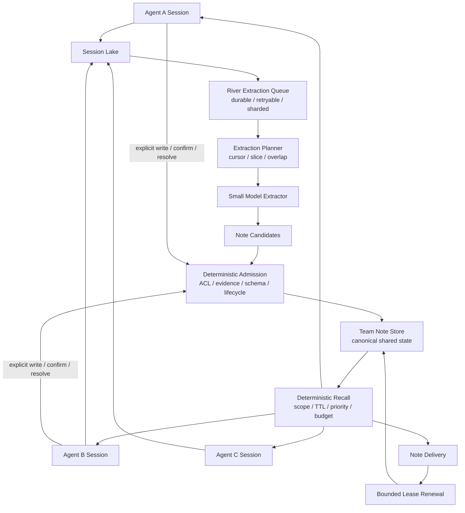
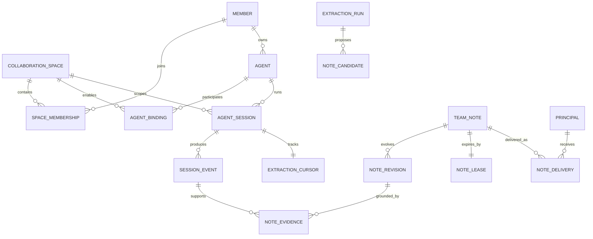

# PAX Team Note Architecture and Evaluation Design

- Status: design draft
- Scope: multi-agent collaboration spaces, Session Lake ingestion, small-model
  extraction, short-lived Team Notes, conservative delivery, and cross-agent
  evaluation
- Out of scope: LLM Wiki implementation, long-term knowledge consolidation,
  knowledge graphs, and semantic search across historical Sessions

### MVP identity decision

The external MVP payload does not carry `space_id`. paxm supplies `user_id`,
`agent_id`, and `session_id`; the server resolves an opaque collaboration scope
from the API key or provider configuration and places it in authenticated
request context. All database isolation remains keyed by that resolved scope.
This is a transport decision, not permission for clients to choose or widen
their own scope.

## 1. Executive summary

PAX Team Note is a shared, short-lived working state for a multi-agent
collaboration space. It is not a personal memory store, transcript summary, or
long-term knowledge base.

PAX records agent activity in an immutable Session Lake. A bounded small-model
pipeline reads incremental session slices and proposes Note Candidates. A
deterministic admission module verifies scope, evidence, authority, visibility,
duplication, and lifecycle policy before a Candidate becomes a Team Note.
Authorized agents receive active notes through exact collaboration scope. A
local embedding model may expand candidates within that already-authorized
active set; no online generative LLM participates in recall.

Each note has a soft TTL that real delivery or explicit confirmation may extend,
and a hard TTL that passive use can never exceed. Resolution, retraction, and
supersession take precedence over TTL.

The central rule is:

> The small model has proposal authority. Deterministic admission has memory
> authority. Source events retain factual authority.

## 2. Goals and non-goals

### Goals

- Give multiple Agents one canonical short-term collaboration state.
- Extract blockers, handoffs, status, next actions, open questions, and
  Artifact references from Agent Sessions.
- Process unbounded Session streams with bounded small-model context.
- Preserve exact speaker, Session, Space, time, and source evidence.
- Keep notes short-lived through TTL and bounded lease renewal.
- Deliver notes without online generative LLM calls; local embeddings may
  expand candidates before deterministic precision checks.
- Support concurrent Agents, conflicts, supersession, resolution, and audit.
- Prevent derived notes from widening source-event visibility.
- Measure construction, state, delivery, utility, safety, latency, and cost
  separately.

### Non-goals

- LLM Wiki or long-term project knowledge.
- Automatic graph construction or entity resolution.
- Semantic search across all historical Sessions.
- Automatic mutation of canonical task, membership, authorization, or approval
  state.
- Treating model confidence as authorization or truth.
- Permanently placing every Team Note in every Agent context.
- Replacing the Session Lake with extracted notes.

## 3. Domain language

- **Collaboration Space**: the highest Team Note isolation scope containing
  Members, Agents, Sessions, Tasks, Threads, Artifacts, and Team Notes.
- **Principal**: an identity that authors an event or receives a note; either a
  human Member or an Agent.
- **Member**: a human participant with a Space membership role.
- **Agent**: a stable execution identity owned or managed by a Member. An Agent
  is not a model name, process, or Session.
- **Agent Session**: one execution context for one Agent in one Space.
- **Session Event**: an immutable ordered event and source of evidence.
- **Session Slice**: a bounded projection of Session Events prepared for one
  extraction call.
- **Note Candidate**: a small-model proposal with no memory authority.
- **Team Note**: shared, short-lived collaboration state.
- **Note Revision**: an immutable version of a Team Note.
- **Note Evidence**: a link from a Revision to source Session Events.
- **Note Lease**: soft expiry, hard expiry, renewal cooldown, and confirmation
  state.
- **Note Delivery**: proof that one Revision entered one Principal's Session
  context.
- **Note Hit**: a real delivery or explicit use signal. Entering an internal
  candidate set is not a hit.

A workspace path is metadata, not a security identity, and must not replace a
`space_id`.

## 4. Architecture



There are two write paths:

1. automatic extraction: `Session Event -> Candidate -> Admission -> Team Note`;
2. explicit collaboration write: `Principal -> Admission -> Team Note`.

Explicit writes normally receive higher authority and a longer lease, but still
pass authorization, scope, visibility, and schema checks. Team Note is a
collaboration module, not another generic memory provider, and must not be
copied into independently mutable per-Agent memories.

## 5. Data model



### 5.1 CollaborationSpace

```text
space_id
name
status
created_at
updated_at
```

Every Session, Note, Membership, and Agent Binding belongs to exactly one Space.
No read or write is accepted without an explicit Space.

### 5.2 Member, Agent, Membership, and Binding

```text
Member:
  member_id
  account_id
  display_name

Agent:
  agent_id
  owner_member_id
  name
  actor_card_ref
  status

SpaceMembership:
  space_id
  member_id
  role                  owner | operator | member
  status
  joined_at
  removed_at

AgentBinding:
  space_id
  agent_id
  owner_member_id
  added_by_principal_id
  status
  joined_at
  removed_at
```

Owning an Agent does not automatically grant that Agent access to every Space.
AgentBinding is the explicit participation record.

### 5.3 AgentSession and SessionEvent

```text
AgentSession:
  session_id
  space_id
  agent_id
  workspace_ref
  task_ref
  thread_ref
  started_at
  ended_at
  state
  share_policy          private | team_note_eligible | team_visible

SessionEvent:
  event_id
  session_id
  space_id
  actor_principal_id
  sequence
  event_type
  content
  occurred_at
  captured_at
  visibility
  share_policy
  metadata
  checksum
```

Only eligible Sessions and Events contribute to automatic extraction. The
system, not the model, supplies identity, ordering, visibility, and scope.

The current capture queue already models event identity, Session key, source
sequence, terminal state, Episode completeness, missing sequences, checksum,
and integrity errors. These are suitable foundations for Session Slices. Space,
Principal, Task, Thread, and visibility should become typed collaboration data
rather than unvalidated metadata.

### 5.4 ExtractionCursor and ExtractionRun

```text
ExtractionCursor:
  space_id
  session_id
  last_processed_sequence
  last_episode_checksum
  updated_at

ExtractionRun:
  run_id
  space_id
  session_id
  from_sequence
  to_sequence
  input_checksum
  model
  prompt_version
  status
  candidate_count
  input_tokens
  output_tokens
  started_at
  completed_at
  error
```

Every Session has an independent cursor. ExtractionRun provides idempotency,
model and prompt provenance, retry visibility, and cost attribution.

### 5.5 NoteCandidate

```text
candidate_id
run_id
proposed_action         create | revise | resolve | noop
kind
scope
subjects
body
basis                   direct_statement | tool_observation | model_inference
confidence
evidence_event_ids
proposed_ttl
proposed_note_key
admission_status
rejection_reason
```

A Candidate without valid source evidence is rejected. A model-proposed key is
advisory; deterministic admission owns canonical identity.

### 5.6 TeamNote and NoteRevision

```text
TeamNote:
  note_id
  space_id
  scope_type            space | task | thread
  scope_id
  kind                  status | blocker | handoff | next_action |
                        open_question | artifact_reference
  subject_refs
  audience
  origin                extracted | agent | human | system
  origin_principal_id
  authority             authoritative | reported | inferred
  state                 active | conflicted | resolved | expired | retracted
  current_revision
  conflict_group_id
  created_at
  updated_at
  resolved_at

NoteRevision:
  revision_id
  note_id
  revision_number
  operation             create | update | resolve | retract
  body
  authority
  basis
  created_by_principal_id
  extraction_run_id
  valid_from
  valid_until
  supersedes_revision_id
  created_at
```

Scope says where the Note is relevant, subjects say what it describes, and
audience says who may read it. Validity time is separate from admission time.

### 5.7 Evidence, Lease, and Delivery

```text
NoteEvidence:
  evidence_id
  revision_id
  event_id
  session_id
  speaker_principal_id
  quote
  quote_hash
  occurred_at
  captured_at
  visibility

NoteLease:
  note_id
  soft_expires_at
  hard_expires_at
  last_delivered_at
  last_confirmed_at
  last_extended_at
  renewal_cooldown_until
  lease_version

NoteDelivery:
  delivery_id
  note_id
  revision_id
  principal_id
  session_id
  delivery_reason
  delivered_at
  context_position
  context_tokens
  renewal_eligible
```

Evidence is immutable. A Note is shared once; Delivery state is per Principal
and Session.

## 6. Bounded small-model extraction

The model never receives a complete long-running Session. The Extraction
Planner builds a Session Slice containing:

```text
session_id
from_sequence
to_sequence
ordered_events
one_or_two_turn_overlap
exact task/thread/actor metadata
active notes for the exact scope
prior candidate digest
```

New events should consume only a bounded portion of model context, initially
25% to 40%, leaving room for schema instructions, active state, and output. This
value is measured configuration, not a domain invariant.

Example rolling windows:

```text
slice 1: events 1-20
slice 2: events 19-38
slice 3: events 37-56
```

Stable Event IDs deduplicate overlap. The cursor advances only after the
Candidate batch is durable.

At Session completion, a bounded reconciliation pass reads the Candidate
ledger, active same-scope notes, and final structured tool outcomes. It does
not reread the full transcript. Extraction failure is fail-open, malformed
output is rejected, and retries reuse the same input checksum.

## 7. Deterministic admission and conflict

Admission applies:

```text
schema validation
-> evidence existence
-> Space and Session consistency
-> source visibility
-> Principal attribution
-> note-kind policy
-> authority classification
-> deterministic note key
-> duplicate, supersede, or conflict handling
-> TTL policy
-> commit
```

Automatically admissible content includes an Agent's direct statement about
its own work, explicit blockers and handoffs, concrete next actions, unresolved
questions, Artifact references, and structured tool results.

Membership changes, assignment authority, final approvals, credentials,
personal evaluations, inferred intent, and unsupported claims about other
Agents never become automatically authoritative.

Kind-specific keys are deterministic, for example:

```text
status:   space/task/subject-agent/status
handoff:  space/task/from-agent/to-agent/handoff
artifact: space/task/artifact-id
blocker:  space/task/subject/blocker/external-ref-or-stable-hash
```

If a safe key cannot be built, retain two Notes rather than ask the model to
merge them. Concurrent disagreement is preserved in a conflict group instead
of using arrival-order last-write-wins.

## 8. TTL and renewal

Initial defaults, to be tuned by evaluation:

| Kind | Soft TTL | Hard TTL |
|---|---:|---:|
| status | 24h | 7d |
| next_action | 48h | 7d |
| blocker | 48h | 14d |
| handoff | 72h | 14d |
| open_question | 72h | 14d |
| artifact_reference | 7d | 30d |

| Event | Renewal |
|---|---|
| enters an internal candidate set | none |
| is inserted into Agent context | short renewal |
| unchanged Note repeats in the same Session | none |
| Agent explicitly confirms or updates | long renewal or new Revision |
| Agent uses Note in a structured collaboration action | long renewal |
| Note is resolved, retracted, or superseded | renewal stops |

```text
new_soft_expiry = min(
  hard_expiry,
  max(old_soft_expiry, now + extension)
)
```

Renewal has a cooldown. A late Delivery cannot resurrect an expired Note, and
resolution or supersession always wins over TTL.

## 9. Conservative delivery

Recall uses no online generative LLM. A local CPU embedding model supplies a
semantic candidate lane; it never overrides authorization or deterministic
precision checks.

```text
input:
  principal_id
  space_id
  session_id
  task_ref
  thread_ref
  token_budget
  delivery_cursor

selection:
  authorize Principal
  -> active and unexpired
  -> exact scope
  -> audience
  -> suppress unchanged Revision already delivered to this Session
  -> lexical top-K + semantic top-K
  -> reciprocal rank fusion
  -> scalar-slot, ownership, kind, and recency rerank
  -> token budget
  -> NoteDelivery
  -> eligible renewal
```

Priority is directed handoff, current-task blocker, changed status, next action,
open question, Artifact reference, then Space-level note. Raw evidence is
inspected explicitly rather than inserted by default.

## 10. Visibility and authorization

Derived visibility cannot exceed evidence visibility:

```text
note.audience subset-of allowed_audience(evidence_events)
```

Private events are excluded unless explicitly marked Team Note eligible. Every
supporting evidence item must permit the proposed audience, or the remaining
shareable evidence must independently support the Candidate. Model confidence
never overrides authorization. Removing an AgentBinding immediately blocks
future delivery.

## 11. Product design influences

| Product | Adopt | Reject for Team Note |
|---|---|---|
| Letta | one shared object attached to multiple Agents; dynamic attachment | every shared block permanently visible |
| Mem0 | user, Agent, and run provenance; asynchronous extraction records | inferred memory as collaboration authority |
| Graphiti/Zep | Episode provenance; event time and validity time | graph storage, LLM entity resolution, semantic default recall |
| Hindsight | source facts separated from observations and beliefs | reflection and long-term mental models in this phase |
| LangMem | hierarchical namespaces and typed schemas | generic semantic memory management in passive recall |

References:

- [Letta memory blocks](https://docs.letta.com/guides/core-concepts/memory/memory-blocks)
- [Letta shared block attachment](https://docs.letta.com/tutorials/attaching-detaching-blocks/)
- [Mem0 add memories](https://docs.mem0.ai/api-reference/memory/add-memories)
- [Graphiti episodes](https://help.getzep.com/graphiti/core-concepts/adding-episodes)
- [Zep temporal facts](https://help.getzep.com/facts)
- [Hindsight paper](https://aclanthology.org/2026.acl-demo.27/)
- [LangMem namespaces](https://langchain-ai.github.io/langmem/concepts/conceptual_guide/)

### 11.1 Minimal Zep/Graphiti temporal slice

Zep models a fact as a relationship with two clocks: domain validity
(`valid_at` and `invalid_at`) and system knowledge time (`created_at` and
`expired_at`). New information invalidates an earlier edge instead of deleting
its history. Graphiti keeps the source episode so an answer can be traced back
to the event that established the fact.

The Team Note MVP adopts the same semantics without adopting a graph database:

- Session Lake events are episodes and remain the evidence/provenance layer.
- Note revisions preserve system-time history; superseded revisions receive
  `expired_at` and a domain-time `invalid_at` boundary.
- Current notes carry `valid_at`, `invalid_at`, and `source_occurred_at`.
- `related_subjects` forms explicit, scoped one-hop edges between extracted
  facts. Recall composes the linked fact into the same context item so a
  dependency date is not separated from the action that depends on it.
- Query terms and local Qwen3 embeddings independently rank current facts. RRF
  combines their top-K candidates before scalar-slot, kind, ownership, and
  recency rules. Invalid facts stay in revision history but are excluded from
  current passive recall.

This is intentionally not a general knowledge graph. It does not perform entity
resolution, arbitrary traversal, historical point-in-time queries, approximate
vector indexes, or model-based cross-encoder reranking. Those capabilities
should be justified by eval failures rather than added preemptively.

## 12. Module interfaces and repository fit

```text
ObserveSession(SessionSlice) -> ExtractionReceipt
WriteNote(WriteNoteCommand) -> TeamNote
ResolveNote(ResolveNoteCommand) -> TeamNote
RecallNotes(CollaborationContext, Budget) -> NoteEnvelope
AcknowledgeNote(NoteAcknowledgement) -> LeaseResult
```

`ObserveSession` belongs to background runtime. Agents receive only
least-privilege explicit write/confirm/resolve operations. Passive delivery
crosses RecallNotes only after runtime supplies authenticated collaboration
context.

The repository already has ordered, idempotent capture Episodes, fail-open
asynchronous delivery, separation between Agent and operator interfaces, and a
sandboxed cross-agent tracer. Team Note should not be another provider behind
generic `Recall/Remember`: generic provider memory lacks canonical Space,
Revision, Evidence, Conflict, Delivery, and Lease semantics.

## 13. Evaluation overview

Evaluation must answer seven separate questions:

1. Did the model propose the right collaboration information?
2. Did admission reject unsupported, unauthorized, or unsafe Candidates?
3. Does current Note state match gold state at each checkpoint?
4. Was the right Note delivered to the right Agent under a fixed budget?
5. Did TTL remove stale state and preserve useful state?
6. Did Team Note improve real downstream task outcomes?
7. What latency, tokens, and money produced the improvement?

No public benchmark covers all of these, so PAX uses a portfolio.

| Dataset | Priority | Measures | Limitation |
|---|---:|---|---|
| PAX TeamNoteBench | P0 | evidence, scope, authority, TTL, conflict, handoff, ACL, delivery | must be authored by PAX |
| GroupMemBench | P0 | multi-party/multi-channel memory, speaker grounding, updates, temporal order, terminology, abstention | no Team Note scope, evidence, or lifecycle labels |
| Existing PAX cross-agent tracer | P0 | real producer-to-consumer transfer and safe task success | only three scenarios today |
| MemoryArena | P1 | whether prior experience improves later action | multi-session, not natively multi-Agent |
| LongMemEval-V2 | P1 | compact evidence from huge trajectory history; workflows and gotchas | closer to durable experience than short notes |
| LongMemEval / LoCoMo | regression | update, temporal, abstention, long-conversation QA | dyadic personal-assistant framing |

## 14. GroupMemBench adaptation

[GroupMemBench](https://arxiv.org/abs/2605.14498) is the closest public match.
It provides enterprise-style multi-author, multi-channel logs with roles,
reply structure, timestamps, work phases, decision points, and distractors.
Questions cover multi-hop, knowledge update, temporal, user-implicit,
terminology ambiguity, and abstention.

The release has Finance, Technology, Healthcare, and Manufacturing domains and
roughly one hundred thousand messages. Finance and Technology questions are
solvability-filtered; Healthcare and Manufacturing are currently unfiltered.
It includes BM25 and dense retrieval baselines with a shared reader and judge.
See the [repository](https://github.com/KimperYang/GroupMemBench) and
[dataset card](https://huggingface.co/datasets/kimperyang/GroupMemBench).

The current public repository does not clearly include a license file. PAX
should not vendor the data until redistribution terms are clarified. Early work
should use an opt-in downloader pinned to an upstream revision.

### 14.1 Data mapping

| GroupMemBench | PAX |
|---|---|
| domain | Collaboration Space fixture |
| channel | Thread or Task collection |
| `User_n` | Principal / Agent fixture |
| role | Actor Card metadata |
| message | Session Event |
| timestamp | `occurred_at` |
| `reply_to` | cross-Session reply reference |
| `phase_name` | Task/work-phase scope |
| topic | Thread topic |
| `is_noise` | distractor label |
| decision/change metadata | update/supersession seed |
| `asking_user_id` | consumer Principal |

Partition messages into Agent Sessions by author, channel, phase, and
contiguous activity while preserving global timestamps and reply links. The
consumer cannot read other Agents' raw Events; it receives only selected Team
Notes.

For the official-compatible BM25 track, retrieval produces a sparse context
after the original conversation has been sampled. Treat `(author, channel,
phase)` as the contiguous-activity boundary for that sparse fixture; do not
infer additional idle-time splits from gaps where unselected messages are no
longer present. PAX-native full-conversation fixtures may use explicit activity
boundaries before retrieval.

### 14.2 Two score tracks

**Official-compatible QA** preserves questions, answers, reader, judge, and
per-type accuracy. It compares with official BM25/dense results but is labeled
group-memory QA, not Team Note extraction quality.

**PAX-native annotation** adds to a stable subset:

```text
consumer_context:
  space_id
  task_ref
  thread_ref
supporting_event_ids
expected_note_atoms
expected_authority
expected_active_interval
expected_superseded_event_ids
forbidden_event_ids
```

The public questions contain question, answer, and asking user, but no passive
delivery scope, source Event IDs, or gold note timeline. Without additional
annotation they cannot measure grounding, TTL, or exact-scope delivery.

Recommended split:

- development/prompt iteration: filtered Finance;
- primary held-out public test: filtered Technology;
- robustness-only: unfiltered Healthcare and Manufacturing;
- keep whole topics/phases together to avoid source leakage across splits.

## 15. PAX TeamNoteBench

PAX TeamNoteBench supplies the missing product semantics.

```yaml
scenario_id: string
space:
  principals: []
  memberships: []
  agent_bindings: []
sessions:
  - session_id: string
    principal_id: string
    task_ref: string
    thread_ref: string
    share_policy: string
    events: []
policy:
  clock_start: timestamp
  ttl_by_kind: {}
  renewal_cooldown: duration
checkpoints:
  - at: timestamp
    expected_active_notes: []
    expected_inactive_notes: []
consumer:
  principal_id: string
  session_id: string
  task: string
  expected_facts: []
  expected_actions: []
  forbidden_facts: []
  forbidden_actions: []
```

Each gold Note atom includes kind, scope, subjects, audience, authority,
canonical facts, evidence Event IDs, state timeline, expiry expectations, and
optional conflict group.

Required scenario families:

1. directed handoff;
2. blocker creation and resolution;
3. superseding stale status;
4. conflicting reports;
5. implicit subject or owner;
6. terminology and aliases;
7. temporal and out-of-order Events;
8. abstention and unsupported Candidate rejection;
9. soft/hard TTL, cooldown, and repeated hits;
10. private Session and cross-Space leakage;
11. duplicate replay, missing sequence, and retry;
12. extractor timeout, malformed output, and recovery.

The three existing tracer scenarios are seeds, not a statistical benchmark. A
reasonable first milestone is at least 80 deterministic fixtures across these
families and at least 30 paid real-Agent scenarios before making product
probability claims. Counts should be revisited after variance and cost are
measured.

## 16. Supplemental benchmarks

### Existing cross-agent tracer

Extend the existing sandboxed runner instead of creating another real-Agent
harness. It already isolates producer/consumer workspaces, hides the shared
channel, and reports task success, trap avoidance, Safe Success, recall hits,
sandbox audit, and duration. New arms should deliver typed Team Note envelopes
instead of generic recalled text.

### MemoryArena

[MemoryArena](https://memoryarena.github.io/) uses interdependent multi-session
tasks across web navigation, constrained planning, progressive search, and
formal reasoning, with CC-BY-4.0 data. Assign consecutive subtasks to different
Agent identities and allow only Team Notes to cross Sessions. Use it for action
utility, not attribution or ACL scoring.

### LongMemEval-V2

[LongMemEval-V2](https://github.com/xiaowu0162/LongMemEval-V2) has 451 manually
curated questions over up to 500 trajectories and 115M tokens. It evaluates
static state, dynamic state, workflows, environment gotchas, and premise
awareness while measuring answer accuracy and latency. Use it as a supplementary
producer-to-consumer experience-transfer test, not the primary Team Note score,
because much of its durable experience may later belong in the LLM Wiki.

### LongMemEval and LoCoMo

[LongMemEval](https://github.com/xiaowu0162/LongMemEval) and
[LoCoMo](https://github.com/snap-research/locomo) are useful regressions for
updates, temporal reasoning, abstention, and extraction. They do not establish
multi-Agent shared-memory quality because their framing is dyadic.

## 17. Experimental arms

All arms use the same consumer model, prompt, tool access, task environment,
context budget, and matched random seeds.

| Arm | Description | Purpose |
|---|---|---|
| Control | no cross-Agent information | base capability |
| Recent Window | bounded recent raw Events | test whether recency is enough |
| Session BM25 | lexical retrieval over authorized raw Events | strong cheap baseline |
| Gold Team Notes | human gold state and lifecycle | upper bound for representation/delivery |
| Extracted, fixed TTL | small-model Notes without hit renewal | isolate extraction/admission |
| Extracted, renewal | full passive TTL policy | renewal benefit versus stale risk |
| Extracted plus explicit writes | extraction plus confirm/write/resolve | intended product arm |
| Dense retrieval, optional | official dense baseline at equal budget | external comparison only |

Gold Notes are essential: if they do not improve outcomes, extractor tuning
cannot repair a bad representation or delivery policy.

## 18. Metrics

### 18.1 Extraction

```text
Candidate Precision = supported candidate atoms / proposed candidate atoms
Candidate Recall = recovered gold atoms / gold atoms
Candidate F1 = harmonic mean of precision and recall
Evidence Precision = valid cited Event links / all cited Event links
Evidence Recall = cited gold Event links / gold Event links
```

Also report kind, scope, subject, speaker, authority, and lifecycle-action
accuracy; malformed output rate; Candidates per 1,000 Events; and tokens per
useful Candidate.

### 18.2 Admission

Count unsupported or unauthorized admitted Notes, wrong-Space Notes, forged
evidence, secret-policy violations, replay duplicates, unsafe merges, and
authority promotions. These are deterministic metrics, not LLM judgments.

### 18.3 State and TTL

```text
Active State Precision = correct active atoms / predicted active atoms
Active State Recall = recovered active atoms / gold active atoms
Stale Active Rate = stale delivered notes / delivered active notes
Resolve Accuracy = correctly resolved notes / gold resolved notes
Conflict Preservation = preserved gold conflicts / gold conflicts
```

TTL metrics include soft-expiry correctness, hard-expiry violations,
renewal-without-delivery, repeated same-Session renewal, expired-note
resurrection, and useful-note premature expiry. Use a fake clock.

### 18.4 Delivery

```text
Critical Delivery Recall@Budget =
  delivered critical atoms / critical gold atoms

Context Precision =
  useful delivered atoms / all delivered atoms

Token Efficiency =
  useful delivered atoms / delivered context tokens
```

Also report targeted-handoff delivery, wrong recipient, changed-Revision
redelivery, unchanged suppression, recall latency, and context tokens. Recall@K,
Precision@K, MRR, and nDCG are supporting metrics for query-based benchmark
compatibility, not the primary passive-delivery metrics.

### 18.5 Downstream utility

For QA: exact match or rule scoring where possible, answer F1 where appropriate,
per-category accuracy, abstention accuracy, stale-answer rate, and blind LLM
judge only when deterministic scoring is insufficient.

For real Agent tasks:

```text
Task Success
Trap Avoidance
Safe Success = Task Success AND Trap Avoidance
Cross-Agent Lift = assisted Safe Success - control Safe Success
```

Record forbidden facts and actions so apparent success cannot hide unsafe use.

### 18.6 Safety, efficiency, and reliability

Safety counts: cross-Space leakage, private-source leakage, delivery after Agent
removal, wrong audience, unauthorized evidence inspection, and hidden fixture
access. The acceptable value is zero.

Efficiency/reliability: extraction and recall p50/p95 latency, reconciliation
lag, tokens and cost per 1,000 Events, cost per useful Note, storage growth,
retry/malformed rates, idempotent replay, out-of-order handling, and provider
outage behavior.

## 19. Evaluation protocol

Freeze dataset revision, repository commit, models, prompts, Note schema, TTL
policy, context budget, tool/sandbox policy, and seeds. Run every arm on the same
scenario and seed; use at least three matched seeds for stochastic real-Agent
runs when cost permits.

Questions in one Space/topic/phase are correlated. Report macro averages by
domain and question type, per-scenario results, cluster-bootstrap 95% confidence
intervals, paired-bootstrap arm differences, and Wilson intervals for small
binary Safe Success samples. Do not treat each question as independent.

Prefer exact/rule scoring. Blind LLM judges to the arm, pin the judge model,
preserve answers and rationales, and manually audit a stratified sample of
correct, incorrect, update, and abstention cases.

Prevent contamination:

- do not tune on held-out Technology;
- keep source topics/phases within one split;
- never expose questions or answers during ingestion;
- sandbox benchmark sources and result artifacts from Agents;
- retain failed trials and never cherry-pick seeds.

Every run manifest records commit, dataset revision/split, scenarios, model
versions, prompt hashes, TTL-policy hash, budget, seeds, timestamps, tokens,
cost, and artifact path.

## 20. CI and paid evaluation

Deterministic CI runs admission, authorization, note identity/conflict,
fake-clock TTL, replay/sequence, deterministic delivery/budget, and recorded
extractor-output fixtures. It makes no paid cross-Agent calls.

Opt-in extractor evaluation runs the real small model on the annotated set and
records model version, tokens, latency, and cost. Explicit paid cross-Agent
evaluation reuses the sandboxed runner, compares matched arms, stores immutable
manifests, and never enters normal CI.

Immediate release-blocking contracts:

- zero cross-Space/private-source leakage;
- zero hard-TTL violations or expired-note resurrection;
- zero forged evidence admitted;
- zero duplicate Notes after identical replay;
- zero delivery to a removed Agent;
- 100% deterministic lifecycle contract pass rate.

Quality budgets for Note precision/recall, stale delivery, attribution,
Cross-Agent Lift, cost, and latency are locked after the first development
baseline and before held-out testing. Thresholds must not be chosen after seeing
test results.

## 21. Recommended delivery sequence

1. Finalize entities and TeamNoteBench scenario schema.
2. Author deterministic TeamNoteBench fixtures.
3. Implement Note state, Revision, Evidence, TTL, and Recall contracts.
4. Add explicit write, confirm, resolve, and Delivery receipts.
5. Add Session Slice, Cursor, and ExtractionRun.
6. Integrate the small-model Candidate extractor.
7. Annotate the GroupMemBench PAX-native subset.
8. Extend the real cross-agent runner with Team Note arms.
9. Run opt-in MemoryArena and LongMemEval-V2 supplements.
10. Revisit LLM Wiki only after Team Note quality and utility are established.

## 22. Proposed decisions

1. One Collaboration Space owns one canonical Team Note state.
2. Agents have per-Session Delivery and Cursor state, not mutable note copies.
3. Session Events remain immutable evidence.
4. The small model emits Candidates and never writes canonical notes directly.
5. Admission and recall are deterministic and authorization-aware.
6. Recall is exact-scope and budget-driven, with local embedding candidate
   generation but no online generative LLM or model-based reranker.
7. Passive hits may extend soft TTL but never hard TTL.
8. Concurrent disagreement remains visible instead of last-write-wins.
9. GroupMemBench is the primary public benchmark, but PAX-native annotation is
   required for Team Note semantics.
10. TeamNoteBench and real cross-agent Safe Success are product gates; public
    QA accuracy is supporting evidence, not a substitute.
