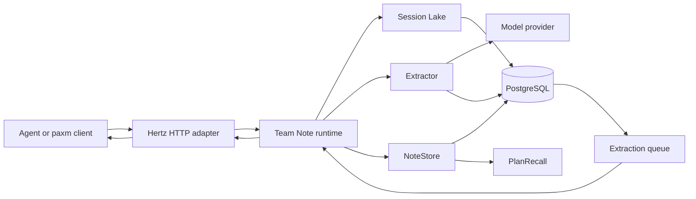
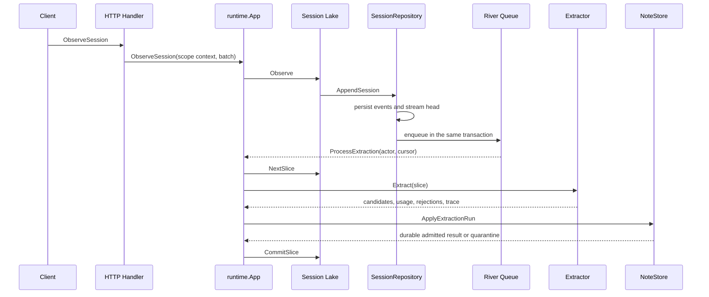
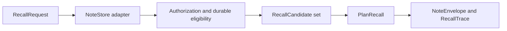

# Code Module Architecture

Status: Current implementation as of 2026-07-19

This document describes the module seams, dependency direction, runtime flows,
concurrency ownership, and verification contracts implemented in this
repository. Decision records under `docs/decisions/` explain why individual
policies exist; this document explains where the current code lives and how the
modules collaborate.

## System shape

`main.go` is the composition root. It creates concrete adapters, connects them
to the product modules, starts the queue and HTTP server, and drains owned work
during shutdown. Product modules do not create PostgreSQL, Hertz, River, or
model-provider clients themselves.

Dependency direction is inward toward the product contracts:

- `internal/session` defines product-independent identities and events.
- `internal/sessionlake` depends on `session`, but not on Team Note.
- `internal/teamnote` may depend on Session Lake, but not on Evaluation or LLM
  Wiki.
- `internal/eval` may depend on product modules; product modules never depend
  on Evaluation.
- `internal/platform` contains concrete infrastructure adapters selected by
  the composition root.

`internal/architecture/dependencies_test.go` enforces the product-level import
rules.

## Module map

| Module | Interface and seam | Implementation responsibility | Current adapters |
| --- | --- | --- | --- |
| Session Lake | `sessionlake.Repository` | Immutable event ingestion, bounded slices, overlap, checksums, and extraction cursors | `postgres.SessionRepository`, test repositories |
| Team Note runtime | `teamnote.Runtime`; queue-side `extractionqueue.Processor` | Orchestrates observe, slice, extract, atomic apply, cursor commit, and recall without owning policy details | `runtime.App` |
| Extraction | `extractor.Extractor`; optional `extractor.Lifecycle` | Converts one Session Slice into candidates and provenance; owns rolling context and provider calls | OpenAI-compatible, fixture, noop |
| Extraction Episode | `extractor.EpisodeStore` | Loads and optimistically saves rolling model context | `postgres.EpisodeStore`, memory episode store |
| Team Note state | `teamnote.NoteStore` | Atomic Extraction Run admission/replay and authorized recall | `postgres.NoteStore`, `teamnote.ScopedLedgerStore` |
| Recall policy | `teamnote.PlanRecall` | Ranking, relation expansion, selection, rejection trace, duplicate control, and shared token packing | One deterministic implementation used by every NoteStore adapter |
| Extraction scheduling | `extractionqueue.Processor` and `postgres.ExtractionEnqueuer` | Durable debounce, shard selection, retries, and worker lifecycle | River queue |
| HTTP transport | `teamnote.Runtime`, `handler.ScopeResolver` | Authentication-to-scope mapping and Thrift/Hertz request mapping | Static API keys and generated Hertz routes |
| PostgreSQL owner | `postgres.Store` accessors | Pool and migration ownership; constructs stable Session and Episode adapters | pgxpool |

These are real seams because production and test or memory adapters exercise
the same interfaces. Callers and tests should observe behavior through these
interfaces rather than reaching into private policy functions or SQL details.

## Ingestion and extraction flow

Important ordering constraints:

1. Event persistence and extraction enqueue commit atomically in
   `SessionRepository.AppendSession`.
2. The runtime persists or quarantines the complete Extraction Run before it
   advances the Session Lake cursor.
3. Transient extraction or storage errors leave the cursor unchanged so River
   can retry.
4. Deterministic admission failures are recorded as quarantined runs and allow
   the stream to advance; retrying the same invalid output cannot repair it.
5. Overlap Events provide context but only `NewEventIDs` advance the slice and
   form its input checksum.

## Extraction Run module

`internal/teamnote/extraction_run.go` is the shared decision module for memory
and PostgreSQL persistence. It owns:

- stable input identity validation;
- deterministic candidate-batch checksums;
- completed versus quarantined replay behavior;
- the rule that a durable result wins over recomputed candidates and usage;
- classification of deterministic errors that should be quarantined.

`NoteStore.ApplyExtractionRun` is the persistence seam. Adapters own transaction
mechanics, but must call the shared Extraction Run decisions so replay and
quarantine behavior cannot drift between memory tests and PostgreSQL.

An Extraction Run is atomic: a candidate batch is admitted as one decision. It
must not be decomposed into independent adapter calls, because that would lose
the run-level idempotency and quarantine contract.

## Rolling extractor and concurrency ownership

The OpenAI-compatible extractor groups rolling work by `EpisodeKey`:
`scope_id + task_ref + thread_ref`. Multiple producer sessions may therefore
advance one collaboration episode.

The extractor owns four kinds of concurrency state:

| State | Protection and lifecycle |
| --- | --- |
| Foreground extraction | Counted by the lifecycle coordinator; rejected after `Close` begins |
| Episode mutation in one process | Reference-counted per-key lease; idle lock entries are reclaimed |
| Cross-process episode mutation | PostgreSQL optimistic version; conflict reloads and replays a committed matching run or retries once |
| Summary or compaction calls | Singleflight per Episode; owned Context is canceled by `Close`; completion and errors are drained |

`WaitForBackground` is intended for evaluation harnesses that must retain all
provider-call telemetry before closing their journal. `Close` additionally
prevents new extractions and cancels extractor-owned background calls. The
composition root stops the queue before closing the extractor, so workers do
not create new foreground work while extraction is draining.

Repeated cross-process conflicts after the bounded in-call retry return
`ErrEpisodeConflict` through wrapped operation errors. The durable queue then
owns the next retry. A provider transport is expected to honor request Context;
a transport that ignores cancellation cannot be forcibly terminated by Go.

## Recall flow and policy locality

`RecallNotes` remains the external module interface. Each NoteStore adapter is
responsible for loading only scope-authorized, temporally eligible durable
candidates and their adapter-specific lexical or semantic observations.

Everything after candidate construction belongs behind `PlanRecall`:

- intent compilation and retrieval-lane attribution;
- ranking and evidence scorecards;
- relation traversal in either direction;
- duplicate suppression and relation degradation;
- final selection and the shared token budget;
- explicit rejection and budget-drop reasons;
- optional selective Hint Recall.

`RecallCandidateStrategy` carries a complete `RecallPolicy`. The build-time
strategy selects the distributed baseline, while supported environment
variables may override individual fields for compatible deployments and
controlled evaluation. `DefaultRecallPolicy` is shared by memory and
PostgreSQL adapters, including the candidate limit, so the same replay fixture
cannot silently observe different default planning behavior.

Extraction and recall are separate control loops. A missing answer is a recall
failure only when the required fact is present in the persisted extraction
observation. Extraction traces, recall traces, and answer judging must remain
separate evidence.

## PostgreSQL adapter ownership

`postgres.Store` owns only the connection pool and schema migrations. It
constructs and returns stable adapters:

- `Sessions()` returns `SessionRepository` for Session Lake storage and atomic
  queue enqueue.
- `Episodes()` returns `EpisodeStore` for rolling extractor state.
- `NewNoteStore` creates the Team Note state and recall adapter with explicit
  TTL, clock, embedding, and Recall Policy dependencies.
- `Pool()` is exposed only for infrastructure modules that genuinely require
  the shared database, currently River and integration setup.

`SessionRepository.ConfigureExtractionEnqueuer` is configure-once and guarded
by a read/write mutex. It is composition wiring, not mutable runtime policy.
New SQL behavior should be added to the narrow adapter that owns the table and
contract instead of growing `Store` back into a single broad repository.

## HTTP transport ownership

Thrift files under `idl/` remain the source of truth for HTTP interfaces.
Generated Hertz routes and generated handler entry points contain only request
dispatch. Handwritten authorization, domain mapping, logging, and error mapping
live in `transport/httpapi/handler/endpoints.go` and related handwritten files.

Each Hertz server receives its own `handler.Handler` through
`InstanceMiddleware`. There is no package-global runtime configuration. This
allows concurrent server instances in one process without leaking runtime,
scope resolver, or logger state between them.

Scope comes from the authenticated credential through `ScopeResolver`; event
payloads cannot select their own collaboration scope.

## Error and failure contracts

- Modules wrap errors with operation context and preserve causes for
  `errors.Is` and `errors.As`.
- Context cancellation is retryable unless it occurs during intentional
  extractor shutdown, where cancellation of owned background work is expected.
- `ErrExtractionRunConflict` means the same durable run ID was attempted with
  different stable inputs or incompatible durable state.
- `ErrExtractionRunQuarantined` means deterministic admission failed and the
  recorded result must be replayed rather than recomputed indefinitely.
- `ErrEpisodeConflict` means optimistic rolling-episode persistence lost a
  race after local recovery was exhausted.
- Transport responses do not expose internal error strings; detailed causes
  are logged at the adapter.

## Verification map

| Contract | Primary verification |
| --- | --- |
| Product dependency direction | `internal/architecture/dependencies_test.go` |
| Extraction Run normalization, replay, and quarantine | `internal/teamnote/extraction_run_test.go` plus both NoteStore adapter suites |
| Shared Recall Policy behavior | `internal/teamnote/recall_test.go`, `store_test.go`, and PostgreSQL cross-adapter contract tests |
| Extractor lifecycle, conflict recovery, and lock reclamation | `internal/teamnote/extractor/openai_test.go` under the race detector |
| Atomic event ingestion and queue scheduling | PostgreSQL and extraction queue integration tests |
| HTTP instance isolation | `internal/teamnote/transport/httpapi/router/register_test.go` under the race detector |
| PostgreSQL semantics | Real PostgreSQL tests; SQLite is not a substitute |

The repository gate is `make lint test`. Handwritten changed packages must keep
aggregate unit coverage at or above 75 percent, and concurrency-sensitive
modules should also be exercised with `go test -race`.

## Placement rules for future changes

- Put domain decisions and invariants in `internal/teamnote`, behind an existing
  interface when possible.
- Put orchestration and ordering in `internal/teamnote/runtime`; do not move
  ranking or admission decisions there.
- Put provider-specific extraction behavior behind `extractor.Extractor` and
  keep prompt, decoder, and protocol revision in one candidate registry entry.
- Put SQL and transaction mechanics in the owning PostgreSQL adapter; do not
  duplicate domain decisions in SQL callers.
- Keep generated Hertz code free of handwritten domain logic.
- Keep ranking, relation expansion, selection, and budget packing behind
  `PlanRecall`; keep `RecallNotes` stable for callers.
- Add a new seam only when behavior actually varies across at least two
  adapters. Otherwise prefer a private implementation detail.
- Verify observable behavior through module interfaces rather than private
  functions.
