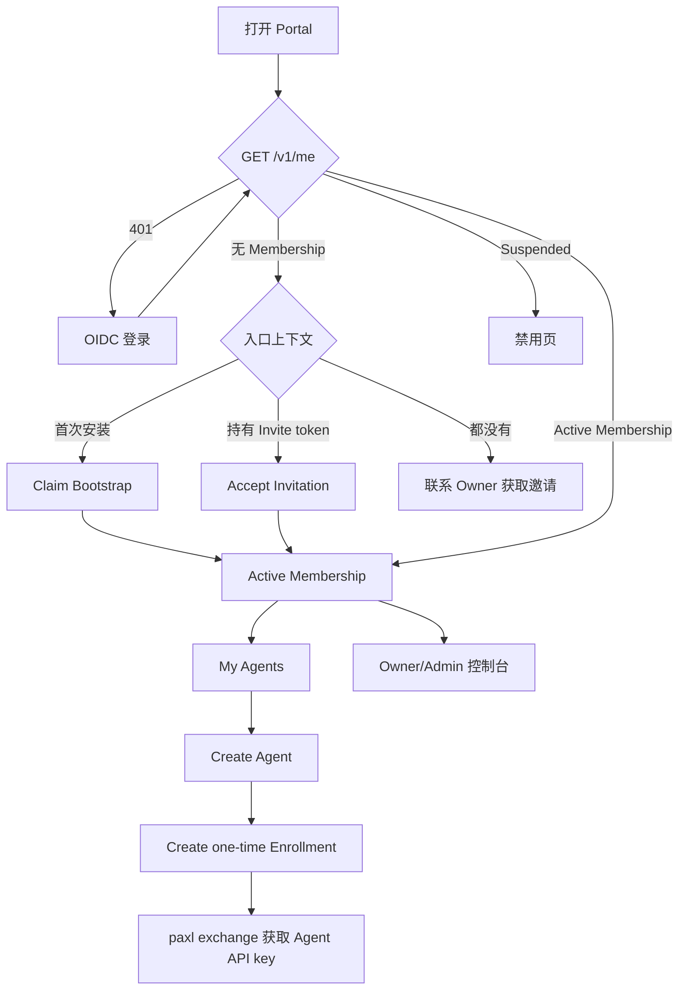

# On-prem Identity 与 Agent Registry 前端接入指南

状态：基于 `idl/team_memory.thrift` 和当前 Hertz handler 的已实现契约。

本文面向 Human Portal 前端，覆盖首次安装、OIDC 登录、邀请加入、成员治理、个人 Agent 注册、一次性 Enrollment、Agent Credential 元数据和管理员审计。架构原因与数据模型见 [On-prem Identity and Agent Registry ADR](./decisions/2026-07-21-on-prem-identity-and-agent-registry.md)。Operations 管理页另见 [On-prem Operations 前端接入指南](./on-prem-operations-frontend-integration.md)。

## 1. 当前接入边界

前端应先按以下边界实现：

- Portal 与 Team Memory API 必须部署在同一 origin，或者由同一网关反向代理到同一 origin。当前服务没有给 Portal 提供跨域 CORS/preflight 支持。
- Human API 使用 OIDC 登录后的 Cookie Session，不使用 Agent API key。
- Agent Directory 和 Capsule Channel 使用 Agent API key，不是 Human Portal 接口。
- Invitation token、Enrollment token 和 Agent API key 都是 secret。前两个只在创建响应中出现一次；API key 只在 Agent 客户端交换 Enrollment token 时返回，Portal 永远不应读取或保存它。
- Human API 错误响应是稳定 JSON envelope：`{"code":"<stable_code>","message":"<safe_message>"}`。前端按 status + code 做流程分支，不得按 message 文案匹配。
- 当前实现没有 rate limiter，不能依赖 `429`；但统一请求层应保留对 `429 Retry-After` 的兼容处理。

如果环境只配置了旧的 `TEAM_MEMORY_ADMIN_API_KEY`，Human Identity API 会返回 `501 Not Implemented`。Portal 上线前必须完整配置 `TEAM_MEMORY_BOOTSTRAP_SECRET`、`TEAM_MEMORY_OIDC_*`、`TEAM_MEMORY_SECRET_PEPPER` 和 `TEAM_MEMORY_PORTAL_URL`。

## 2. 前端需要理解的对象

### 2.1 User、Membership、Agent、Credential

- `User`：OIDC subject 对应的人。第一次成功登录时由后端自动创建或更新，没有单独的“注册用户”接口。
- `Membership`：User 在这套单 Team 安装里的角色和状态。一个已登录 User 可以暂时没有 Membership。
- `Agent Profile`：Human 所有、可编辑的 Agent 身份。`agent_id` 是稳定且不可修改的全局标识。
- `Enrollment`：把某个 Agent 安全接入客户端的一次性、短期 token。
- `Credential`：Agent 客户端持有的长期 API key。Portal 只能看到非敏感元数据和执行吊销。

### 2.2 角色能力

| 能力 | Owner | Admin | Member |
| --- | --- | --- | --- |
| 邀请 Member | 是 | 是 | 否 |
| 邀请 Admin | 是 | 否 | 否 |
| 查看成员和审计 | 是 | 是 | 否 |
| 查看 Operations | 是 | 是 | 否 |
| 管理 Member | 是 | 是 | 否 |
| 管理 Owner/Admin | 是 | 否 | 否 |
| 管理自己的 Agent | 是 | 是 | 是 |
| 查看全部 Agent | 是 | 是 | 否 |
| 暂停任意 Agent | 是 | 是 | 否 |
| 编辑、恢复、retire、转移任意 Agent | 是 | 否 | 否 |
| Claim 首个 Owner | 仅首次安装 | 否 | 否 |

系统必须始终保留至少一个 active Owner。最后一个 active Owner 不能被降级、暂停或移除。

### 2.3 状态机

Membership：

```text
active <-> suspended
active/suspended -> removed
removed -> terminal
```

Agent：

```text
active <-> suspended
active/suspended -> retired
retired -> terminal
```

Invitation：`pending -> accepted | revoked | expired`。

Enrollment：`pending -> consumed | revoked | expired`。

Credential 的响应里没有独立 `status` 字段。前端可按 `revoked_at`、`expires_at` 和当前时间展示 active/expired/revoked，但服务端过滤结果才是权威状态。

## 3. HTTP、Cookie 和请求封装

### 3.1 登录与 Cookie

`GET /v1/auth/login` 是浏览器顶层跳转入口，会 `302` 到 OIDC Provider，不要用 `fetch` 调用：

```ts
window.location.assign("/v1/auth/login");
```

OIDC callback 成功后，后端会设置：

| Cookie | JavaScript 可读 | Path | SameSite | 用途 |
| --- | --- | --- | --- | --- |
| `tm_oidc_flow` | 否 | `/v1/auth` | `Lax` | 短期 OIDC state/PKCE flow |
| `tm_human_session` | 否 | `/` | `Lax` | Human Session |
| `tm_csrf` | 是 | `/` | `Lax` | double-submit CSRF token |

`tm_human_session` 的当前有效期是 12 小时。生产 Cookie 默认 `Secure=true`；本地纯 HTTP 开发必须显式设置 `TEAM_MEMORY_HUMAN_COOKIE_SECURE=false`。

所有 Human API 请求都使用：

```ts
credentials: "include"
```

所有 `POST`、`PATCH`、`DELETE` Human 请求还必须把 `tm_csrf` Cookie 原样放到 `X-CSRF-Token` header。缺失或不一致返回 `403`。

### 3.2 推荐的 API wrapper

```ts
class ApiError extends Error {
  constructor(
    readonly status: number,
    readonly diagnostic: string,
    readonly code?: string,
  ) {
    super(`API request failed with ${status}`);
  }
}

function readCookie(name: string): string | undefined {
  const prefix = `${encodeURIComponent(name)}=`;
  return document.cookie
    .split(";")
    .map((part) => part.trim())
    .find((part) => part.startsWith(prefix))
    ?.slice(prefix.length);
}

async function humanFetch<T>(path: string, init: RequestInit = {}): Promise<T> {
  const method = (init.method ?? "GET").toUpperCase();
  const headers = new Headers(init.headers);
  headers.set("Accept", "application/json");

  if (!["GET", "HEAD", "OPTIONS"].includes(method)) {
    const csrf = readCookie("tm_csrf");
    if (!csrf) throw new Error("Missing CSRF cookie");
    headers.set("X-CSRF-Token", decodeURIComponent(csrf));
  }

  const response = await fetch(path, {
    ...init,
    method,
    headers,
    credentials: "include",
  });

  if (!response.ok) {
    const body = await response.text();
    try {
      const parsed = JSON.parse(body) as { code?: unknown; message?: unknown };
      if (typeof parsed.code === "string" && typeof parsed.message === "string") {
        throw new ApiError(response.status, parsed.message, parsed.code);
      }
    } catch (err) {
      if (err instanceof ApiError) throw err;
    }
    throw new ApiError(response.status, body);
  }
  return (await response.json()) as T;
}
```

不要在 wrapper 内对所有 `401` 立即重定向。邀请接受页需要先保留 join continuation，再进入登录流程。更稳妥的做法是由路由层根据当前页面处理 `401`。

### 3.3 幂等与并发控制

以下请求支持 `Idempotency-Key`：

- `POST /v1/invitations/accept`
- `POST /v1/me/agents`
- `DELETE /v1/me/agents/:agent_id`
- `DELETE /v1/admin/agents/:agent_id`
- Human/Admin 下的 Enrollment 和 Credential revoke

每次用户动作生成一个 `crypto.randomUUID()`，网络重试复用同一个 key；用户重新发起的新动作使用新 key。同一个 key 对应不同请求意图会返回 `409`。

Invitation 创建和 Enrollment 创建会返回一次性 secret，但目前不支持 Idempotency-Key。发生网络超时时不要自动重试：先刷新列表，确认是否已经产生 pending 记录；由用户选择吊销并重新创建。否则可能生成多个有效 secret，且前端拿不到第一次响应里的明文 token。

所有更新 Member/Agent 的请求都使用 `resource_version` 做乐观锁。推荐同时发送 body 和 `If-Match`：

```http
If-Match: "7"
Content-Type: application/json

{"status":"suspended","resource_version":7}
```

`If-Match` 支持 `7`、`"7"` 和 `W/"7"`。header 与 body 不一致返回 `400`；版本过期返回
`409 resource_version_conflict`。只有该 code 表示应重新 GET 并显示“内容已被其他管理员
修改”；其他 409 应按 code 给出对应提示，不要一律 refetch，也不要静默覆盖。

### 3.4 分页

所有 list 接口：

- `limit` 默认 50，范围 1 到 100；非法值返回 `400`。
- 响应存在 `next_cursor` 时，用它请求下一页。
- cursor 必须当作 opaque string 原样传回，不要解析、递增或持久依赖其当前格式。
- filter 变化时清空 cursor 和已加载列表。

## 4. 全局登录路由

Portal 启动时先调用 `GET /v1/me`：



```json
{
  "user_id": "usr_01",
  "email": "alice@example.com",
  "email_verified": true,
  "membership_id": "mbr_01",
  "role": "member",
  "membership_status": "active",
  "capabilities": []
}
```

`capabilities` 是 required string list。当前显式发布 `view.operations`；新增 Operations
入口应按该服务端 capability 判断，未知值忽略。其他既有入口暂时仍使用角色 matrix，但任何
前端判定都不能覆盖后端逐请求授权。

建议路由判定：

| 结果 | 页面 |
| --- | --- |
| `401` | 登录页；保留邀请 continuation 后跳 OIDC |
| `501` | 安装未启用 Human Identity 的运维提示页 |
| 200 且无 `membership_id` | Join/Bootstrap 页 |
| `membership_status=active` | 普通 Portal；按 `role` 控制管理员入口 |
| `membership_status=suspended` | 禁用页；提示联系管理员 |

Membership 被 suspended 或 removed 时，后端会撤销 Human Session。已有页面下一次请求通常收到 `401`；前端应清空缓存的 `me`、Member 和 Agent 数据。removed 是终态，新登录后可能表现为“已登录但无 Membership”，需要新邀请，不是“恢复账号”。

不要仅依赖前端隐藏按钮做权限控制。角色切换、暂停和 Session 撤销可能发生在另一个浏览器窗口，后端仍会逐请求校验。

OIDC callback 当前总是跳到固定的 `TEAM_MEMORY_PORTAL_URL`，不会回显原页面。进入 `/v1/auth/login` 前，前端可把经过校验的站内相对路由放到 `sessionStorage`；登录后读取一次并删除。只接受以 `/` 开头且不含 origin 的内部路径，避免 open redirect。Invitation token 使用独立的 `pending_invitation` continuation，不要混进普通 return URL。

## 5. 用户动线

### 5.1 首次安装：Claim 首个 Owner

```text
打开 Portal
  -> GET /v1/me 返回 401
  -> 顶层跳转 /v1/auth/login
  -> OIDC callback 设置 Cookie 并跳回 TEAM_MEMORY_PORTAL_URL
  -> GET /v1/me 返回已登录、无 Membership
  -> 用户进入 Bootstrap 页面并手工输入 bootstrap secret
  -> POST /v1/bootstrap/claim
  -> 返回 role=owner/status=active
  -> 进入 Owner 控制台
```

请求：

```http
POST /v1/bootstrap/claim
X-PAX-Bootstrap-Secret: <operator-provided-secret>
X-CSRF-Token: <tm_csrf>
```

前端不得把 bootstrap secret 放入 URL、localStorage、日志、埋点或错误报告。请求结束后立即清空输入框状态。

边际场景：

- secret 错误或当前 User 已有 Membership：`403`。
- 已有 Owner 或 bootstrap 已经被其他人抢先 claim：`409`。刷新 `/v1/me`；如果仍无 Membership，引导用户联系 Owner 获取邀请。
- bootstrap 一旦成功永久关闭，旧 static Admin key 也停止认证。Portal 不应再显示 Claim 入口。
- 多个浏览器同时 claim 时只有一个成功，失败方不能覆盖首个 Owner。

### 5.2 Owner/Admin 邀请用户

Owner 可邀请 `admin` 或 `member`；Admin 只能邀请 `member`。
Owner 可吊销任意 pending 邀请；Admin 只能吊销 `member` 邀请。

```http
POST /v1/admin/invitations
Content-Type: application/json
X-CSRF-Token: <tm_csrf>

{
  "target_email": "bob@example.com",
  "role": "member",
  "expires_in_seconds": 86400
}
```

默认有效期 24 小时；必须大于 0，最大 7 天。创建成功返回：

```json
{
  "invitation_id": "inv_01",
  "token": "tm_invite_inv_01.secret",
  "target_email": "bob@example.com",
  "role": "member",
  "status": "pending",
  "created_at": "2026-07-21T18:00:00Z",
  "expires_at": "2026-07-22T18:00:00Z"
}
```

`token` 只出现在这次响应。前端应立即生成 join URL 并提供一次 Copy/Share：

```text
https://portal.example/join#invite=tm_invite_inv_01.secret
```

如果 Portal 是 hash router，可使用 `https://portal.example/#/join?invite=...`。关键要求是 token 位于 URL fragment 内，不出现在服务端 access log、Referer query 或 analytics 参数中。

邀请列表不会再次返回 token。token 丢失时只能 revoke 旧邀请并重新创建。列表支持 `status=pending|accepted|revoked|expired`。

### 5.3 受邀用户注册并接受邀请

“注册”由首次 OIDC 登录自动完成，没有 email/password 注册表单：

```text
用户打开 join URL
  -> 前端从 fragment 读取 token
  -> 立即擦除地址栏 fragment，并仅在当前 tab 的 sessionStorage 暂存
  -> 若未登录，跳 /v1/auth/login
  -> OIDC callback 后回 Portal
  -> GET /v1/me
  -> POST /v1/invitations/accept，body 携带 token
  -> 删除 sessionStorage 中的 token
  -> 返回 active Membership，进入 Portal
```

fragment 擦除示例：

```ts
const token = new URLSearchParams(location.hash.slice(1)).get("invite");
if (token) {
  sessionStorage.setItem("pending_invitation", token);
  history.replaceState(null, "", location.pathname + location.search);
}
```

如果使用 hash router，应由 router 解析 `#/join?invite=...`，再调用 `replaceState` 切到不带 token 的路由。不要把 token 放入 Redux persistence、localStorage、Sentry breadcrumb 或 analytics event。

接受请求：

```http
POST /v1/invitations/accept
Idempotency-Key: <stable-uuid-for-this-accept>
X-CSRF-Token: <tm_csrf>
Content-Type: application/json

{"token":"tm_invite_inv_01.secret"}
```

后端要求 OIDC email 已验证，并按大小写不敏感方式精确匹配 `target_email`。

边际场景：

- token 过期、已撤销、已使用、格式错误、email 未验证或 email 不匹配：统一 `410`，避免泄漏邀请详情。显示“邀请无效，请联系管理员重新邀请”。
- 用户已经有 active/suspended Membership：`409`。不要把邀请用于覆盖现有角色。
- 相同用户用相同 Idempotency-Key 重放已成功接受请求：返回同一成功结果。
- OIDC callback 失败或用户取消登录：保留当前 tab 的 invitation continuation，允许重试；用户主动取消 Join 时删除它。
- 用户在另一个 tab 成功接受：当前 tab 的接受可能得到 `410`；刷新 `/v1/me` 后如果已经 active，应直接进入 Portal。

### 5.4 用户注册个人 Agent

```text
进入 My Agents
  -> GET /v1/me/agents
  -> Create Agent 表单填写 agent_id、display_name 等
  -> POST /v1/me/agents + Idempotency-Key
  -> 进入 Agent detail
```

```http
POST /v1/me/agents
Idempotency-Key: <uuid>
X-CSRF-Token: <tm_csrf>
Content-Type: application/json

{
  "agent_id": "alice-codex",
  "display_name": "Alice Codex",
  "description": "Reviews Go changes",
  "agent_type": "codex",
  "directory_visible": true
}
```

规则：

- `agent_id` 必填、全局唯一、最大 128 字符，不能含 `/`、`\\` 或控制字符；创建后不可修改。
- `display_name` 必填、trim 后非空、最大 200 字符。
- 未传 `directory_visible` 时当前默认 `true`。建议前端总是明确发送用户选择，避免默认值变更造成歧义。
- 重复 `agent_id` 返回 `409`。相同 Idempotency-Key 和相同意图重试会返回已创建 Agent；相同 key 对应不同意图返回 `409`。
- 只有 active Membership 可以使用 My Agents。

编辑 Agent 必须带最新 `resource_version`。自己的 Agent 可以在 `active` 与 `suspended` 之间切换，也可以 retire。`retired` 不可恢复。

暂停或 retire Agent 会立刻吊销它的 Credential 和 pending Enrollment；重新 active 不会恢复旧 key，必须创建新的 Enrollment。

### 5.5 为 Agent 签发 Enrollment

Portal 签发的是一次性 Enrollment token，不是 API key：

```http
POST /v1/me/agents/alice-codex/enrollments
X-CSRF-Token: <tm_csrf>
Content-Type: application/json

{
  "credential_label": "Alice MacBook",
  "permissions": ["observe", "search", "get", "channel_send", "channel_receive"],
  "expires_in_seconds": 900,
  "credential_expires_at": "2026-10-21T18:00:00Z"
}
```

- `credential_label` 必填。
- `permissions` 必须显式、非空，只能取 `observe`、`search`、`get`、`channel_send`、`channel_receive`，并受部署配置 `TEAM_MEMORY_MEMBER_GRANTABLE_PERMISSIONS` 限制。
- Enrollment token 默认 15 分钟过期；`expires_in_seconds` 不能为负。前端建议限制为短期选项，不提供无限或超长 token。
- `credential_expires_at` 可选，格式为 RFC 3339；前端应校验为未来时间。

成功响应：

```json
{
  "enrollment_id": "enr_01",
  "token": "tm_enroll_enr_01.secret",
  "expires_at": "2026-07-21T18:15:00Z"
}
```

同 Invitation 一样，token 只返回一次。页面应显示一次 Copy 按钮、过期倒计时和客户端接入命令，不写入持久存储。用户随后在 paxl/Agent 客户端调用：

```http
POST /v1/agent-enrollments/exchange
Content-Type: application/json

{"token":"tm_enroll_enr_01.secret"}
```

exchange 成功后只有客户端收到 `api_key`。Portal 可轮询 Enrollment 列表，观察 `pending -> consumed`，再刷新 Credential 列表。不要要求用户把 API key 粘回 Portal。

边际场景：

- token 丢失：revoke pending Enrollment，再创建新的。
- 创建请求超时：不要盲目重试；先刷新 pending 列表。
- exchange 返回 `410`：token 已过期、吊销或使用；Portal 生成新 Enrollment。
- Agent 或 Membership 在 exchange 竞争窗口中被暂停、移除或转移：exchange 失败，不能产生仍有效的 key。
- Agent 恢复 active 后，旧 Credential 仍保持 revoked。

### 5.6 管理成员

```text
Admin/Owner 打开 Members
  -> GET /v1/admin/members
  -> GET /v1/admin/members/:membership_id
  -> PATCH 更新 role/status + If-Match
  -> 成功后刷新 Member、Agent 和 Audit 视图
```

Owner 可以管理所有角色；Admin 只能管理 Member，不能修改 Owner/Admin。removed 是终态，不能通过 PATCH 恢复；需要让用户重新走邀请。

暂停或移除 Membership 会撤销该用户的 Human Sessions、Agent Credentials 和 pending Enrollments。恢复 suspended Membership 不会恢复旧 Credential，用户需要为 Agent 重新签发 Enrollment。

最后一个 active Owner 的降级、暂停或移除返回 `409 last_active_owner`。前端应明确显示
“必须先提升另一位 active Owner”。不要根据当前已加载的分页预判并禁用按钮：当前页可能
不是全量数据，服务端事务内校验才是唯一权威判定。

### 5.7 管理全部 Agent

Owner/Admin 可使用 `/v1/admin/agents` 查看所有 Agent，并按 owner、status、query 过滤。

- Admin 只能把 Agent 设为 `suspended`，不能改资料、恢复、retire 或 transfer。
- Owner 可以编辑资料、暂停/恢复、通过 `DELETE /v1/admin/agents/:agent_id` retire，以及 transfer。
- PATCH 只处理资料和 `active`/`suspended` 状态；不得用 PATCH `status=retired` 代替 DELETE。
- Transfer 只允许转给 active Membership，且目标 Agent 不能已 retired。
- Transfer 会吊销旧 Owner 下的所有 Credential 和 pending Enrollment。新 Owner 必须重新签发 Enrollment。
- Owner/Admin 都可以查看并吊销任意 Agent 的 Enrollment/Credential。

### 5.8 审计

Owner/Admin 可以查看 immutable Audit Event。列表支持：

- `actor_kind`
- `action`
- `target_kind`
- `target_id`
- `limit`
- `cursor`

响应提供 actor/target ID 和时间，不包含可直接展示的人名或扩展 metadata。前端需要用已加载的 Member/Agent 数据做非权威的 label enrichment，并保留原始 ID，避免对象删除后审计记录无法展示。

## 6. Human Portal API 清单

### 6.1 Auth 与当前用户

| 方法 | 路径 | 身份 | 说明 |
| --- | --- | --- | --- |
| GET | `/v1/auth/login` | 无 | `302` 到 OIDC Provider |
| GET | `/v1/auth/callback?code=&state=` | OIDC flow cookie | 设置 Session/CSRF Cookie 并跳 Portal |
| POST | `/v1/auth/logout` | Human + CSRF | 撤销 Session 并清 Cookie |
| GET | `/v1/me` | Human | 返回 User 和可选 Membership |
| POST | `/v1/bootstrap/claim` | Human + CSRF + bootstrap header | 首次 claim Owner |
| POST | `/v1/invitations/accept` | Human + CSRF | 接受邀请 |

### 6.2 邀请、成员和审计

| 方法 | 路径 | 角色 | 说明 |
| --- | --- | --- | --- |
| POST | `/v1/admin/invitations` | Owner/Admin | 创建邀请；token 仅返回一次 |
| GET | `/v1/admin/invitations?status=&limit=&cursor=` | Owner/Admin | 邀请列表，不返回 token |
| DELETE | `/v1/admin/invitations/:invitation_id` | Owner/Admin | 吊销 pending 邀请 |
| GET | `/v1/admin/members?role=&status=&limit=&cursor=` | Owner/Admin | 成员列表 |
| GET | `/v1/admin/members/:membership_id` | Owner/Admin | 成员详情 |
| PATCH | `/v1/admin/members/:membership_id` | Owner/Admin | 更新 role/status，需 version |
| GET | `/v1/admin/audit-events?...` | Owner/Admin | 审计列表 |
| GET | `/v1/admin/audit-events/:audit_event_id` | Owner/Admin | 审计详情 |

### 6.3 My Agents

| 方法 | 路径 | 说明 |
| --- | --- | --- |
| GET | `/v1/me/agents?status=&limit=&cursor=` | 自有 Agent 列表 |
| POST | `/v1/me/agents` | 创建 Agent |
| GET | `/v1/me/agents/:agent_id` | 自有 Agent 详情 |
| PATCH | `/v1/me/agents/:agent_id` | 更新资料/状态，需 version |
| DELETE | `/v1/me/agents/:agent_id?resource_version=` | retire Agent，需 version |
| POST | `/v1/me/agents/:agent_id/enrollments` | 创建一次性 Enrollment |
| GET | `/v1/me/agents/:agent_id/enrollments?status=&limit=&cursor=` | Enrollment 列表 |
| DELETE | `/v1/me/agents/:agent_id/enrollments/:enrollment_id` | 吊销 Enrollment |
| GET | `/v1/me/agents/:agent_id/credentials?status=&limit=&cursor=` | Credential 元数据列表 |
| DELETE | `/v1/me/agents/:agent_id/credentials/:credential_id` | 吊销 Credential |

Enrollment status filter：`pending|consumed|revoked|expired`。Credential status filter：`active|expired|revoked`。

### 6.4 Admin Agents

| 方法 | 路径 | 说明 |
| --- | --- | --- |
| GET | `/v1/admin/agents?owner_membership_id=&status=&q=&limit=&cursor=` | 全部 Agent 列表 |
| GET | `/v1/admin/agents/:agent_id` | Agent 详情 |
| PATCH | `/v1/admin/agents/:agent_id` | 治理 Agent，需 version |
| DELETE | `/v1/admin/agents/:agent_id?resource_version=` | Owner retire Agent，需 version 与 Idempotency-Key |
| POST | `/v1/admin/agents/:agent_id/transfer` | Owner 转移 Agent，需 version |
| GET | `/v1/admin/agents/:agent_id/enrollments?status=&limit=&cursor=` | Enrollment 列表 |
| DELETE | `/v1/admin/agents/:agent_id/enrollments/:enrollment_id` | 吊销 Enrollment |
| GET | `/v1/admin/agents/:agent_id/credentials?status=&limit=&cursor=` | Credential 元数据列表 |
| DELETE | `/v1/admin/agents/:agent_id/credentials/:credential_id` | 吊销 Credential |

### 6.5 更新与转移 payload

Member 更新：

```json
{
  "role": "admin",
  "status": "active",
  "resource_version": 3
}
```

`role` 和 `status` 至少按页面意图传一个；`resource_version` 必传。Agent 更新结构相同，但可更新字段是 `display_name`、`description`、`agent_type`、`directory_visible`、`status`：

```json
{
  "display_name": "Alice Codex v2",
  "directory_visible": false,
  "resource_version": 4
}
```

Agent transfer：

```json
{
  "target_membership_id": "mbr_02",
  "resource_version": 5
}
```

Agent retire 的 `resource_version` 由 query 传入，并同时发送 `If-Match`。自己的 Agent 使用
`/v1/me/agents/...`；Owner 从治理入口 retire 任意 Agent 时将 `me` 替换为 `admin`：

```http
DELETE /v1/me/agents/alice-codex?resource_version=5
If-Match: "5"
Idempotency-Key: <uuid>
X-CSRF-Token: <tm_csrf>
```

Admin retire 具有相同的终态、幂等、Credential/pending Enrollment 级联吊销和 audit 语义。

Invitation、Enrollment 和 Credential revoke 不需要 JSON body；不要为了统一 wrapper 发送虚构字段。

## 7. 非 Portal 接口

以下接口不要用 Human Cookie 调用：

| 方法 | 路径 | 调用方 | 身份 |
| --- | --- | --- | --- |
| POST | `/v1/agent-enrollments/exchange` | paxl/Agent 客户端 | 一次性 Enrollment token |
| GET | `/v1/agent-identity` | Agent 客户端 | Bearer Agent key |
| POST | `/v1/agent-credentials/rotate` | Agent 客户端 | Bearer Agent key |
| GET | `/v1/channel/agents` | Agent 客户端 | Bearer key + `channel_send` |
| GET | `/v1/channel/agents/:agent_id` | Agent 客户端 | Bearer key + `channel_send` |

Agent Directory 只返回可路由的 Agent：Agent active、所属 Membership active、所属 User identity 为 active/unclaimed、`directory_visible=true`，且至少有一个 active `channel_receive` Credential。隐藏或不可路由的 exact get 返回 `404`。

`directory_visible` 只是 discovery 控制，不是发送 ACL。Portal 可以编辑这个字段，但不能把 Human Session 当作目录查询凭据。

## 8. 响应模型

List response 的顶层集合字段分别为 `members`、`invitations`、`agents`、`enrollments`、`credentials`、`audit_events`，并可选返回 `next_cursor`。Single-resource response 通常使用 `member`、`agent`、`enrollment`、`credential` 或 `audit_event` 包裹；`GET /v1/me`、Invitation create/accept 和 Enrollment create 是例外，按本文示例直接读取。

### 8.1 Agent Profile

```json
{
  "agent": {
    "agent_id": "alice-codex",
    "display_name": "Alice Codex",
    "description": "Reviews Go changes",
    "agent_type": "codex",
    "status": "active",
    "directory_visible": true,
    "created_at": "2026-07-21T18:00:00Z",
    "updated_at": "2026-07-21T18:00:00Z",
    "resource_version": 1,
    "owner_membership_id": "mbr_01",
    "owner_user_id": "usr_01"
  }
}
```

### 8.2 Enrollment metadata

```json
{
  "enrollment_id": "enr_01",
  "agent_id": "alice-codex",
  "credential_label": "Alice MacBook",
  "permissions": ["observe", "search"],
  "status": "pending",
  "created_at": "2026-07-21T18:00:00Z",
  "expires_at": "2026-07-21T18:15:00Z",
  "credential_expires_at": "2026-10-21T18:00:00Z"
}
```

### 8.3 Credential metadata

```json
{
  "credential_id": "cred_01",
  "agent_id": "alice-codex",
  "label": "Alice MacBook",
  "permissions": ["observe", "search"],
  "created_at": "2026-07-21T18:03:00Z",
  "expires_at": "2026-10-21T18:00:00Z",
  "last_used_at": "2026-07-21T18:05:00Z"
}
```

这些 metadata 响应不会包含 API key。

## 9. HTTP 状态与 UI 行为

| Status | 常见 code | 推荐 UI 行为 |
| --- | --- | --- |
| 400 | `invalid_request` | 保留表单并提示检查 body/query/If-Match/RFC3339 |
| 401 | `unauthorized` | 清空身份缓存，保留安全 continuation 后重新登录 |
| 403 | `forbidden`, `csrf_invalid`, `membership_required` | 刷新 `/v1/me`；显示无权限，不自动重试 |
| 404 | `agent_not_found`, `audit_event_not_found`, `credential_not_found` | 返回列表；不要区分隐藏与不存在 |
| 409 | 见下表 | 按 code 精确恢复，不能一律 refetch |
| 410 | `invitation_gone`, `enrollment_gone` | 清除本地 token，要求重新签发 |
| 422 | `invalid_input` | 映射到表单字段或权限策略提示 |
| 429 | 未来限流 code | 遵循 `Retry-After`，避免自动风暴式重试 |
| 500 | `internal_error` | 保留非 secret 表单状态，提供 retry；不要上报 token |
| 501 | `not_configured` | 显示安装配置问题，不当作用户权限错误 |

409 的恢复策略：

| code | 含义 | Portal 行为 |
| --- | --- | --- |
| `resource_version_conflict` | 客户端版本已过期 | GET 当前资源、重置草稿并提示已刷新 |
| `last_active_owner` | 变更会移除最后一个 active Owner | 保留表单，提示先提升另一位 Owner；不靠分页预判 |
| `agent_id_conflict` | 全局 `agent_id` 已存在 | 在 Agent ID 字段显示冲突，要求换 ID |
| `idempotency_conflict` | 同一 key 被用于不同请求意图 | 停止重试；用户重新发起动作并生成新 key |
| `invalid_state_transition` | 当前状态不允许该变更 | 刷新状态并说明终态/专用操作入口 |
| `bootstrap_closed` | bootstrap 已被其他请求或历史 claim 关闭 | 刷新 `/v1/me`，无 Membership 时联系 Owner |
| `membership_conflict`, `agent_conflict` | 其他并发或状态冲突 | 保守刷新相关资源并显示通用冲突提示 |

`message` 是安全诊断文案，可以显示或记录，但不能参与流程控制；前端不得使用
`diagnostic.includes(...)`。为兼容滚动升级，API wrapper 在收到旧的非 JSON 错误时保留
status + diagnostic fallback，此时采用对应 status 的保守行为。

## 10. 必测边际场景

前端集成测试至少覆盖：

1. 未登录打开普通页面，完成 OIDC 后恢复目标页面。
2. 未登录打开 join link，OIDC round-trip 后 token 仍可接受，且 URL、埋点和错误日志中不再出现 token。
3. 两个人同时 claim bootstrap，只有一个进入 Owner 控制台。
4. Invitation/Enrollment 创建响应丢失时不自动重试；可以从列表发现 pending 记录并吊销。
5. 邀请 email 大小写差异可接受；不同 email、未验证 email、过期/撤销 token 显示统一无效态。
6. 重放 Invitation accept、Agent create 和 revoke 时复用 Idempotency-Key，不产生重复副作用。
7. 两个管理员同时编辑 Member/Agent，较晚的旧版本更新收到
   `409 resource_version_conflict`，且只有这个 code 触发 refetch。
8. 最后一个 Owner 不能被降级、暂停或移除；即使该 Owner 不在已加载分页中，Portal 仍按
   `last_active_owner` 正确提示。
9. Membership suspended/removed 后，已打开页面下一次请求收到 `401` 并清空敏感缓存。
10. owner-side 和 admin-side DELETE retire、suspend、transfer 后，pending Enrollment 与
    Credential 立即失效；Admin 不能 retire，Owner 的 PATCH `status=retired` 被拒绝。
11. Enrollment consumed 后 Portal 只显示 Credential metadata，任何响应和日志都没有 API key。
12. hidden、无 `channel_receive` key、inactive owner 或 inactive Agent 不出现在 Agent Directory；Human Cookie 不能调用 Directory。
13. cursor 分页中途切换 filter 时从第一页重新加载，不混合旧结果。
14. 本地 HTTP 环境 Cookie Secure 配置错误时，给出运维提示，而不是无限登录循环。

## 11. 前端交付检查单

- 全部 Human API 使用同源相对 URL 和 `credentials: "include"`。
- Mutation 统一发送 CSRF header。
- OIDC login 使用 top-level navigation。
- Invitation/Enrollment/bootstrap secret 不进入持久存储、日志、埋点或 error tracker。
- 一次性 secret 的创建请求不做盲目自动重试。
- 支持 Idempotency-Key 的动作按“同一动作同一 key”实现。
- PATCH/retire/transfer 使用最新 `resource_version` 和 `If-Match`。
- 页面按钮按角色隐藏，同时按稳定 error code 正确处理后端 `401/403/409/410`。
- Members 页不根据当前分页猜测最后一个 Owner；`last_active_owner` 由服务端权威返回。
- 所有 list 接口原样透传 cursor，并在 filter 变化时重置分页。
- suspended/removed/retired 等终态和 Credential revocation 在 UI 上不可误解为可恢复。
- 测试环境覆盖 Secure Cookie、OIDC callback、邀请 continuation 和一次性 token 擦除。
