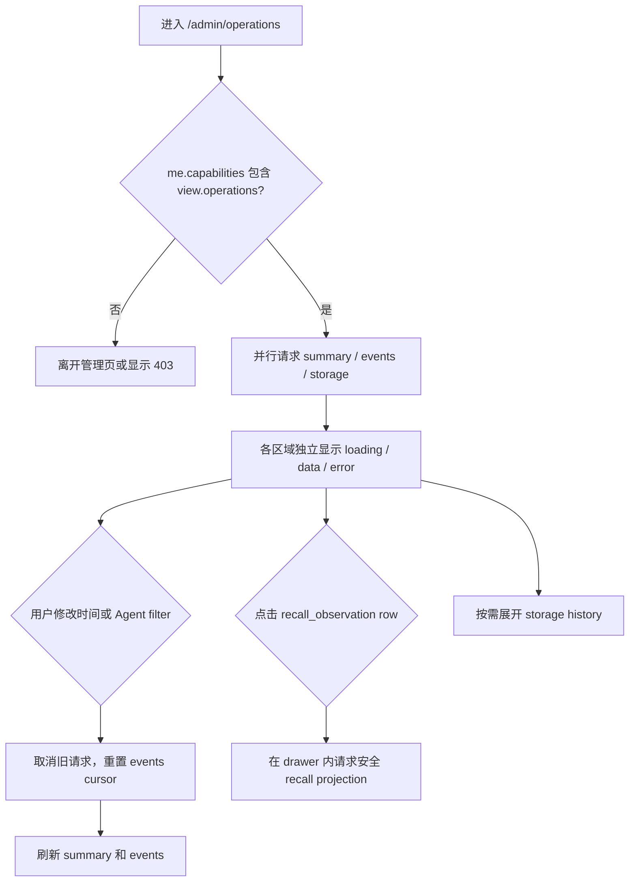

# On-prem Operations 前端接入指南

状态：基于 `idl/team_memory.thrift`、当前 Hertz handler 和已通过的 Docker E2E 契约。

本文面向 `web/` Human Portal 前端，说明如何接入 `/v1/admin/operations/*`。身份、Cookie、
CSRF、统一错误封装和基础分页约定继续遵循
[On-prem Identity 与 Agent Registry 前端接入指南](./on-prem-identity-frontend-integration.md)；
指标语义和数据边界见
[On-prem Operations Monitor and Storage Accounting ADR](./decisions/2026-07-22-on-prem-operations-monitor-and-storage.md)。

Operations 是只读管理面，不是 Audit、Evaluation、backup 或基础设施 health 的替代品。
页面不得展示或尝试恢复 raw query、Observation content、Team Note body、Memory Hit text、
Capsule payload、credential secret 或原始 error message。

## 1. 接入范围和前端改动位置

当前后端已实现五个接口：

```text
GET /v1/admin/operations/summary
GET /v1/admin/operations/events
GET /v1/admin/operations/recalls/:observation_id
GET /v1/admin/operations/storage
GET /v1/admin/operations/storage/history
```

建议前端按现有目录边界落位：

```text
web/src/api/types.ts                 Operations DTO 和 HumanMe.capabilities
web/src/api/queries.ts               五个只读 query wrapper
web/src/lib/capabilities.ts          view.operations 导航能力
web/src/pages/AdminOperationsPage.tsx
web/src/pages/PortalShell.tsx         导航和 /admin/operations route
web/src/styles.css                    summary、table、drawer、storage layout
```

Operations 没有 mutation，不应放进 `web/src/api/actions.ts`。所有 GET 仍通过现有
`humanFetch`，使用同源相对 URL、Human Cookie 和 `credentials: "include"`。

## 2. 授权、导航和路由

### 2.1 以后端 capabilities 为准

`GET /v1/me` 现在必定返回 `capabilities: string[]`。active Owner/Admin 包含
`view.operations`，Member 不包含；未知 capability 必须忽略，以兼容滚动升级。

```json
{
  "user_id": "usr_01",
  "email": "owner@example.com",
  "email_verified": true,
  "membership_id": "mbr_01",
  "role": "owner",
  "membership_status": "active",
  "capabilities": ["view.operations"]
}
```

前端需要给现有 `HumanMe` 增加：

```ts
export interface HumanMe {
  user_id: string;
  email?: string;
  email_verified: boolean;
  membership_id?: string;
  role?: Role;
  membership_status?: MembershipStatus;
  capabilities: string[];
}

export function hasServerCapability(me: HumanMe, capability: string): boolean {
  return me.membership_status === "active" && me.capabilities.includes(capability);
}
```

Operations 导航和 route guard 应使用 `hasServerCapability(me, "view.operations")`。当前
`capabilities` 只承载后端显式发布的 Operations capability；其他既有页面暂时仍使用现有 role
matrix。若滚动升级期间响应没有 `capabilities`，保守行为是当作空数组并隐藏 Operations，
而不是按角色猜测开放。

### 2.2 Portal 路由

在 Admin Console 中把 `Operations` 与 `Audit Events` 并列：

```text
/admin/operations
```

没有 `view.operations` 时：

- 不显示导航；
- 直接访问该路由时回到安全的 `/agents` 或显示 403 页面；
- 不发起 Operations API 请求；
- 不能把前端隐藏当作授权，后端仍逐请求返回 `403 forbidden`。

Agent API key 无论 permissions 如何都不能访问这些接口。用 Bearer Agent key 调用会得到
`401`，不能将它解释为“Agent 没有某项 permission”。

## 3. 页面信息架构和用户动线

页面建议保持五个彼此独立的区域：

1. **Activity summary**：Observation、Recall、error、latency；
2. **Pipeline health**：Extraction outcome、unextracted backlog、oldest pending age；
3. **Storage**：数据库总量及各 component 的 logical/physical size；
4. **Recent activity**：可过滤、cursor 分页的事件表；
5. **Recall detail drawer**：从带安全 diagnostic link 的 recall row 打开。

首次进入页面的请求顺序：



不要用一个全页 `Promise.all` 让 Storage 的 `503` 清空已经成功返回的 summary/events。每个
区域维护独立的 `loading | ready | empty | error` 状态；可用 `Promise.allSettled` 启动首屏。

## 4. 查询、时间和刷新约定

### 4.1 时间范围

- 所有请求时间参数使用 RFC3339/RFC3339Nano；前端发送 UTC ISO 字符串；
- summary 默认最近 24 小时；
- events 默认在 Operation Event retention 内取最新 50 条；
- storage history 默认在 Storage retention 内取最新 50 条；
- `from` 必须早于 `to`，`to` 不能超过服务端当前时间约一分钟；
- 请求窗口超过部署配置的 retention 会返回 `400 invalid_request`；
- UI 可提供 `1h`、`24h`、`7d` preset，但不要假设每个部署都保留 7 天以上；
- 用户切换时间范围、Agent、operation 或 outcome 时必须清空旧 cursor 和旧追加结果。

浏览器负责把 UTC timestamp 本地化，但 tooltip 应保留完整 timestamp。不要把
`generated_at`、event `started_at` 和 storage `captured_at` 当作同一个采样时刻。

### 4.2 分页

- `limit` 默认 50，范围 1 到 100；
- `next_cursor` 是 opaque string，只能原样回传；
- events 排序是 `started_at DESC, operation_event_id DESC`；
- history 排序是 `captured_at DESC, snapshot_id DESC`；
- 请求下一页时必须带上与第一页完全相同的 filters；
- response 没有 `next_cursor` 表示结束；不要发送空字符串 cursor；
- cursor 非法或与已经过 retention 的数据不再兼容时，后端返回 `400`，前端应从第一页重载。

### 4.3 轮询

推荐默认策略：

- summary 和第一页 events：页面可见时每 15 秒刷新；
- storage current：进入页面时加载，之后每 5 分钟或手工刷新；
- storage history：用户展开时加载，不轮询；
- recall detail：只在用户打开 drawer 时加载一次；
- `document.visibilityState !== "visible"` 时暂停；
- 每次刷新先 `AbortController.abort()` 取消旧请求，禁止重叠轮询；
- 用户正在查看 events 后续页时，不把第一页轮询结果插入当前列表。可以显示“有新活动”并让
  用户回到第一页刷新。

## 5. TypeScript 数据模型

字段名与 Hertz JSON 输出一致，全部使用 snake_case。Thrift `optional` 字段可能完全缺失，
不要只按 `null` 处理。

```ts
export type OperationKind =
  | "observation.observe"
  | "memory.search"
  | "memory.get"
  | "team_note.recall"
  | "extraction.run"
  | "channel.send"
  | "channel.accept"
  | "channel.archive"
  | "system.retention";

export type OperationOutcome =
  | "succeeded"
  | "rejected"
  | "failed"
  | "timed_out"
  | "cancelled";

export interface OperationsSummary {
  from_time: string;
  to_time: string;
  generated_at: string;
  observations: {
    requests: number;
    succeeded: number;
    input_events: number;
    events_written: number;
    duplicate_events: number;
  };
  extraction: {
    runs: number;
    completed: number;
    quarantined: number;
    failed: number;
    admitted_revisions: number;
    unextracted_events: number;
    oldest_unextracted_at?: string;
  };
  recalls: {
    requests: number;
    succeeded: number;
    with_evidence: number;
    empty: number;
    memory_hits: number;
    team_notes_delivered: number;
    memory_search_requests: number;
    memory_get_requests: number;
    team_note_recall_requests: number;
    evidence_hits: number;
    hint_hits: number;
    reference_hits: number;
  };
  latency: {
    sample_count: number;
    p50_ms?: number;
    p95_ms?: number;
  };
  errors: number;
}

export interface OperationEvent {
  operation_event_id: number;
  attempt_id: string;
  operation_kind: OperationKind;
  outcome: OperationOutcome;
  actor_user_id?: string;
  actor_membership_id?: string;
  actor_agent_id?: string;
  session_id?: string;
  started_at: string;
  completed_at: string;
  duration_ms: number;
  input_items: number;
  accepted_items: number;
  duplicate_items: number;
  result_items: number;
  delivered_items: number;
  evidence_items: number;
  hint_items: number;
  reference_items: number;
  input_tokens?: number;
  output_tokens?: number;
  detail_kind?: string;
  detail_id?: string;
  error_code?: string;
}

export interface RecallDiagnostic {
  observation_id: number;
  occurred_at: string;
  agent_id: string;
  session_id: string;
  duration_ms: number;
  token_budget: number;
  max_items: number;
  evidence_sufficient: boolean;
  reason_codes: string[];
  lanes_executed: string[];
  candidates: number;
  fusion_kept: number;
  planned_notes: number;
  planned_tokens: number;
  delivered_items: number;
  disposition_counts: Record<string, number>;
  rejection_counts: Record<string, number>;
  budget_drop_counts: Record<string, number>;
  hard_gate_failure_counts: Record<string, number>;
}

export interface StorageComponent {
  component: string;
  counts: Record<string, number>;
  logical_bytes: number;
  physical_bytes: number;
  estimated_reclaimable_bytes?: number;
  oldest_at?: string;
  newest_at?: string;
}

export interface OperationsStorageSnapshot {
  snapshot_id: number;
  schema_version: number;
  captured_at: string;
  status: "complete" | "partial" | string;
  warning_codes: string[];
  database_physical_bytes: number;
  other_physical_bytes: number;
  components: StorageComponent[];
}
```

`status`、`warning_codes`、map key、reason code 和 lane 必须按 forward-compatible enum 处理：
已知值提供友好 label，未知值显示原始安全 code，不抛异常、不丢整张卡。

## 6. API wrapper

建议在 `web/src/api/queries.ts` 增加以下只读函数。filters 构造时省略空值，不能把
`undefined` 编码成字符串。

```ts
export interface OperationsTimeFilter {
  from?: string;
  to?: string;
  agent_id?: string;
}

export interface OperationEventFilter extends OperationsTimeFilter {
  operation_kind?: OperationKind;
  outcome?: OperationOutcome;
  limit?: number;
  cursor?: string;
}

export async function getOperationsSummary(
  filter: OperationsTimeFilter,
  signal?: AbortSignal,
): Promise<OperationsSummary> {
  return humanFetch(
    `/v1/admin/operations/summary${query({
      from: filter.from,
      to: filter.to,
      agent_id: filter.agent_id,
    })}`,
    { signal },
  );
}

export async function listOperationEvents(
  filter: OperationEventFilter,
  signal?: AbortSignal,
): Promise<{ items: OperationEvent[]; nextCursor?: string; generatedAt: string }> {
  const response = await humanFetch<{
    events: OperationEvent[];
    next_cursor?: string;
    generated_at: string;
  }>(
    `/v1/admin/operations/events${query({
      from: filter.from,
      to: filter.to,
      agent_id: filter.agent_id,
      operation_kind: filter.operation_kind,
      outcome: filter.outcome,
      limit: filter.limit,
      cursor: filter.cursor,
    })}`,
    { signal },
  );
  return {
    items: response.events,
    nextCursor: response.next_cursor,
    generatedAt: response.generated_at,
  };
}

export async function getRecallDiagnostic(
  observationId: number,
  signal?: AbortSignal,
): Promise<RecallDiagnostic> {
  const response = await humanFetch<{ recall: RecallDiagnostic }>(
    `/v1/admin/operations/recalls/${encodeURIComponent(String(observationId))}`,
    { signal },
  );
  return response.recall;
}

export async function getOperationsStorage(
  signal?: AbortSignal,
): Promise<OperationsStorageSnapshot> {
  const response = await humanFetch<{ storage: OperationsStorageSnapshot }>(
    "/v1/admin/operations/storage",
    { signal },
  );
  return response.storage;
}

export async function listOperationsStorageHistory(
  filter: { from?: string; to?: string; limit?: number; cursor?: string },
  signal?: AbortSignal,
): Promise<{ items: OperationsStorageSnapshot[]; nextCursor?: string }> {
  const response = await humanFetch<{
    snapshots: OperationsStorageSnapshot[];
    next_cursor?: string;
  }>(
    `/v1/admin/operations/storage/history${query({
      from: filter.from,
      to: filter.to,
      limit: filter.limit,
      cursor: filter.cursor,
    })}`,
    { signal },
  );
  return { items: response.snapshots, nextCursor: response.next_cursor };
}
```

如果保留现有 `query()` 的参数类型，需要让它接受上述 typed filter，或在 wrapper 中显式映射
字段；不要用 `as Record<string, ...>` 掩盖拼错的 query name。事件过滤参数叫
`operation_kind`，不是 `kind`。

## 7. Summary 接口与卡片语义

请求：

```http
GET /v1/admin/operations/summary?from=2026-07-22T10:00:00Z&to=2026-07-22T12:00:00Z&agent_id=agent-1
```

示例响应：

```json
{
  "from_time": "2026-07-22T10:00:00Z",
  "to_time": "2026-07-22T12:00:00Z",
  "generated_at": "2026-07-22T12:00:01Z",
  "observations": {
    "requests": 18,
    "succeeded": 17,
    "input_events": 52,
    "events_written": 48,
    "duplicate_events": 4
  },
  "extraction": {
    "runs": 12,
    "completed": 10,
    "quarantined": 1,
    "failed": 1,
    "admitted_revisions": 8,
    "unextracted_events": 3,
    "oldest_unextracted_at": "2026-07-22T11:58:00Z"
  },
  "recalls": {
    "requests": 30,
    "succeeded": 29,
    "with_evidence": 18,
    "empty": 5,
    "memory_hits": 41,
    "team_notes_delivered": 21,
    "memory_search_requests": 20,
    "memory_get_requests": 4,
    "team_note_recall_requests": 6,
    "evidence_hits": 23,
    "hint_hits": 11,
    "reference_hits": 7
  },
  "latency": {
    "sample_count": 30,
    "p50_ms": 24,
    "p95_ms": 91
  },
  "errors": 2
}
```

前端必须按字段原义展示，不能重新命名成一个模糊的 `write_count` 或 `success rate`：

- Observation success 包括合法的纯幂等 replay；此时 `events_written=0`、
  `duplicate_events>0`；
- Observation accepted 不代表 extraction 已完成；backlog 和 extraction 是另一条异步链；
- `quarantined` 是 deterministic rejection，不计入 `failed`；
- recall 正确返回零结果仍是 `succeeded`，同时可增加 `empty`；
- `with_evidence` 不等于 answer correctness；正确性属于 Evaluation；
- `memory_hits` 只统计 Memory Search hit；
- `errors` 统计 `failed | timed_out | cancelled`，不包括 `rejected`；
- latency 样本包括 `memory.search`、`memory.get` 和 `team_note.recall` 完整外部调用；
- `sample_count < 2` 时 `p50_ms` 缺失；`sample_count < 20` 时 `p95_ms` 缺失。UI 显示
  “样本不足”，不能显示 `0 ms`。

`oldest_unextracted_at` 缺失且 `unextracted_events=0` 是健康空态。字段缺失但 backlog 非零时
不要自行推导时间，显示 count 并标记 age unavailable。

## 8. Recent activity 接口

支持的 `operation_kind`：

| kind | UI label | 典型 detail |
| --- | --- | --- |
| `observation.observe` | Observation | 无 |
| `memory.search` | Memory Search | `recall_observation` |
| `memory.get` | Memory Get | 无 |
| `team_note.recall` | Team Note Recall | `recall_observation` |
| `extraction.run` | Extraction | `extraction_run`，当前无前端详情接口 |
| `channel.send` | Capsule Send | `channel_envelope` |
| `channel.accept` | Capsule Accept | `channel_envelope` |
| `channel.archive` | Capsule Archive | `channel_envelope` |
| `system.retention` | Retention | 无 |

支持的 outcome 是 `succeeded | rejected | failed | timed_out | cancelled`。筛选值必须使用完整
枚举；未知值不应发送到后端。

```http
GET /v1/admin/operations/events?operation_kind=memory.search&outcome=succeeded&agent_id=agent-1&limit=50
```

```json
{
  "events": [
    {
      "operation_event_id": 812,
      "attempt_id": "op_q6Jx...",
      "operation_kind": "memory.search",
      "outcome": "succeeded",
      "actor_agent_id": "agent-1",
      "session_id": "session-42",
      "started_at": "2026-07-22T11:59:58Z",
      "completed_at": "2026-07-22T11:59:58.024Z",
      "duration_ms": 24,
      "input_items": 1,
      "accepted_items": 0,
      "duplicate_items": 0,
      "result_items": 3,
      "delivered_items": 2,
      "evidence_items": 2,
      "hint_items": 1,
      "reference_items": 0,
      "detail_kind": "recall_observation",
      "detail_id": "41"
    }
  ],
  "next_cursor": "MjAyNi0wNy0yMlQxMTo1OTo1OFp8ODEy",
  "generated_at": "2026-07-22T12:00:01Z"
}
```

表格建议列：time、Agent ID、operation、outcome、duration、items、error code、detail。
actor label enrichment 可以复用已加载的 Admin Agent 数据，但 raw `actor_agent_id` 必须保留；
Agent retired/owner removed 后历史事件仍然有效，label 只是非权威显示。

只有 `detail_kind === "recall_observation"` 且 `detail_id` 是正整数时显示 “Inspect recall”。
`channel_envelope` 和 `extraction_run` 当前没有 Operations detail endpoint，不要错误链接到 Recall
接口。`error_code` 是安全稳定 code，可以展示；不要从其他产品接口拼接原始错误文本。

## 9. Recall detail drawer

示例：

```http
GET /v1/admin/operations/recalls/41
```

```json
{
  "recall": {
    "observation_id": 41,
    "occurred_at": "2026-07-22T11:59:58Z",
    "agent_id": "agent-1",
    "session_id": "session-42",
    "duration_ms": 24,
    "token_budget": 256,
    "max_items": 5,
    "evidence_sufficient": true,
    "reason_codes": ["fact_coverage"],
    "lanes_executed": ["lexical", "recent"],
    "candidates": 8,
    "fusion_kept": 4,
    "planned_notes": 3,
    "planned_tokens": 182,
    "delivered_items": 2,
    "disposition_counts": {"evidence": 2, "hint": 1},
    "rejection_counts": {"temporal_gate": 1},
    "budget_drop_counts": {"token_budget": 1},
    "hard_gate_failure_counts": {"authorization": 0}
  }
}
```

drawer 可以展示漏斗：

```text
candidates -> fusion_kept -> planned_notes -> delivered_items
```

以及 token budget、planned tokens、lanes 和各类 reason count。它不提供 query、note ID、正文、
hit text 或完整 trace；前端不得根据缺失字段去调用其他内部接口补齐内容。

详情生命周期：

- `404 recall_diagnostic_not_found`：从未存在，或 Operation Event 和诊断都已过 retention；
- `410 diagnostic_expired`：列表中的安全事件仍可见，但产品诊断已过期或被 cleanup；
- 两者都不应从 events 表删除该 row；drawer 显示不可用状态并允许关闭；
- 不自动无限重试 `404/410`；
- drawer state 留在 React memory，不写入 URL、localStorage、analytics、console 或 error tracker。

## 10. Storage current 和 history

```http
GET /v1/admin/operations/storage
```

```json
{
  "storage": {
    "snapshot_id": 91,
    "schema_version": 1,
    "captured_at": "2026-07-22T12:00:00Z",
    "status": "partial",
    "warning_codes": ["recall_diagnostics_logical_unavailable"],
    "database_physical_bytes": 104857600,
    "other_physical_bytes": 12582912,
    "components": [
      {
        "component": "session_lake",
        "counts": {
          "events": 1024,
          "streams": 27,
          "unextracted_events": 3,
          "content_bytes": 481203,
          "metadata_bytes": 32110
        },
        "logical_bytes": 513313,
        "physical_bytes": 4194304,
        "oldest_at": "2026-07-01T09:00:00Z",
        "newest_at": "2026-07-22T11:59:58Z"
      }
    ]
  }
}
```

已知 component：

| component | 主要 counts |
| --- | --- |
| `session_lake` | events、streams、unextracted_events、content_bytes、metadata_bytes |
| `extraction` | runs、started/completed/quarantined/failed_runs、candidates、episodes、各 payload bytes |
| `team_memory` | notes、active/resolved/expired_notes、revisions、evidence_links、deliveries、relation_references、各 bytes |
| `recall_diagnostics` | recall_observations、hint_deliveries、diagnostic_bytes |
| `capsule_channel` | envelopes、pending/accepted/archived_envelopes、payload_bytes |
| `identity_audit` | users、memberships、agents、active_credentials、active_human_sessions、invitations、audit_events、各 profile/metadata bytes |
| `operations` | operation_events、storage_snapshots、event_metadata_bytes、snapshot_bytes |

前端对未知 component 和 count key 使用通用 fallback，不依赖数组顺序。

容量概念必须分开：

- `logical_bytes`：领域 payload 的可解释大小，不等于数据库文件大小；
- `physical_bytes`：相关 PostgreSQL relation 的当前 allocation；
- `database_physical_bytes`：整个数据库大小；
- `other_physical_bytes`：没有归到已知 component 的 allocation；
- `estimated_reclaimable_bytes`：可选估算，缺失时不能用 `physical-logical` 自行替代；
- 删除后 logical/count 可以下降而 physical 暂不下降，这是正常 PostgreSQL 行为。

`status=partial` 时仍展示成功采集的 component，同时在页面顶部显示 `warning_codes` 和
`captured_at`。失败 component 可能仍存在但 count/bytes 为零，零值不能被解释为真实空库。
warning code 使用 `<component>_logical_unavailable`、
`<component>_relation_size_unavailable` 等安全形式，但前端应允许未知值。

若 `captured_at` 过旧，显示明确 age。默认部署每小时采集一次；页面可以在超过两小时后显示
“stale”提示，但不能仅凭 age 宣布数据库故障，因为部署可能调整 interval。Storage history
只用于趋势，不是 backup；页面应链接
[workstation deployment instruction](../deployment-instruction.md) 的 backup/restore 操作。

History：

```http
GET /v1/admin/operations/storage/history?from=2026-07-15T00:00:00Z&to=2026-07-22T00:00:00Z&limit=50
```

返回 `{"snapshots": [...], "next_cursor": "..."}`。趋势图按 `captured_at` 排序；不要把
schema version 不同的 component keys 强行合并。遇到未知 `schema_version` 时仍可展示 database
total 和原始 component 名称，同时提示版本不匹配。

## 11. 错误映射和恢复

错误 envelope：

```json
{"code":"invalid_request","message":"the request is invalid"}
```

流程只按 HTTP status + `code` 分支，不匹配 message。

| Status | code | UI 行为 |
| --- | --- | --- |
| 400 | `invalid_request` | 校验 RFC3339、window、enum、limit、cursor；清 cursor 后可回第一页 |
| 401 | `unauthorized` | 清 auth cache，保存安全 return route 后重新登录 |
| 403 | `forbidden` | 刷新 `/v1/me`，隐藏 Operations 并离开 route |
| 403 | `membership_required` | 进入 suspended/join 状态处理，不重试 |
| 404 | `recall_diagnostic_not_found` | drawer 显示诊断不存在，不删除 activity row |
| 410 | `diagnostic_expired` | drawer 显示已过期，不重试 |
| 500 | `internal_error` | 保留 filters，区域级 retry；不清空其他成功区域 |
| 501 | `not_configured` | 安装配置提示，不当作角色不足 |
| 503 | `storage_not_available` | Storage 专用空态；summary/events 继续可用 |

网络错误或 abort：

- `AbortError` 是正常取消，不弹 toast；
- 离线/timeout 保留最后一次内存数据并显示“可能已过期”，但不能写 localStorage；
- retry 必须是区域级、退避且无重叠；
- 后端当前无 rate limiter，但 wrapper 应继续兼容未来 `429 Retry-After`。

## 12. 必测边际场景

前端 Vitest/DOM smoke 至少覆盖：

1. `capabilities` 含 `view.operations` 时显示导航；Member、缺字段或未知 capability 不开放。
2. 直接访问 `/admin/operations` 时 route guard 正确处理 401/403，且不发多余请求。
3. 首屏 summary 成功、storage 503 时 summary/events 仍显示。
4. summary 的所有合法零值显示为 `0`，不能进入“无数据”错误态。
5. `p50_ms`/`p95_ms` 缺失时显示样本不足，不显示 0 ms 或 NaN。
6. 幂等 Observation 显示 succeeded + duplicates，不误报写入失败。
7. empty successful recall 与 failed recall 使用不同 label/color。
8. quarantined extraction 不计入 failed/error。
9. filter 变化会 abort 旧请求、重置 cursor，不把旧页 append 到新 filter。
10. events 使用 `operation_kind` query name；响应 row kind 不匹配时不打开错误 detail。
11. 只有 `recall_observation` detail 打开 drawer；extraction/channel detail 不误调 Recall API。
12. Recall 404、410、500 分别显示正确状态，且安全 activity row 保留。
13. drawer 响应、filter 以外的 detail 和 session 信息不进入 URL、持久存储、analytics 或 console。
14. storage `complete`、`partial`、stale、503 和 history empty 是五种不同状态。
15. partial component 的零值不显示成“0 bytes healthy”。
16. 未知 operation/outcome/component/warning/reason/lane/schema version 使用安全 fallback。
17. `next_cursor` 缺失时停止；非法 cursor 后从第一页恢复。
18. 页面 hidden 时停止轮询，visible 后只启动一个新 poll。
19. Agent retired 或 label enrichment 失败时仍展示 raw Agent ID。
20. API payload 中没有 query、content、note text、capsule payload 或 credential secret。

## 13. 前端交付检查单

- `HumanMe` 增加 required `capabilities`，导航按 `view.operations` gating。
- `PortalShell` 增加 `/admin/operations` route 和 `Operations` 导航。
- Operations DTO 与 Thrift snake_case 字段逐项一致，optional 字段允许缺失。
- 五个接口全部放在 read-side `queries.ts`，不进入 Action Layer。
- summary、events、storage、detail 分区独立 loading/error；不使用全页失败。
- query 参数使用 `operation_kind`，cursor opaque，filter 变化重置分页。
- polling 可取消、不重叠、页面 hidden 时暂停。
- timestamp 本地化且保留原始 tooltip；显示 `generated_at`/`captured_at` freshness。
- bytes 使用 IEC 单位统一格式化，并始终标明 logical 或 physical。
- `partial`、stale、empty、503 分开；unknown code forward-compatible。
- Recall drawer 仅展示安全 projection，不补查正文。
- Operations response 不进入 localStorage、URL、埋点、console 或错误上报附件。
- 前端测试覆盖权限、分页、轮询取消、样本不足、过期诊断和 partial storage。
